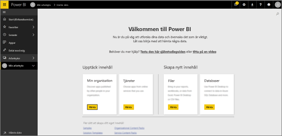
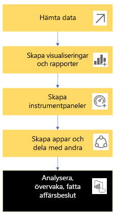
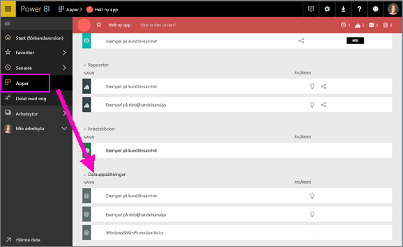
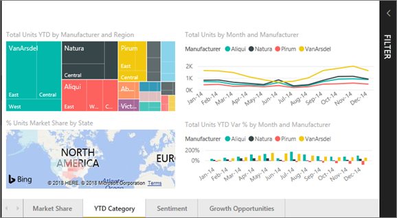
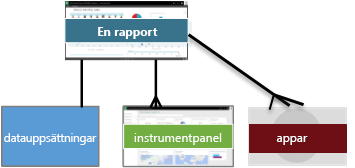
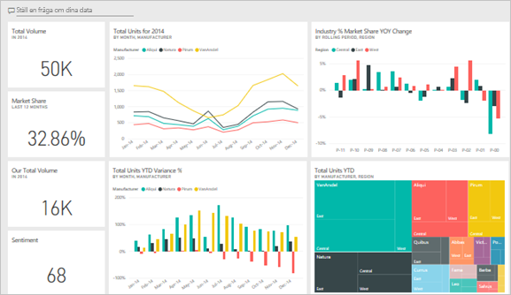
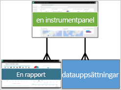
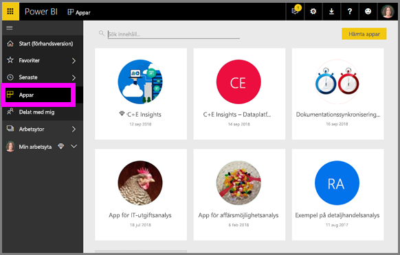

# Grundläggande begrepp för ***användare*** av Power BI-tjänsten

## *Användare* och *designers* av Power BI
Den här artikeln förutsätter att du redan har läst [översikten över Power BI](../power-bi-overview.md) och har identifierat dig själv som ***användare*** av Power BI. Användare får Power BI-innehåll såsom instrumentpaneler och rapporter från kollegor. Användare använder Power BI-tjänsten, som är den webbplatsbaserade versionen av Power BI. 

Du kommer säkerligen att höra termen ”Power BI Desktop” eller bara ”Desktop”, och det här är ett fristående verktyg som används av *designers* som skapar och delar instrumentpaneler och rapporter med dig. Det är viktigt att veta att det finns andra Power BI-verktyg, men så länge du är användare arbetar du bara med Power BI-tjänsten. Och den här artikeln gäller endast för Power BI-tjänsten. 

## Termer och begrepp
Den här artikeln är inte en visuell genomgång av Power BI eller en praktisk självstudie. I stället är den en översiktsartikel som vi hoppas kommer att bekanta dig med termer och begrepp i Power BI. Det gäller alltså jargongen och hur det ser ut i allmänhet. Om du vill få en genomgång av Power BI-tjänsten och dess navigering kan du [ta en rundtur](end-user-experience.md).

## Öppna Power BI-tjänsten för första gången
De flesta Power BI-användare skaffar Power BI-tjänsten eftersom 1) deras företag köper licenser och 2) en administratör tilldelar de licenserna till medarbetare. 

För att komma igång öppnar du en webbläsare och anger **app.powerbi.com**. Första gången du öppnar Power BI-tjänsten ser det ut ungefär så här.

När du använder Power BI anpassar du det som visas när du öppnar webbplatsen varje gång.  Till exempel föredrar vissa att Power BI öppnas till startsidan, medan andra har en favoritinstrumentpanel som de vill se först. Det kommer vi att gå igenom. 
- [Förhandsgranskning av Start](https://powerbi.microsoft.com/blog/introducing-power-bi-home-and-global-search)    
- [Ange innehåll som **aktuellt**](end-user-featured.md) 

Men innan vi fortsätter går vi igenom de byggstenar som utgör Power BI-tjänsten.

## Power BI-***innehåll***
### Introduktion till byggstenar
För Power BI-användare är de 5 byggblocken: ***visualiseringar***, ***instrumentpaneler***, ***rapporter***, ***appar*** och ***datamängder***. Dessa kallas ibland *Power BI*-***innehåll***. Och *innehåll* finns i ***arbetsytor***. Ett vanligt arbetsflöde inbegriper alla dessa byggstenar:  En Power BI-*designer* (gul i diagrammet nedan) samlar in data från *datamängder* hämtar in dem till Power BI för analys, skapar  *rapporter* med *visualiseringar* som visar intressanta fakta och insikter, fäster visualiseringar från rapporter på en instrumentpanel och delar rapporter och instrumentpanelerna med *användare* som du (svarta i diagrammet nedan) i form av *appar* eller andra typer av delat innehåll. 

I dess mest grundläggande form 
* är  en ***visualisering*** (eller *visuellt objekt*) en typ av diagram som skapas av Power BI-*designers* med hjälp av data i *rapporter* och *datamängder*. Normalt skapar *designers* visuella objekt i Power BI Desktop. 

    Mer information finns i [Visualiseringar för Power BI-*användare*](end-user-visualizations.md)

*  En *datamängd* är en container för data. Exempelvis kan det vara en Excel-fil från Världshälsoorganisationen, en företagsägd databas med kunder eller en Salesforce-fil.  

*  En *instrumentpanel* är en enskild skärm med interaktiva visuella objekt, text och bilder. En instrumentpanel samlar in dina viktigaste mått på en skärm för att ge en bild över något eller besvara en fråga. Innehållet på instrumentpanelen kommer från en eller flera rapporter och en eller flera datamängder.

    Mer information finns i [Instrumentpaneler för Power BI-*användare*](end-user-dashboards.md)

*  En *rapport* är en eller flera sidor med interaktiva visuella objekt, text och grafik som tillsammans utgör en enskild rapport. Rapporter baseras på en enskild datamängd. Ofta är rapportsidor organiserade till varje adress i ett viktigt intresseområde eller besvarar en enskild fråga.

    Mer information finns i [Rapporter för Power BI-*användare*](end-user-reports.md)

*  En *app* är ett sätt för *designers* att paketera och dela relaterade instrumentpaneler och rapporter tillsammans. *Användare* får vissa appar automatiskt men kan söka efter andra appar som skapats av kollegor eller av communityn. Till exempel erbjuder externa tjänster som du kanske redan använder, t.ex. Google Analytics och Microsoft Dynamics CRM, också Power BI-appar.

Bara för tydlighetens skull: om du är en helt ny användare och loggar in i Power BI för första gången har du inga instrumentpaneler, appar eller rapporter ännu. 
_______________________________________________________

## Datauppsättningar
En *datamängd* är en samling data som *designers* importerar eller ansluter till och sedan använder för att skapa rapporter och instrumentpaneler. Som användare kommer du inte att interagera direkt med datamängder, men det är fortfarande bra att förstå syftet med dem.  

Varje datamängd representerar en enskild datakälla, till exempel en Excel-arbetsbok på OneDrive, en lokal SSAS-tabelldatamängd eller en Salesforce-datamängd. Det finns många olika datakällor som stöds.

När en designer delar en app med dig kan du se vilka datamängder som ingår i appen. 

**EN** datauppsättning ...

* kan användas flera gånger
* kan användas i många olika rapporter
* Visualiseringar från denna enskilda datamängd kan visas på många olika instrumentpaneler
  
  

Nu går vi vidare till nästa byggsten – visualiseringar.
__________________________________________________________

## Visualiseringar
Visualiseringar (även kända som visuella objekt) visar insikter som har upptäckts i data. Visualiseringar gör det lättare att tolka insikten eftersom hjärnan förstår en bild snabbare än till exempel ett kalkylblad med siffror.

Några exempel på de visualiseringar som du stöter på i Power BI är: vattenfallsdiagram, trädkartor, cirkeldiagram, trattdiagram, kort, punktdiagram och mätare. Se den [fullständiga listan över visualiseringar som ingår i Power BI](../power-bi-visualization-types-for-reports-and-q-and-a.md).

   

Visualiseringar är även tillgängliga från communityn. Dessa kallas *anpassade visuella objekt*. Om du får en rapport med ett visuellt objekt som du inte känner igen är det sannolikt ett anpassat visuellt objekt. Om du behöver hjälp med att tolka det visuella objektet <!--[look up the name of the report or dashboard *designer*](end-user-owner.md)-->letar du upp namnet på *designern* av rapporten eller instrumentpanelen och kontaktar denne.

**EN** visualisering i en rapport ...

* kan användas flera gånger i samma rapport med hjälp av kopiera och klistra in.
* kan användas på många olika instrumentpaneler.
__________________________________________________
## Rapporter
En Power BI-rapport är en eller flera sidor med visualiseringar, grafik och text. Alla visualiseringar i en rapport kommer från en enda datauppsättning. *Designers* delar rapporter med *användare* som [interagerar med rapporterna i *läsvyn*](end-user-reading-view.md).

**EN** rapport ...

* kan associeras med flera instrumentpaneler (paneler fästa från en rapport kan visas på flera instrumentpaneler).
* skapas med hjälp av data från endast en datamängd.  
* kan ingå i flera appar
  
  

________________________________________________

## Instrumentpaneler
En instrumentpanel representerar en anpassad vy av någon delmängd av de underliggande datamängderna. *Designers* skapar instrumentpaneler och delar dem med *användare*, antingen enskilt eller som en del av en app. En instrumentpanel är en enskild arbetsyta som innehåller *paneler*, bilder och text. 

  

En panel är en rendering av ett visuellt objekt som en *designer* *fäster* till exempel från en rapport till en instrumentpanel.  Varje fäst panel visar en [visualisering](end-user-visualizations.md) som skapats från en datamängd och fästs på den instrumentpanelen. En panel kan även innehålla en hel rapportsida och kan innehålla liveuppspelningsdata eller en video. Det finns många sätt som *designers* kan använda för att lägga till paneler i instrumentpaneler, för många för att omfattas i det här översiktsämnen. Läs mer i [Paneler på instrumentpanelen i Power BI](end-user-tiles.md). 

Från ett användarperspektiv går det inte att redigera instrumentpaneler. Du kan dock lägga till kommentarer, visa relaterade data, ange en instrumentpanel som favorit, prenumerera med mera. 

Vad är syftet med instrumentpaneler?  Här följer några:

* för att få en överblick över all information som behövs för att fatta beslut
* för att övervaka den viktigaste informationen om verksamheten
* för att se till att alla kollegor är på samma sida och ser och använder samma information
* för att övervaka hälsotillståndet för ett företag, en produkt, en affärsenhet, en marknadsföringskampanj o.s.v.
* för att skapa en anpassad vy av en större instrumentpanel – alla mått som är viktiga för dig

**EN** instrumentpanel ...

* kan visa visualiseringar från många olika datauppsättningar
* kan visa visualiseringar från många olika rapporter
* kan visa visualiseringar som fästs från andra verktyg (t.ex. Excel)
  
  

________________________________________________

## Appar
Dessa samlingar av instrumentpaneler och rapporter organiserar relaterat innehåll tillsammans i ett enda paket. Power BI-*designers* skapar och delar dem med enskilda användare, grupper, en hel organisation eller allmänheten. Som användare kan du vara säker på att du och dina kolleger arbetar med samma data, en enskild betrodd version av sanningen. 

Apparna är lätta att hitta och installera på Power BI-tjänsten (https://powerbi.com)) och på din mobila enhet. När du har installerat en app behöver du inte längre komma ihåg namnet på en massa olika instrumentpaneler eftersom de har samlats tillsammans i en och samma app, i din webbläsare eller på din mobila enhet. 

Den här appen har tre relaterade instrumentpaneler och tre relaterade rapporter som utgör en enda app.

Och när appförfattare släpper uppdateringar, så ser du dem automatiskt. Författaren också styr också hur ofta data schemaläggs för uppdatering, så du inte behöver bry dig om att hålla det uppdaterat.

Du kan hämta appar på några olika sätt. Appdesignern kan installera appen automatiskt i ditt Power BI-konto eller skicka dig en direktlänk till en app, eller så kan du söka efter den i Microsoft AppSource, där du kan se alla appar som du har åtkomst till. I Power BI på din mobila enhet kan du bara installera appar från en direktlänk och inte från AppSource. Om appdesignern installerar appen automatiskt visas den i din lista över appar.

När appen har installerats behöver du bara markera den från applistan och välja vilken instrumentpanel eller rapport du vill öppna och utforska först.   

Jag hoppas att den här artikeln gav nyttig information om de byggstenar som utgör Power BI-tjänsten för användare. 

## Nästa steg
- Granska och bokmärk [ordlistan](end-user-glossary.md)    
- Få en [genomgång av Power BI-tjänsten](end-user-experience.md)
- Läs [översikten över Power BI som skrivits särskilt för användare](end-user-consumer.md)    
- Titta på en video där Will går igenom de grundläggande begreppen och ger en genomgång av Power BI-tjänsten. <iframe width="560" height="315" src="https://www.youtube.com/embed/B2vd4MQrz4M" frameborder="0" allowfullscreen></iframe>