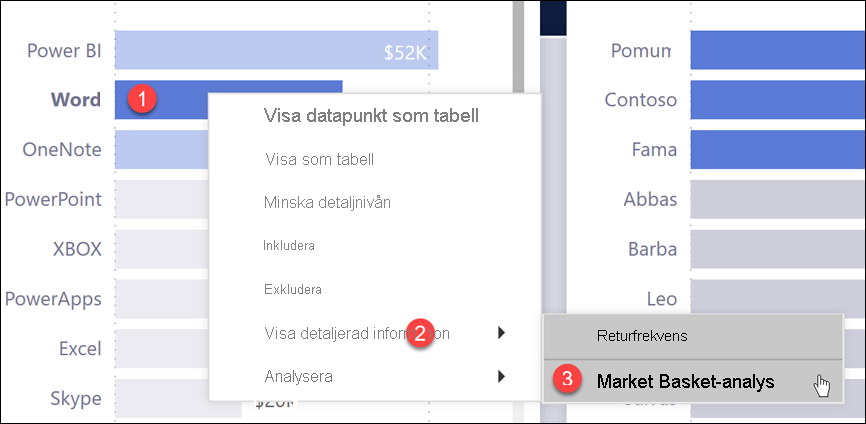
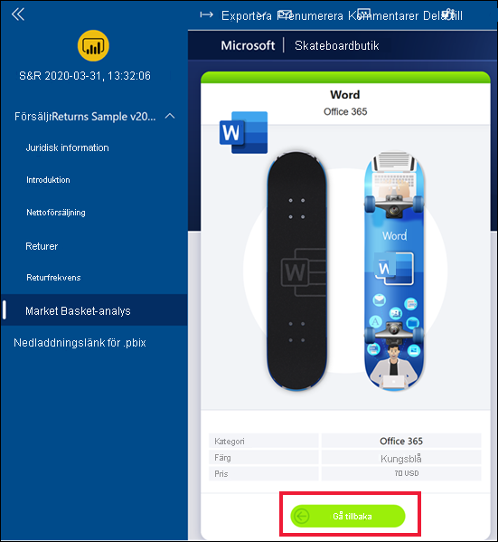
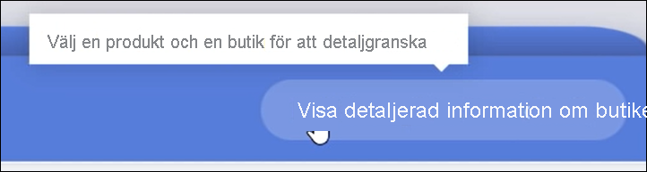
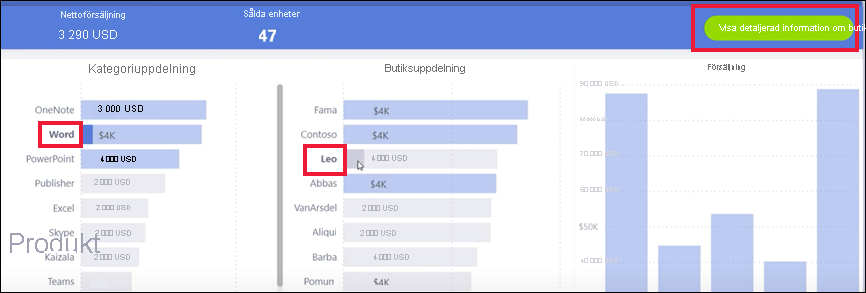
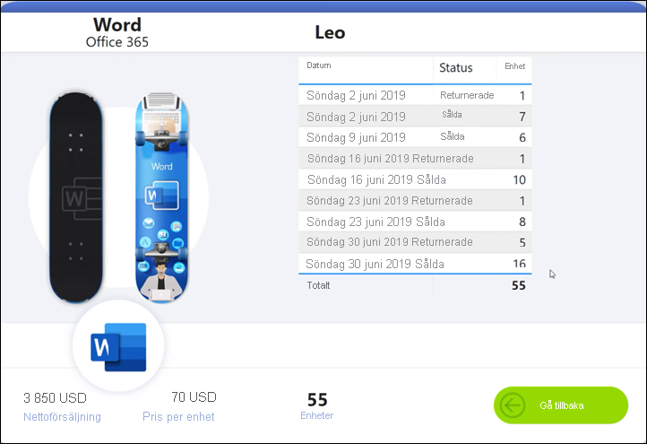
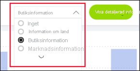
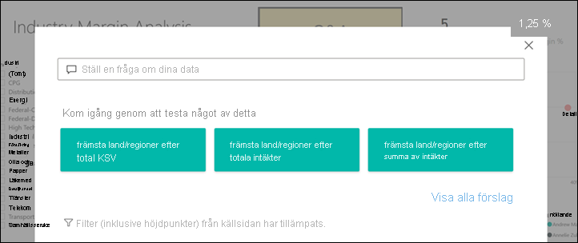
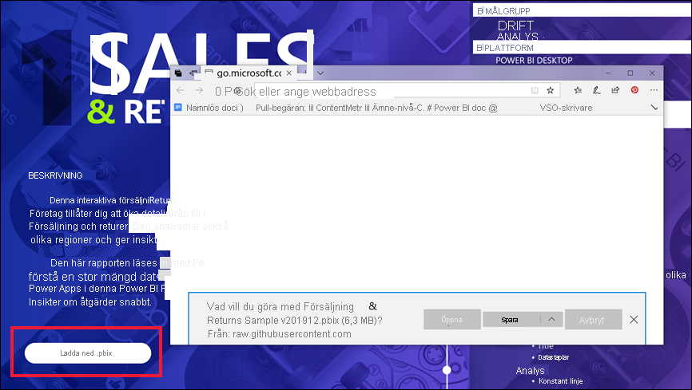

# Knappar i Power BI-tjänsten
I rapporterna som du har fått från dina kollegor kanske du har lagt märke till vissa knappar och funderat över vad du ska använda dem till. En del knappar innehåller ord, en del har pilar, andra har grafik och vissa har även listmenyer. I artikeln får du lära dig hur du känner igen en knapp och hur du tar reda på vad du kan göra med den.

## Känna igen en knapp
Knappar kan se ut som figurer, bilder eller ikoner på en rapportsida. Om en åtgärd utförs när du klickar på den, är det förmodligen en knapp.

## Typer av knappar
Rapportskapare lägger till knappar i rapporter för att hjälpa dig med navigering och utforskning. De olika knapptyperna är: **Tillbaka** **Bokmärke** **Detaljerad information**, **Sidnavigering**, **Frågor och svar** samt **Webb-URL**. 

### Bakåtknappar 
En bakåtknapp kan vara en pilikon och när du väljer den kommer du tillbaka till föregående sida i Power BI.  Bakåtknappar används ofta vid visning av detaljerad information. Här är ett exempel när knappen Tillbaka används vid visning av detaljerad information.

1. Välj **Word** i stapeldiagrammet.
1. Välj **Detaljerad information** och **Market Basket-analys**.

    

    När du väljer **Market Basket-analys** öppnar Power BI rapportsidan *Market Basket-analys* och använder de val som gjorts på källsidan för att filtrera det som visas på målsidan.

    

    Du är nu på rapportsidan **Market Basket-analys** som filtrerats för Word. Välj knappen Tillbaka för att återgå till föregående sida. 

## Bokmärkesknappar
I rapportdesignern används ofta bokmärken i rapporterna. Du kan se listan med rapportbokmärken genom att välja **Visa** > **Bokmärken** i det övre högra hörnet. När en *knapp* för bokmärken läggs till i rapporten, är det bara ett annat sätt att gå till den specifika rapportsida som är kopplad till bokmärket. På sidan används filter och inställningar som är konfigurerade för bokmärket. [Läs mer om bokmärken i Power BI](end-user-bookmarks.md). 

I det här exemplet består knappen av en bokmärkesikon och namnet på bokmärket, *Urbant*. 

När du klickar på bokmärkesknappen tar Power BI tar dig till den plats och de inställningar som definierats för bokmärket.  I det här fallet finns bokmärket på rapportsidan *Tillväxtmöjligheter* och sidan är korsfiltrerad för **Urbant**.

## Knappar för visning av detaljerad information
Det finns två sätt att visa detaljerad information på i Power BI-tjänsten. Visningen av detaljerad information tar dig till en annan rapportsida och data på målsidan visas enligt de filter och val som du har gjort på källsidan.

Ett sätt att visa detaljerad information på i en rapport är att högerklicka på en datapunkt i ett visuellt objekt, välja **Detaljerad visning** och välja mål. Den här metoden beskrivs ovan i avsnittet **Bakåtknapp**. Ibland används en *knapp* för visning av detaljerad information i rapporter i stället, för att göra åtgärden mer uppenbar och för att dra uppmärksamhet till viktiga insikter.  

Knappar för visning av detaljerad information kan bestå av mer än en förutsättning. Om du inte uppfyller alla krav kommer knappen inte att fungera. Låt oss ta en titt på ett exempel.

Här är en knapp för visning av detaljerad information som tar oss till sidan *Butiksinformation*. När du hovrar över knappen visas en knappbeskrivning om att vi måste välja både en butik och en produkt. Knappen förblir inaktiv tills vi har valt en av dem.

Nu när vi har valt en produkt (**Word**) och en butik (**Leo**), ändrar knappen färg för att visa att den nu är aktiv.

När vi väljer knappen för visning av detaljerad information kommer vi till rapportsidan *Butik*. Sidan *Butik* filtreras enligt våra val av **Word** och **Leo**.

Knappar för visning av detaljerad information kan också innehålla listmenyer med olika mål. När du har gjort dina val på sidan för källrapporten, väljer du målrapportsidan som ska visa den detaljerade informationen. I exemplet nedan ändrar vi vårt val för att visa detaljerad information på rapportsidan *Marknadsinformation*. 

## Sidnavigering

Sidnavigeringsknappar tar dig till en annan sida i samma rapport. Vid utformningen av rapporter skapas ofta navigeringsknappar som visar en berättelse eller vägleder dig genom rapportens insikter. I exemplet nedan har en knapp lagts till på varje rapportsida som tar dig till första sidan (sammanfattningen på den översta nivån) i rapporten. Navigeringsknappen för den här sidan är användbar, eftersom det finns många sidor i rapporten.

## Knappar för frågor och svar 
Om du väljer en knapp för frågor och svar öppnas Power BI Explorer-fönstret Frågor och svar. Fönstret för frågor och svar visas överst på rapportsidan och stängs när man trycker på X. [Läs mer om Frågor och svar](end-user-q-and-a.md)

## Webbadress
Knappar för webbadresser öppnar ett nytt webbläsarfönster. Knapptypen kan läggas till i rapporten som referenskälla, för att länka till företagets webbplats eller som länk till en annan rapport eller instrumentpanel. I exemplet nedan kan du med knappen Webb-URL ladda ned källfilen för rapporten. 

Eftersom sidan öppnas i ett separat fönster, stänger du fönstret eller väljer fliken Power BI när du ska återgå till Power BI-rapporten.

## Nästa steg
[Bokmärken](end-user-bookmarks.md)    
[Minska/öka detaljnivån](end-user-drill.md)
