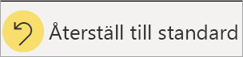

# Ändra hur ett diagram sorteras i en Power BI-rapport
I en Power BI-rapport kan du sortera de flesta visualiseringar alfabetiskt efter namnen på kategorierna i diagrammet eller efter de numeriska värdena i varje kategori. Det här diagrammet sorteras exempelvis på kategorin **butiksnamn**.

Det är enkelt att ändra sorteringen från en kategori (lagernamn) till ett värde (försäljning per kvadratmeter) i stället.

1. Välj ellipsen (...) och **Sortera efter försäljning per kvadratfot**.
2. Om det behövs väljer du ellipsen igen och sedan **Sortera fallande**.

   

> [!NOTE]
> Det går inte att sortera alla visuella objekt. Till exempel går det inte att sortera följande visuella objekt: trädkarta, karta, koropletkarta, punktdiagram, mätare, kort och vattenfall.

## Spara dina ändringar av sorteringsordningen
De filter, utsnitt, sorteringar och andra datavisningsändringar som du gör sparas i Power BI-rapporterna. Ändringarna finns alltså kvar om du lämnar rapporten och kommer tillbaka senare.  Om du vill återställa ändringarna till rapportdesignerns inställningar väljer du **Återställ till standard** i det övre menyfältet. 

Om knappen **Återställ till standard** är nedtonad betyder det att rapportdesignern har inaktiverat möjligheten att spara ändringarna.

## Sortera med andra kriterier
Ibland kan du vilja sortera ditt visuella objekt på ett annat fält eller med andra kriterier.  Du kan t.ex. sortera efter månad (i stället för alfabetisk ordning), eller med heltal i stället för siffra (exempelvis 0, 1, 9, 20 och inte 0, 1, 20, 9).  

I vissa fall kan du sortera det visuella objektet som du vill, exempelvis på månad.  Om det inte går kan det bero på att datauppsättningen bakom rapporten behöver ändras. Be rapportdesignern att uppdatera datauppsättningen.

## Nästa steg
Mer om [Visualiseringar i Power BI-rapporter](end-user-visualizations.md).

[Power BI – grundläggande begrepp](end-user-basic-concepts.md)
