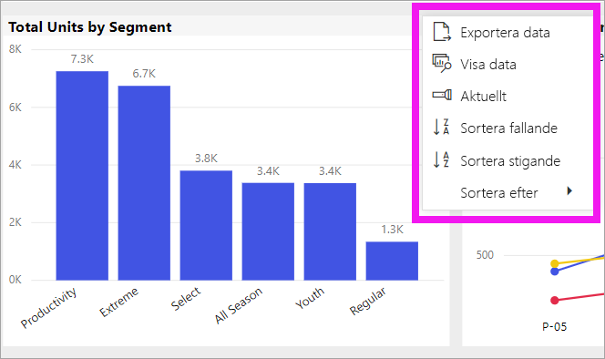
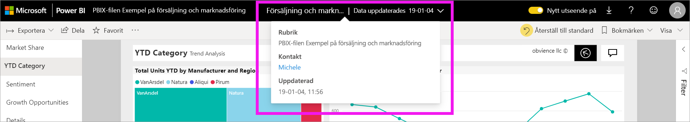

# Ändra hur ett diagram sorteras i en Power BI-rapport

[!INCLUDE[consumer-appliesto-ynnn](../includes/consumer-appliesto-ynnn.md)]

> [!IMPORTANT]
> **Den här artikeln är avsedd för Power BI-användare som inte har redigeringsbehörigheter för rapporten eller datamängden, och som endast fungerar i onlineversionen av Power BI (Power BI-tjänsten). Om du är rapport*designer*, *administratör* eller *ägare*, så erbjuder kanske inte den här artikeln all information du behöver. Läs då istället [Sortera efter kolumn i Power BI Desktop](../create-reports/desktop-sort-by-column.md)** .

I Power BI-tjänsten kan du ändra utseendet för ett visuellt objekt genom att sortera det enligt olika datafält. Genom att ändra sorteringen för ett visuellt objekt kan du framhäva den information du vill förmedla. Oavsett om du använder numeriska data (som försäljningssiffror) eller textdata (som namn på delstater) kan du sortera dina visuella objekt som det passar dig. Power BI ger stor flexibilitet gällande sortering och du kan använda olika snabbmenyer. 

Det går inte att sortera visuella objekt på en instrumentpanel. Men i en Power BI-rapport kan du sortera de flesta visuella objekt ett och ibland två fält i taget. För vissa typer av visuella objekt är sortering inte tillgänglig överhuvudtaget: trädkartor, mätare, kartor osv. 

## Kom igång

Börja med att öppna valfri rapport som har delats med dig. Välj ett visuellt objekt (som kan sorteras) och välj **Fler åtgärder** (...).  Det finns tre sorteringsalternativ: **Sortera fallande**, **Sortera stigande** och **Sortera efter**. 
    

### Sortera alfabetiskt eller numeriskt

Du kan sortera visuella objekt alfabetiskt efter textnamnen på kategorierna i det visuella objektet, eller efter de numeriska värdena i respektive kategori. Det här diagrammet är till exempel sorterat efter kategorin för **butiksnamn** längs X-axeln.

Det är enkelt att ändra sorteringen från en kategori (lagernamn) till ett värde (försäljning per kvadratmeter) i stället. Välj **Fler åtgärder** (...) och sedan **Sortera efter**. Välj ett numeriskt värde som används i det visuella objektet.  I det här exemplet har vi valt **Sales Per Sq Ft**.

Om det behövs kan du ändra sorteringsordningen mellan stigande och fallande.  Välj **Fler åtgärder** (...) igen och välj **Sortera fallande** eller **Sortera stigande**. Fältet som används för sortering visas i fetstil och med ett gult fält.

   

> [!NOTE]
> Det går inte att sortera alla visuella objekt. Till exempel går det inte att sortera följande visuella objekt: trädkarta, karta, koropletkarta, punktdiagram, mätare, kort och vattenfall.

## Sortera efter flera kolumner
Data i den här tabellen sorteras efter **Antal kunder**.  Vi vet detta på grund av den lilla pilen under ordet *Antal*. Pilen pekar nedåt vilket innebär att kolumnen sorteras i *fallande* ordning.

Om du vill lägga till fler kolumner i sorteringsordningen, så Skift-klicka på den kolumnrubrik som du vill lägga till härnäst i sorteringsordningen. Om du exempelvis klickar på **Antal kunder** och sedan Skift-klickar på **Totala intäkter**, så sorteras tabellen först efter antal kunder och sedan efter intäkter. Den röda konturen visar områden där sorteringsordningen har ändrats.

Om du Skift-klickar en andra gång i samma kolumn ändras sorteringsriktningen för den kolumnen. Om du Skift-klickar på en kolumn som du tidigare har lagt till i sorteringsordningen flyttas den kolumnen längst tillbaka i sorteringsordningen.

## Spara dina ändringar av sorteringsordningen
De filter, utsnitt, sorteringar och andra datavisningsändringar som du gör sparas i Power BI-rapporterna – även om du arbetar i [läsvyn](end-user-reading-view.md). Om du navigerar bort från en rapport och sedan kommer tillbaka så har dina sorteringsändringar sparats.  Om du vill återställa ändringarna till rapport*designerns* inställningar väljer du **Återställ till standard** i det övre menyfältet. 

Om knappen **Återställ till standard** däremot är nedtonad innebär det att *rapportdesignern* har inaktiverat möjligheten att spara dina ändringar.

## Överväganden och felsökning

### Sortera med andra kriterier
Ibland kan du vilja sortera ditt visuella objekt efter ett annat fält (som inte ingår i det visuella objektet) eller något annat villkor.  Du kan till exempel sortera efter månad i sekvens (i stället för alfabetiskt), eller efter heltal snarare än siffror (så att det blir 0, 1, 9, 20 och inte 0, 1, 20, 9).  

Det är bara den som designat rapporten som kan göra de här ändringarna åt dig. Du hittar kontaktuppgifter till *designern* genom att välja rapportnamnet i rubrikfältet.

Om du är *designer* och har redigeringsbehörigheter till innehållet, så läs [Sortera efter kolumn i Power BI Desktop](../create-reports/desktop-sort-by-column.md) om du vill veta mer om hur man uppdaterar datamängden och aktiverar den här typen av sortering.

## Nästa steg
Du hittar mer i [Visualiseringar i Power BI-rapporter](end-user-visualizations.md).

[Power BI – grundläggande begrepp](end-user-basic-concepts.md)
