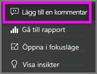
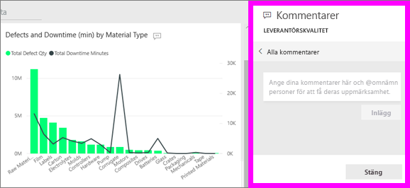
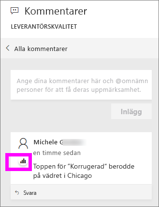
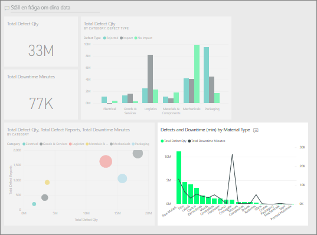

# Lägga till kommentarer i en instrumentpanel
Lägg till en personlig kommentar eller starta en konversation om en instrumentpanel med dina kollegor. **Kommentarsfunktionen** är bara ett exempel på hur en *användare* kan samarbeta med andra. 

## Hur du använder kommentarsfunktionen
Kommentarer kan läggas till i en hel instrumentpanel eller i enskilda visuella objekt på en instrumentpanel. Lägg till en allmän kommentar eller en kommentar riktad till specifika kollegor.  

### Lägga till en allmän kommentar på instrumentpanelen
1. Öppna en Power BI-instrumentpanel och välj ikonen **Kommentarer**. Då öppnas dialogrutan Kommentarer.

    

    Här ser vi att skaparen av instrumentpanelen redan har lagt till en allmän kommentar.  Alla med åtkomst till instrumentpanelen kan se den här kommentaren.

    

2. Svara genom att välja **Svara**, skriva svaret och välja **Publicera**.  

    

    Som standard dirigerar Power BI ditt svar till de kollegor som startade kommentarstråden, i det här fallet Aaron F. 

    

 3. Om du vill lägga till en instrumentpanelskommentar som inte är en dela av en befintlig tråd skriver du kommentaren i det övre textfältet.

    

    Kommentarerna för den här instrumentpanelen ser nu ut så här.

    

### Lägga till en kommentar för ett visst visuellt objekt på instrumentpanelen
1. Hovra över det visuella objektet och välj ellipsen (...).    
2. Välj **Lägg till en kommentar** i listrutan.

      

3.  Dialogrutan **Kommentarer** öppnas. Det visuella objektet har inga kommentarer än. 

      

4. Skriv kommentaren och välj sedan **Publicera**.

      

    Diagramikonen  meddela om den här kommentaren är knuten till ett specifikt visuellt objekt. Välj ikonen för att markera det relaterade visuella objektet på instrumentpanelen.

    

5. Välj **Stäng** för att återgå till instrumentpanelen eller rapporten.

### Få kollegornas uppmärksamhet genom att använda @-tecknet
Oavsett om du skapar instrumentpanelskommentarer för ett visst visuellt objekt kan du fånga kollegornas uppmärksamhet med hjälp av @-tecknet.  När du skriver @-tecknet öppnar Power BI en listruta där du kan söka efter och välja användare från din organisation. Alla verifierade namn med @-tecknet först visas i blått. 

Det här är en konversation jag har med *visualiseringsdesignern*. Han använder @-tecknet för att försäkra sig om att jag ser kommentaren. Jag vet att den här kommentaren är avsedd för mig. När jag öppnar den här appen i Power BI väljer jag **Kommentarer** i rubriken. Vår konversation visas i **kommentarsfönstret**.

  

## Nästa steg
Tillbaka till [visualiseringar för användare](end-user-visualizations.md)    
<!--[Select a visualization to open a report](end-user-open-report.md)-->