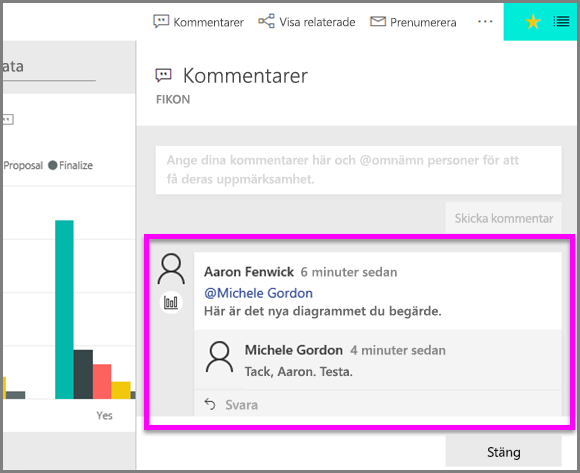

# Lägga till kommentarer i en visualisering
Lägg till en personlig kommentar eller starta en konversation om en visualisering med dina kollegor. **Kommentarsfunktionen** är bara ett exempel på hur en *användare* kan interagera med en visualisering. 

## Hur du använder kommentarsfunktionen

1. Hovra över visualiseringen och välj ellipsen (...).    
2. Välj **Lägg till en kommentar** i listrutan.

      

3.  Skriv kommentaren och välj sedan **Skicka kommentar**. Det här är en kommentar till mig själv, med en felstavning.

      

4. Det här är en konversation jag har med *visualiseringsdesignern*. Han använder @-tecknet för att försäkra sig om att jag ser kommentaren. Jag vet att den här kommentaren är avsedd för mig. När jag öppnar den här appen i Power BI väljer jag **Kommentarer** i rubriken. Vår konversation visas i **kommentarsfönstret**. 

      

5. Klicka på **Stäng** för att återgå till instrumentpanelen eller rapporten.

## Nästa steg
Tillbaka till [visualiseringar för användare](end-user-visualizations.md)    
<!--[Select a visualization to open a report](end-user-open-report.md)-->