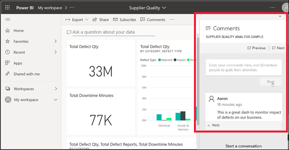

# Lägga till kommentarer på en instrumentpanel eller i en rapport

[!INCLUDE[consumer-appliesto-ynny](../includes/consumer-appliesto-ynny.md)]

[!INCLUDE [power-bi-service-new-look-include](../includes/power-bi-service-new-look-include.md)]

Lägg till en personlig kommentar eller starta en konversation om en instrumentpanel eller en rapport med dina kollegor. **Kommentarsfunktionen** är bara ett exempel på hur en *användare* kan samarbeta med andra. 

> [!NOTE]
> När du ska samarbeta med andra, till exempel om du vill lägga till kommentarer i delade rapporter, behöver du en Power BI Pro- eller Premium-licens. [Vilken licenstyp har jag?](end-user-license.md)

## Hur du använder kommentarsfunktionen
Kommentarer kan läggas till på en hel instrumentpanel, i enskilda visuella objekt på en instrumentpanel, på en rapportsida, i en sidnumrerad rapport samt i enskilda visuella objekt på en rapportsida. Lägg till en allmän kommentar eller en kommentar riktad till specifika kollegor.  

När du lägger till en kommentar i en rapport hämtar Power BI de aktuella filter- och utsnittsvärdena och skapar ett [bokmärke](end-user-bookmarks.md). Det innebär att när du väljer eller svarar på en kommentar så kan rapportsidan eller rapportens visuella objekt ändras till att visa de filter- och utsnittsval som var aktiva när kommentaren först lades till.  

Varför är det här viktigt? Anta att en kollega använde ett filter som gav en intressant insikt som kollegan vill dela med teamet. Utan det filtret skulle kommentaren kanske inte ge någon tydlig information.

Om du använder en sidnumrerad rapport kan du endast lämna en allmän kommentar om rapporten.  Du kan inte lämna kommentarer till enskilda visuella objekt i sidnumrerade rapporter.

### Lägga till en allmän kommentar på en instrumentpanel eller i en rapport
Processen för att lägga till kommentarer på en instrumentpanel liknar den där du lägger till i en rapport.  I det här exemplet använder vi en instrumentpanel. 

1. Öppna en Power BI-instrumentpanel eller en rapport och välj ikonen **Kommentarer**. Då öppnas dialogrutan Kommentarer.

    

    Här ser vi att skaparen av instrumentpanelen redan har lagt till en allmän kommentar.  Alla med åtkomst till instrumentpanelen kan se den här kommentaren.

    

2. Svara genom att välja **Svara**, skriva svaret och välja **Publicera**.  

    

    Som standard dirigerar Power BI ditt svar till de kollegor som startade kommentarstråden, i det här fallet Aaron. 

    

 3. Om du vill lägga till en kommentar som inte ingår i en befintlig tråd skriver du kommentaren i det övre textfältet.

    

    Kommentarerna för den här instrumentpanelen ser nu ut så här.

    

### Lägga till en kommentar i ett visst visuellt objekt på en instrumentpanel eller i en rapport
Utöver att lägga till kommentarer på en hel instrumentpanel eller en hel rapportsida kan du lägga till kommentarer i enskilda instrumentpanelsrutor och enskilda visuella objekt i rapporter. Processerna liknar varandra, och i det här exemplet använder vi en rapport.

1. Hovra över det visuella objektet och välj **Fler alternativ** (...).    
2. Välj **Öppna kommentarer** i listrutan.

      

3.  Dialogrutan **Kommentarer** öppnas och de andra visuella objekten på sidan är gråtonade. Det visuella objektet har inga kommentarer än. 

      

4. Skriv kommentaren och välj sedan **Publicera**.

      

    - På en rapportsida kan du välja en kommentar som gjorts på ett visuellt objekt för att markera det visuella objektet (se ovan).

    - På en instrumentpanel visas diagramikonen  meddela om en kommentar är knuten till ett specifikt visuellt objekt. Kommentarer som gäller för hela instrumentpanelen har ingen särskild ikon. Om du väljer diagramikonen markeras det relaterade visuella objektet på instrumentpanelen.
    

    

5. Välj **Stäng** för att återgå till instrumentpanelen eller rapporten.

### Få kollegornas uppmärksamhet genom att använda @-tecknet
Oavsett om du skapar en kommentar för instrumentpanel, rapport, ruta eller visuellt objekt kan du fånga kollegornas uppmärksamhet med hjälp av ”\@”-tecknet.  När du skriver ”\@”-tecknet öppnar Power BI en listruta där du kan söka efter och välja personer från din organisation. Alla verifierade namn med \@-tecknet först visas i blått. Personer med @mentioned får omedelbart ett e-postmeddelande i inkorgen, och om de använder en Power BI Mobile-app får de ett push-meddelande på enheten. De kan öppna kommentaren direkt från meddelandet, visa data och svara på lämpligt sätt.

Det här är en konversation jag har med *visualiseringsdesignern*. Den personen använder @-tecknet för att försäkra sig om att jag ser kommentaren. Jag får ett meddelande och väljer länken för att öppna den här instrumentpanelen och relevant konversation.  

  

## Överväganden och felsökning

- Bokmärken samlas inte in när du svarar på en konversation. Det är bara den första kommentaren i en konversation som skapar ett bokmärke.

## Nästa steg
Tillbaka till [visualiseringar för användare](end-user-visualizations.md)    
<!--[Select a visualization to open a report](end-user-open-report.md)-->
