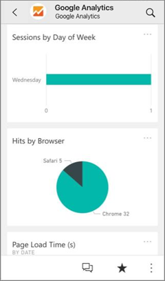
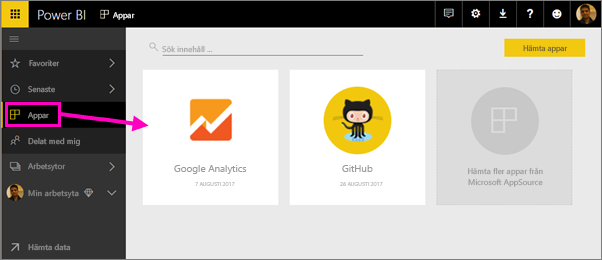
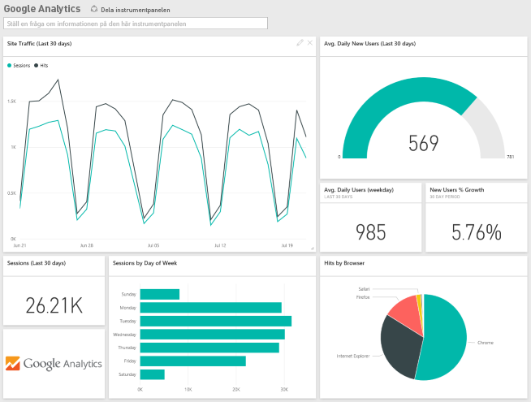
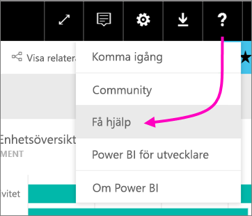

# Ansluta till de tjänster du använder med Power BI

När du har installerat appen kan du visa instrumentpanelen och rapporterna i Power BI-tjänsten ([https://powerbi.com](https://powerbi.com)) och i Power BI-mobilapparna. 

## Kom igång
[!INCLUDE [powerbi-service-apps-get-more-apps](.././includes/powerbi-service-apps-get-more-apps.md)]

## Visa instrumentpanelen och rapporterna
När importen är klar visas den nya appen på sidan Appar.

1. Välj **Appar** i det vänstra navigeringsfönstret > välj appen.
   
     
2. Du kan ställa en fråga genom att skriva i Frågor och svar eller klicka på en panel för att öppna den underliggande rapporten. 
   
    
   
    Du kan filtrera och markera data i rapporten, men du kan inte spara dina ändringar.

## Det här ingår
När du har anslutit till en tjänst, kan du se en nyligen skapad app med en instrumentpanel, rapporter och datauppsättning. Data från tjänsten fokuserar på ett specifikt scenario och det kan hända att inte all information från tjänsten finns med. Data uppdateras automatiskt en gång per dag. Du kan styra schemat genom att välja datauppsättningen.

Mer information om hur du ansluter till särskilda tjänster finns på de enskilda hjälpsidorna.

## Felsökning
**Tomma paneler**  
Medan Power BI först ansluter till tjänsten, kan du se en tom uppsättning paneler på instrumentpanelen. Om du fortfarande ser en tom instrumentpanel efter två timmar, har anslutningen sannolikt misslyckats. Öppna ett supportärende om du inte ser något felmeddelande med information om att korrigera problemet.

* Välj frågetecken-ikonen (**?**) i det övre högra hörnet > **Få hjälp**.
  
    

**Information som saknas**  
Instrumentpanelen och rapporterna består av innehåll från tjänsten som fokuserar på ett specifikt scenario och innehåller inte all information från tjänsten. Om det finns ett särskilt mått som du inte kan se i innehållspaketet, kan du lägga till en idé om det på [Power BI-supportsidan](https://support.powerbi.com/forums/265200-power-bi).

## Föreslå tjänster
Använder du en tjänst som du vill föreslå för Power BI-appen? Gå till [Power BI-supportens sida](https://support.powerbi.com/forums/265200-power-bi) och berätta för oss.

Har du en tjänst som du vill skapa en app för? [Skicka in din kandidat](https://azure.microsoft.com/marketplace/programs/certified/apply/) och välj ”Publicera ett Power BI-innehållspaket” för att komma igång.

## Nästa steg
* [Vad är appar i Power BI?](../service-install-use-apps.md)
* [Hämta data i Power BI](../service-get-data.md)
* Har du fler frågor? [Fråga Power BI Community](http://community.powerbi.com/)

