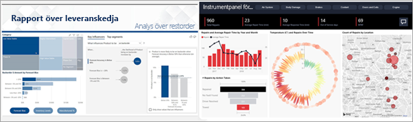
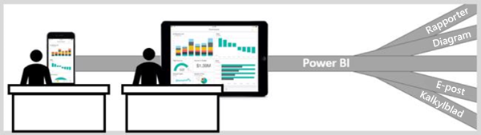

# Power BI-tjänsten för konsumenter

[!INCLUDE[consumer-appliesto-ynny](../includes/consumer-appliesto-ynny.md)]

Du lever i en datakultur där affärsbeslut baseras på fakta, och inte på åsikter. Du behöver data för att kunna fatta dessa beslut, och dina kollegor hjälper dig gärna.     
 
De skickar dig alla typer av rapporter, kalkylblad, e-postmeddelanden med diagram och till och med utskrivet informationsmaterial. Ju mer data du samlar in desto svårare blir det att snabbt hitta vad du behöver, och du oroar dig för att du inte använder dig av den mest aktuella informationen.  
 

## Power BI-tjänsten för *konsumenter*

Power BI gör jobbet enklare samtidigt som det ger större effekt. Alla dessa data blir till diagram och grafer som visualiserar dina data åt dig. I stället för långa listor eller tabeller med siffror och ord blir dina datainsikter ***snygga*** – färgglada och fängslande visuella objekt som redovisar de kunskaper som ryms i dina data. 

 
Det enda du behöver göra är att öppna Power BI-tjänsten i en webbläsare eller på en mobil enhet. Du och dina kollegor arbetar från samma betrodda instrumentpaneler och rapporter, som uppdateras automatiskt, vilket innebär att du alltid arbetar med det senaste innehållet.   

Eftersom innehållet inte är statiskt kan du studera trender, insikter och annan företagsinformation närmare. Segmentera och blanda innehållet – du kan till och med ställa frågor till det med dina egna ord. Eller luta dig tillbaka och låt dina data upptäcka intressanta insikter åt dig; skicka aviseringar när data ändras och skicka rapporter via e-post till dig enligt ett schema som du själv anger. Det här gäller alla dina data, när som helst, i molnet eller lokalt och från valfri enhet. Det här är bara några exempel på allt som Power BI kan göra. 

## Är jag en Power BI-*konsument*?

Hur du interagerar med Power BI beror på din arbetsroll. Som slutanvändare eller *konsument* är du den som tar emot innehåll (instrumentpaneler, rapporter och appar) från kollegorna. Du arbetar i online- eller mobilversionen av Power BI, som kallas för Power BI-tjänsten, där du granskar och interagerar med innehållet för att fatta affärsbeslut. 
   
Som konsument har du inte tillgång till alla funktioner i Power BI, men du har heller inget behov av att kunna skapa instrumentpaneler eller rapporter. Du kommer att använda Power BI-tjänsten till analys, övervakning, utforskning och beslutsfattande. 

Du kommer säkerligen att höra termen ”Power BI Desktop” eller bara ”Desktop”, och det här är ett fristående verktyg som används av de *designers* som skapar och delar instrumentpaneler och rapporter med dig.  Det är viktigt att veta att det finns andra Power BI-verktyg, men som användare arbetar du bara med Power BI-tjänsten. 

Och eftersom du arbetar med *delat* innehåll är en **kostnadsfri** licens allt du behöver när du arbetar i en organisation som använder **Premium**-kapacitet. [Vilken licens har jag?](end-user-license.md)

## Interagera på ett säkert sätt med innehåll 
När du filtrerar, gör utsnitt och exporterar behöver du inte oroa dig – ditt arbete påverkar inte den underliggande datauppsättningen eller det ursprungliga delade innehållet (instrumentpaneler, rapporter och appar).  

Du kan inte förstöra dina data.  Power BI är en bra plats där du kan utforska och experimentera, utan att du behöver oroa dig för att ”förstöra” något.  
 
Det betyder inte att du inte kan spara dina ändringar – det kan du. Men de ändringarna påverkar bara din vy över innehållet. Och att återgå till den ursprungliga standardvyn är lika enkelt som att klicka på en knapp.  

## Nästa steg

[Få en genomgång av Power BI-tjänsten för användare](end-user-reading-view.md)    
[Utbildning i Power BI-tjänsten för konsumenter](https://docs.microsoft.com/learn/paths/consume-data-with-power-bi/)    
[Termer och begrepp för Power BI-*användare*](end-user-basic-concepts.md)    

