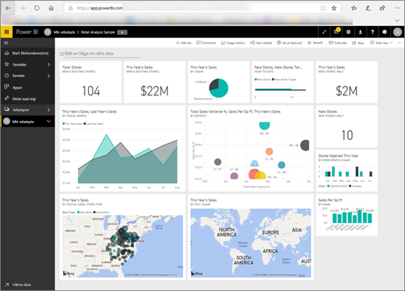

<!-- fold this topic into existing topics -->
# Power BI för konsumenter
Hur du interagerar med Power BI beror på din arbetsroll. Som *slutanvändare* eller *konsument* är du den som tar emot instrumentpaneler, rapporter och appar från kollegorna. Du arbetar i ***Power BI-tjänsten*** med att granska och interagera med innehållet i syfte att kunna fatta välgrundade affärsbeslut.

Om du är nybörjare på Power BI kan vi rekommendera att du först läser igenom [översikten över Power BI](../power-bi-overview.md). Där får du lära dig mer om den verktygsuppsättning som ingår i Power BI.

Som konsument har du inte tillgång till alla funktioner i Power BI, men du har heller inget behov av att kunna skapa instrumentpaneler eller rapporter. Ditt jobb är att använda Power BI till analys, övervakning, utforskning och beslutsfattande.

När du läser igenom artiklarna för konsumenter får du lära dig terminologin, du får en genomgång av Power BI-tjänsten, du får veta hur du gör för att navigera till innehåll och du får lär dig hur du interagerar med innehållet.  Nu kör vi igång!

## Nästa steg

[Termer och begrepp för Power BI-*användare*](end-user-basic-concepts.md)

<!-- [Get started guide for *consumers*] -->
[Komma igång med Power BI-tjänsten](../service-get-started.md)

