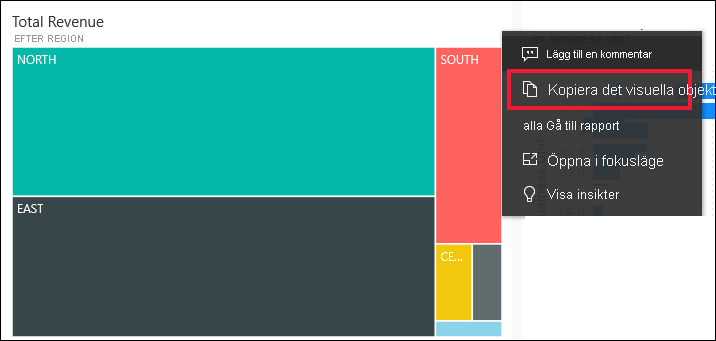
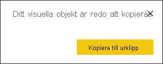
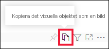
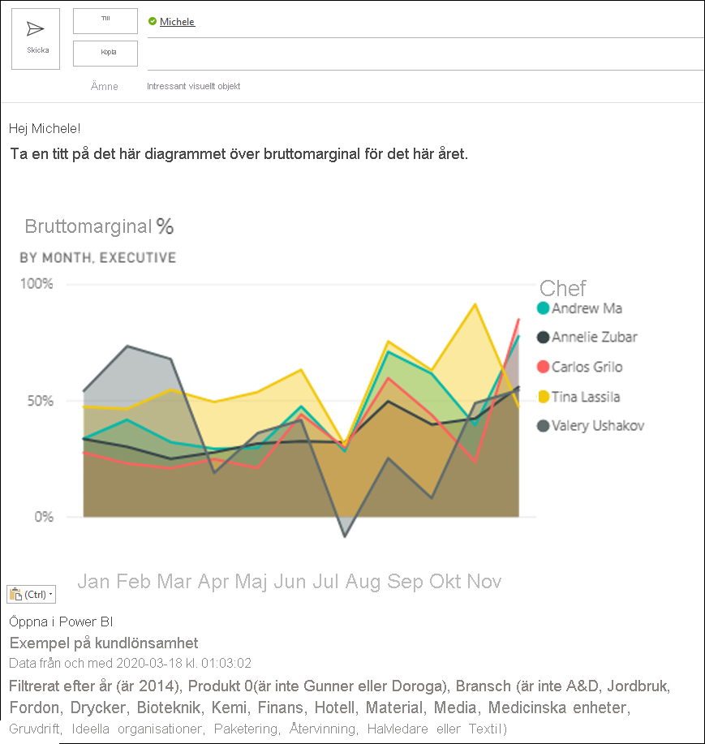
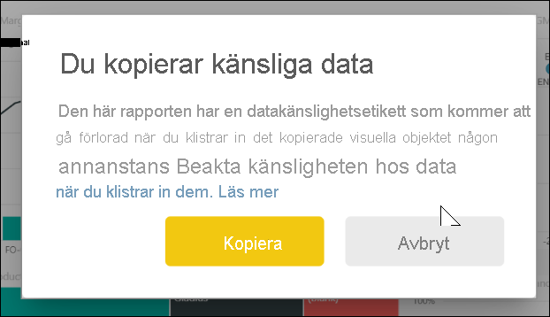
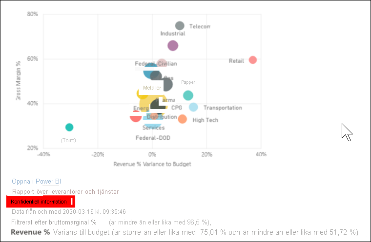
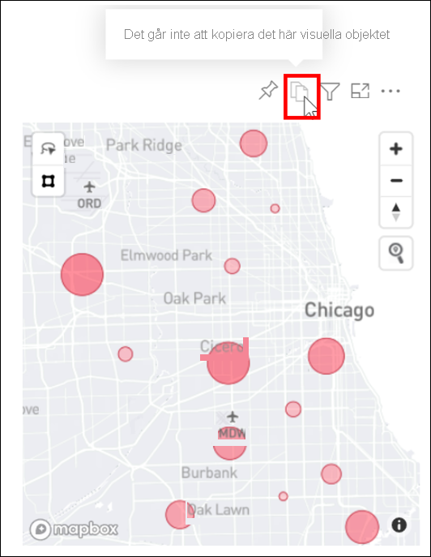

# Kopiera ett visuellt objekt som en bild till Urklipp

[!INCLUDE[consumer-appliesto-yyyn](../includes/consumer-appliesto-yyyn.md)]

Har det hänt att du velat dela en bild från en Power BI-rapport eller en instrumentpanel? Nu kan du kopiera det visuella objektet och klistra in det i andra program som har stöd för inklistring. 

När du kopierar en statisk bild av ett visuellt objekt får du en kopia av det visuella objektet samt metadata. Det här omfattar:
* länk tillbaka till Power BI-rapporten eller instrumentpanelen
* rubrik för rapporten eller instrumentpanelen
* meddelande om bilden innehåller konfidentiell information
* tidstämpel för senaste uppdatering
* filter som tillämpas på det visuella objektet

### Kopia från en instrumentpanelsruta

1. Gå till den instrumentpanel som du vill kopiera från.

2. I det övre högra hörnet av det visuella objektet väljer du **Fler alternativ (...)** och sedan **Kopiera visuellt objekt som bild**. 

    

3. När dialogrutan **Ditt visuella objekt är redo att kopieras** visas väljer du **Kopiera till Urklipp**.

    

4. När det visuella objektet är redo klistrar du in det i ett annat program genom att trycka på **Ctrl + V** eller högerklicka > Klistra in. I skärmbilden nedan har vi klistrat in det visuella objektet i Microsoft Word. 

    

### Kopiera från ett visuellt rapportobjekt 

1. Gå till den rapport som du vill kopiera från.

2. I det övre högra hörnet av det visuella objektet väljer du ikonen för **Kopiera visuellt objekt som bild**. 

    

3. När dialogrutan **Ditt visuella objekt är redo att kopieras** visas väljer du **Kopiera till Urklipp**.

    

4. När det visuella objektet är redo klistrar du in det i ett annat program genom att trycka på **Ctrl + V** eller högerklicka > Klistra in. I skärmbilden nedan har vi klistrat in det visuella objektet i ett e-postmeddelande.

    

5. Om det finns en datakänslighetsetikett tillämpad på rapporten visas en varning när du väljer kopieringsikonen.  

    

    Dessutom läggs en känslighetsetikett till i metadata nedanför det inklistrade visuella objektet. 

    

## Överväganden och felsökning

   

F: Varför är kopieringsikonen inaktiverad i ett visuellt objekt?    
S: Vi stöder för tillfället inbyggda visuella Power BI-objekt och certifierade visuella objekt. Det finns begränsat stöd för vissa visuella objekt, inklusive: 
- ESRI och andra kartvisualiseringar 
- Visuella Python-objekt 
- R-visualiseringar 
- PowerApps    

S: Möjligheten att kopiera ett visuellt objekt kan stängas av av IT-avdelningen eller Power BI-administratören.

F: Varför klistras mitt visuella objekt inte in på rätt sätt?    
S: Det finns begränsningar för anpassade visuella objekt och animerade visuella objekt. 

## Nästa steg
Mer om [Visualiseringar i Power BI-rapporter](end-user-visual-type.md)

Har du fler frågor? [Prova Power BI Community](https://community.powerbi.com/)

