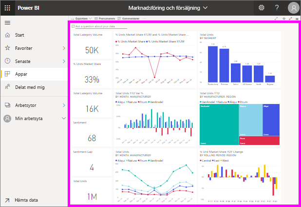

# Visa en instrumentpanel

[!INCLUDE[consumer-appliesto-ynny](../includes/consumer-appliesto-ynny.md)]

[!INCLUDE [power-bi-service-new-look-include](../includes/power-bi-service-new-look-include.md)]

Power BI-*användare* tillbringar mycket tid framför instrumentpaneler. Instrumentpaneler är utformade för att fokusera på specifik information från de underliggande rapporterna och datauppsättningarna. Och Power BI-konsumenter använder denna information för att spåra, övervaka, svara på frågor, testa med mera, för att kunna fatta datadrivna affärsbeslut.

Du behöver Power BI Pro både för att dela en instrumentpanel och att visa delade instrumentpaneler. [Vilken licens har jag?](end-user-license.md) 

## Öppna en instrumentpanel

|              |         |
|------------|--------------------------------|
|      |Instrumentpaneler kan öppnas från många olika platser i Power BI-tjänsten.   Sök efter den här instrumentpanelsikonen. När du har hittat en  instrumentpanel är det enkelt att öppna den, välj den bara så visas den på Power BI-arbetsytan. |
|                    |          |

Det kan finnas instrumentpaneler i alla containrar i navigeringsfönstret. 

- **Start** 
- **Favoriter** – om du har [angett en instrumentpanel som en favorit](end-user-favorite.md)
- **Senaste** – om du nyligen har besökt en instrumentpanel
- **Appar** – de flesta appar innehåller både instrumentpaneler och rapporter
- **Delat med mig** – om en kollega har [delat en instrumentpanel med dig](end-user-shared-with-me.md)
- **Min arbetsyta** – om du har laddat ned något av [Power BI-exemplen](../sample-datasets.md)

## Nästa steg
* Bekanta dig med instrumentpaneler genom att ta en titt på ett av våra [exempel](../sample-tutorial-connect-to-the-samples.md).    
* Lär dig mer om [panelerna](end-user-tiles.md) och vad som händer när du väljer en.