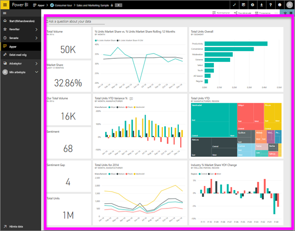

# Visa en instrumentpanel
Power BI-användare tillbringar mycket tid framför instrumentpaneler. Instrumentpaneler är utformade för att fokusera på specifik information från de underliggande rapporterna och datauppsättningarna. Och Power BI-konsumenter använder denna information för att spåra, övervaka, svara på frågor, testa med mera, för att kunna fatta datadrivna affärsbeslut.

Power BI Pro krävs för att både dela en instrumentpanel och visa en delad instrumentpanel.

## Öppna en instrumentpanel
Instrumentpaneler kan öppnas från olika platser i Power BI-tjänsten.  Nyckeln är att räkna ut vilka innehåll som är en instrumentpanel (till skillnad från en rapport, till exempel). När du har identifierat en instrumentpanel är det enkelt att öppna den – klicka bara på instrumentpanelen så fylls Power BI-arbetsytan i.

|              |         |
|------------|--------------------------------|
|      |Det enklaste sättet att identifiera en instrumentpanel är att leta efter denna  instrumentpanelikon. När du hittar innehåll med den här ikonen markerar du det för att öppna instrumentpanelen. |
|                    |          |

 

<!--insert aGIF-->

Du kan hitta instrumentpaneler i alla behållare i det vänstra navigeringsfältet. 
- **Start** (förhandsversion)
- **Favoriter** – om du har [angett en instrumentpanel som en favorit](end-user-favorite.md)
- **Senaste** – om du nyligen har besökt en instrumentpanel
- **Appar** – de flesta appar innehåller både instrumentpaneler och rapporter
- **Delat med mig** – om en kollega har [delat en instrumentpanel med dig](end-user-shared-with-me.md)
- **Min arbetsyta** – om du har laddat ned något av [Power BI-exemplen](../sample-datasets.md)

## Nästa steg
* Bekanta dig med instrumentpaneler genom att ta en titt på ett av våra [exempel](../sample-tutorial-connect-to-the-samples.md).
* Lär dig mer om [panelerna](end-user-tiles.md) och vad som händer när du väljer en.
* Vill du spåra en enskild panel på instrumentpanelen och får ett e-postmeddelande när den når ett visst tröskelvärde? [Skapa aviseringar för paneler](end-user-alerts.md).
* Roa dig med att ställa frågor till instrumentpanelen. Lär dig hur du använder [Power BI:s frågor och svar](end-user-q-and-a.md) för att ställa en fråga om dina data och få ett svar i form av en visualisering. 