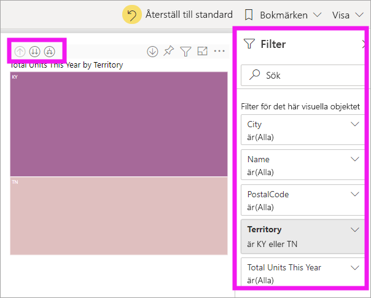
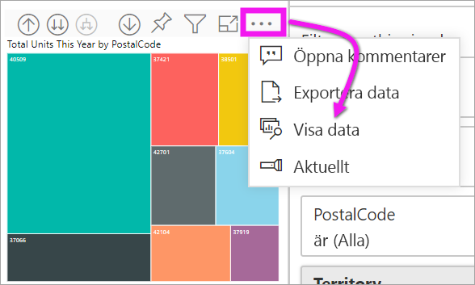

# Granskningsläge i ett visuellt objekt i Power BI

[!INCLUDE [power-bi-service-new-look-include](../includes/power-bi-service-new-look-include.md)]

Den här artikeln beskriver hur du ökar detaljnivån i ett visuellt objekt i Microsoft Power BI-tjänsten. Genom att öka och minska detaljnivån för dina datapunkter, kan du utforska detaljerad information om dina data. 

## Detaljgranskning kräver en hierarki

När en visualisering har en hierarki kan du öka detaljnivån till att visa ytterligare information. Du kan till exempel ha ett visuellt objekt som kontrollerar OS-medaljantal enligt en hierarki som består av sport, gren och evenemang. Som standard visar det visuellt objektet medaljantal efter sport: gymnastik, skidåkning, vattensport osv. Men eftersom den har en hierarki, skulle val av ett av de visuella elementen (till exempel ett stapel-, linje- eller bubbeldiagram), visa en allt mer detaljerad bild. Om du väljer elementet **vattensporter** visas data för simning, simhopp och vattenpolo.  Om du väljer elementet **simhopp** visas detaljer för trampolin, plattform och synkroniserade simhopp.

Datum är en unik typ av hierarki.  Rapportdesigners lägger ofta till datum-hierarkier i visuella objekt. En vanlig datumhierarki kan till exempel innehålla år, kvartal, månad och dag. 

## Räkna ut vilka visuella objekt som kan detaljgranskas
Är du osäker på vilka visuella Power BI-objekt som innehåller en hierarki? Hovra över ett visuellt objekt. Om du ser en kombination av dessa granskningskontroller längst upp har det visuella objektet en hierarki.

  

## Lär dig hur du ökar/minskar detaljnivån

I det här exemplet använder vi en trädkarta som har en hierarki som består av område, stad, postnummer och butiksnamn. Trädkartan visar, före granskningen, hur många enheter som sålts totalt den här året per område. 

  

### Tre sätt att få åtkomst till granskningsfunktioner

Det finns två sätt att få åtkomst till funktioner för att öka och minska detaljnivån samt expandera för visuella objekt som har hierarkier. Prova dem och använd den som du gillar mest.

- Det första sättet: Hovra över ett visuellt objekt för att se och använda ikonerna.  

    

- Det andra sättet: Högerklicka på ett visuellt objekt för att visa och använda menyn.

    

## Sökvägar för granskning

### Öka detaljnivån för alla fält på en gång

Det finns olika sätt att granska det visuella objektet mer detaljerat. Om du väljer ikonen för att öka detaljnivån kommer du till nästa nivå i hierarkin. Om du tittar på nivån **Område** för Kentucky och Tennessee kan du öka detaljnivån till stadsnivån för båda delstaterna, sedan postnummernivån för båda delstaterna och slutligen butiknamnsnivån för båda delstaterna. Varje steg i sökvägen visar nya uppgifter.

Välj ikonen för att minska detaljnivån  tills du kommer tillbaka till ”Totalt antal enheter i år efter område”.

### Expandera alla fält samtidigt

**Expandera** lägger till ytterligare en hierarkinivå i den aktuella vyn. Så om du tittar på nivån **Område** kan du expandera och lägga till ort, postnummer och namn i din trädkarta. Varje steg i sökvägen visar samma information och lägger till en nivå med ny information.

Du kan också välja att öka detaljnivån för eller expandera ett fält i taget.

### Öka detaljnivån ett fält i taget

1. Välj ikonen för ökad detaljnivå för att aktivera den .

    Nu kan du öka detaljnivån **ett fält i taget** genom att välja ett visuellt element. Exempel på visuella element är: stapel-, bubbel- eller lövdiagram.

    

    Om du inte slår på ökad detaljnivå på, visas inte en ökad detaljnivå när du väljer ett visuellt element (till exempel ett stapel-, bubbel- eller lövdiagram). I stället korsfiltrerar det de övriga diagrammen på rapportsidan.

1. Välj lövnod för **TN**. Din trädkarta visar nu alla städer och områden i Tennessee som har en butik.

    

1. Nu kan du:

    1. Fortsätta öka detaljnivån för Tennessee.

    1. Öka detaljnivån för en viss stad i Tennessee.

    1. Expandera i stället.

    Låt oss nu fortsätta att öka detaljnivån ett fält i taget.  Välj **Knoxville, TN**. Din trädkarta visar nu postnumren för dina butiker i Knoxville.

    

    Observera att rubriken ändras när du ändrar detaljnivån ner och upp igen.

### Expandera alla och expandera ett fält i taget

En trädkarta som bara visar postnummer är inte användbar.  Så låt oss *expandera* en nivå ned i hierarkin.  

1. Välj ikonen för att expandera ned *expandera ned* med trädkartan aktiverad.  Två nivåer av vår hierarki visas nu i din trädkarta: postnummer och butiksnamn.

    

1. För att se alla fyra hierarkinivåer av data för Tennessee väljer du pilen för att minska detaljnivån tills du når den andra nivån, **totalt antal enheter i år efter område och stad**, för din trädkarta.

    

1. Se till att ökning av detaljnivån fortfarande är aktiverat.  och välj ikonen för att *expandera ned*  Din trädkarta visar nu samma antal löv (rutor), men varje löv har ytterligare information. Istället för att bara visa stad och stat, visas nu även postnumret.

    

1. Välj ikonen *expandera ned* en gång till för att visa alla fyra hierarkinivåer i detalj för Tennessee i din trädkarta. Hovra över en lövnod för att se ytterligare information.

    

## Visa data medan du ändrar detaljnivå
Använd **Visa data** för att se vad som händer bakom kulisserna. Varje gången du ökar detaljnivån eller expanderar visas de data som används för att bygga det visuella objektet när du använder **Visa data**. Detta kan hjälpa dig att förstå hur visuella objekt byggs upp genom en samverkan av hierarkier, detaljgranskning och expansion. 

Välj **Fler alternativ** (...) uppe till höger och sedan **Visa data**. 

I följande tabell visas resultatet av en ökning av detaljnivån för alla fält samtidigt, från område till butiksnamn.  

Observera att summorna är desamma för **Stad**, **Postnummer** och **Namn**. Detta är inte alltid fallet.  Men för dessa data finns endast en butik i varje postnummer och i varje stad.  

## Överväganden och begränsningar
Som standard filtreras inte andra visuella objekt i rapporten när du ändrar detaljnivån. Rapportdesignern kan dock ändra detta standardbeteende. Medan du ändrar detaljnivå ser du om de andra visuella objekten på sidan korsfiltreras eller korsmarkeras.

## Nästa steg

[Visuella objekt i Power BI-rapporter](../visuals/power-bi-report-visualizations.md)

[Power BI-rapporter](end-user-reports.md)

[Power BI – grundläggande begrepp](end-user-basic-concepts.md)

Har du fler frågor? [Prova Power BI Community](https://community.powerbi.com/)
