# Granskningsläge i en visualisering i Power BI

## Detaljgranskning kräver en hierarki
När en visualisering har en hierarki kan du öka detaljnivån till att visa ytterligare information. Du kan till exempel ha en visualisering som kontrollerar OS-medaljantal enligt en hierarki som består av sport, gren och evenemang. Som standard visar visualiseringen medaljantal enligt sport – gymnastik, skidåkning, vattensport osv. Men eftersom den har en hierarki, skulle val av ett av de visuella elementen (till exempel ett stapel-, linje- eller bubbeldiagram), visa en allt mer detaljerad bild. Välj elementet **vattensporter** för att se data för simning, simhopp och vattenpolo.  Välj elementet **simhopp** för att visa detaljer för trampolin, plattform och synkroniserade simhopp.

Du kan lägga till hierarkier till rapporter som du äger men inte till de rapporter som delats med dig.
Är du osäker på vilka Power BI-visualiseringar som innehåller en hierarki?  Hovra över en visualisering och om du ser dessa kontroller för ökad detaljnivå i de övre hörnen, har din visualiseringen en hierarki.

   

Datum är en unik typ av hierarki. När du lägger till ett datumfält i en visualisering lägger Power BI automatiskt till en tidshierarki som innehåller år, kvartal, månad och dag. Mer information finns i [Visuella hierarkier och beteende för ökad detaljnivå](../guided-learning/visualizations.yml?tutorial-step=18) eller titta på videon nedan.

  <iframe width="560" height="315" src="https://www.youtube.com/embed/MNAaHw4PxzE?list=PL1N57mwBHtN0JFoKSR0n-tBkUJHeMP2cP" frameborder="0" allowfullscreen></iframe>

> [!NOTE]
> Om du vill lära dig mer om att skapa hierarkier med hjälp av Power BI Desktop, titta på videon [Hur du skapar och lägger till hierarkier](https://youtu.be/q8WDUAiTGeU)
> 

## Förutsättningar

1. I Power BI-tjänsten eller Desktop krävs en visualisering med en hierarki för ökad detaljnivå. 
   
2. För att följa med ska du [öppna exemplet för detaljhandelsanalys](../sample-datasets.md) och skapa ett trädkartediagram som kontrollerar (värdena) **totala enheter detta år** enligt (grupperna) **Område**, **Stad**, **Postnummer** och **Namn**.  Trädkartan har en hierarki som består av område, stad, postnummer och stadsnamn. Varje område har en eller flera städer, varje stad har ett eller flera postnummer osv. Visualiseringen visar som standard endast områdesdata, eftersom *Område* visas först i listan.
   
   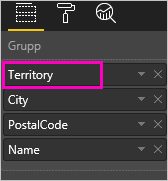

2. Att förstå hur de olika ikonerna för detaljgranskning fungerar tillsammans kan vara förvirrande, så låt oss filtrera trädkartan så att vi bara visar 2 av de mindre områdena: **KY** och **TN**. Välj trädkarta och under **Visuella nivåfilter** expanderar du **Område** och väljer **KY** och **TN**.

    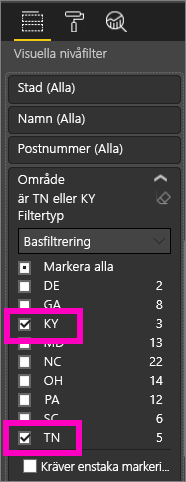    

   Nu visas bara två områden i trädkartan.

   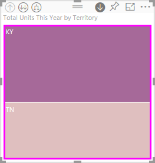

## Tre sätt att få åtkomst till granskningsfunktioner
Det finns flera sätt att få åtkomst till funktioner för att öka och minska detaljnivån samt expandera för visualiseringar som har hierarkier. Den här artikeln visar hur du använder det första alternativet nedan. När du förstår hur man ökar detaljnivån och expanderar kan du uppnå samma sak med alla tre metoderna. Prova och se vilken du föredrar att använda.

- Hovra över en visualisering för att se och använda ikonerna.  

    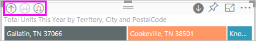

- Högerklicka på en visualisering för att visa och använda menyn.
    
    

- I menyraden Power BI väljer du knappen **Utforska**.

   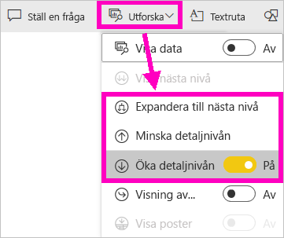

## Sökvägar för granskning
### Ökad detaljnivå
Det finns olika sätt att granska visualiseringen mer detaljerat. ***Öka detaljnivån*** tar dig till nästa nivå i hierarkin, så om du tittar på nivån **Område** kan du öka detaljnivån till nivån Stad och sedan Postnummer och slutligen Namn. Varje steg i sökvägen visar nya uppgifter.

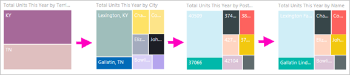

### Expandera

***Expandera*** lägger till ytterligare en hierarkinivå i den aktuella vyn. Så om du tittar på nivån **Område** kan du expandera och lägga till ort, postnummer och namn i din trädkarta. Varje steg i sökvägen visar samma information och lägger till en nivå med ny information.

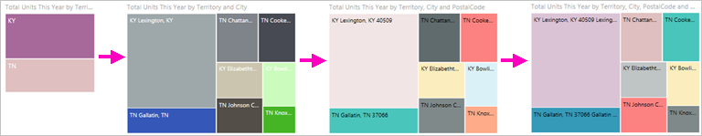

Du kan också välja om du vill öka detaljnivån eller expandera ett fält i taget eller alla fält på en gång. 

## Öka detaljnivån för alla fält på en gång

1. Starta på den översta nivån av trädkartan som visar data för KY och TN. Bredda din trädkarta genom att välja ett handtag och dra det till höger. 

    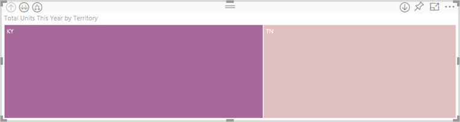 .

2. Om du vill öka detaljnivån för ***alla fält samtidigt*** väljer du dubbelpilen längst upp till vänster i visualiseringen . Din trädkarta visar nu stadsdata för Kentucky och Tennessee. 

    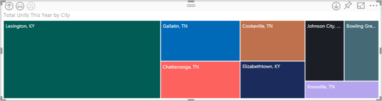
   
5. Öka detaljnivån en gång till, till postnummernivån i hierarkin.

    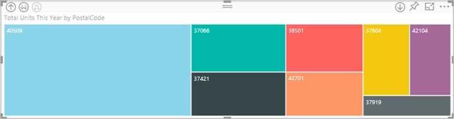

3. Om du vill minska detaljnivån igen väljer du uppåtpilen i det övre vänstra hörnet av visualiseringen .

## Öka detaljnivån ett fält i taget
Den här metoden använder ikonerna för ökad detaljnivå som visas i det övre högra hörnet i själva visualiseringen. 

1. Välj ikonen för ökad detaljnivå för att aktivera den . Nu kan du öka detaljnivån ***ett fält i taget***. 
   
   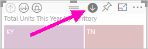

   Om du inte aktiverar den ökade detaljnivån kommer valet av ett visuellt element (t.ex. ett stapel- eller bubbeldiagram eller en lövnod) att korsfiltrera diagrammen på rapportsidan.

2. Välj *lövnod* för **TN**. Din trädkarta visar nu alla orter i Tennessee som har en butik. 

    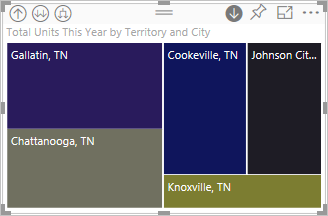

2. Du kan nu öka detaljnivån för Tennessee eller för en viss stad i Tennessee, eller så kan du expandera (se här för information om hur du **expanderar alla fält samtidigt** nedan). Låt oss nu fortsätta att öka detaljnivån ett fält i taget.  Välj **Knoxville, TN**. Din trädkarta visar nu postnumret för din butik i Knoxville. 

   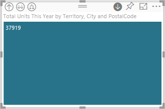

    Observera att rubriken ändras när du ändrar detaljnivån ner och upp igen.  

## Expandera alla och expandera ett fält i taget
En trädkarta som bara visar postnummer är inte användbar.  Så låt oss expandera en nivå ned i hierarkin.  

1. Om trädkartan är aktiverad kan du välja ikonen *för att expandera ned* . Två nivåer av vår hierarki visas nu i din trädkarta: postnummer och butiksnamn. 

    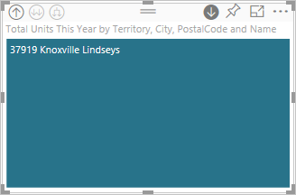

2. För att se alla fyra hierarkinivåer av data för Tennessee väljer du pilen för att minska detaljnivån tills du når den andra nivån, **totalt antal enheter i år efter område och stad**, för din trädkarta. 

    

3. Se till att ökad detaljnivå fortfarande är aktiverat , och välj ikonen *expandera ned* . Nu visas lite mer detaljer i din trädkarta. Istället för att bara visa stad och stat, visas nu även postnumret. 

    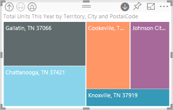

4. Välj ikonen *expandera ned* en gång till för att visa alla fyra hierarkinivåer i detalj för Tennessee i din trädkarta. Hovra över en lövnod för att se ytterligare information.

   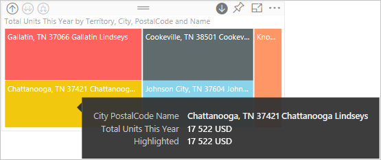

## Att gå in på detalj filtrerar andra visuella objekt
När du arbetar i granskningsläget får du bestämma hur du vill gå nedåt och hur expansionen ska påverka de andra visualiseringarna på sidan. 

Som standard filtreras inte andra visuella objekt i rapporten när du ändrar detaljnivån. Men den funktionen kan aktiveras i Power BI Desktop- och Power BI-tjänsten. 

1. I Desktop väljer du fliken **Format** och markerar kryssrutan för **Att gå in på detalj filtrerar andra visuella objekt**.

    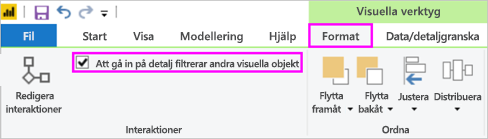

2. När du ökar detaljnivån (eller minskar eller expanderar) i ett visuellt objekt med en hierarki, filtrerar åtgärden nu även övriga visuella objekt på sidan. 

    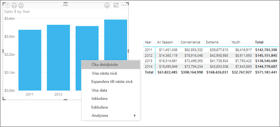

    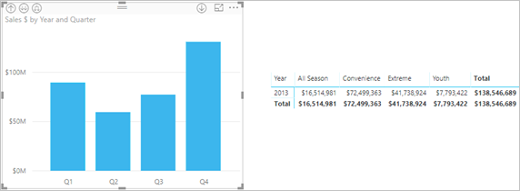

> [!NOTE]
> Om du vill aktivera detta i Power BI-tjänsten, väljer du **Visuella interaktioner > Att gå in på detalj filtrerar andra visuella objekt** från den översta menyraden.
>
> 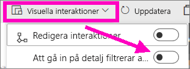

## Förstå hierarkins axel och grupp
Hierarkiaxeln och hierarkigruppen är mekanismer du kan använda för att öka och minska granulariteten för data som du vill visa. Data som kan ordnas i kategorier och underkategorier anses ha en hierarki. Detta omfattar naturligtvis datum och tider.

Du kan skapa en visualisering i Power BI som har en hierarki genom att välja ett eller flera datafält som läggs till i området **Axel** eller **Grupp**, tillsammans med data som du vill granska som datafält i området **Värden**. Dina data är hierarkiska om *detaljnivåikonerna* visas längst upp till vänster och höger i visualiseringen. 

Det enklaste är att tänka på det som två typer av hierarkiska data:
- Datum- och tidsdata – om du har ett datafält med datatypen DateTime har du redan hierarkiska data. Power BI skapar automatiskt en hierarki för alla datafält vars värden kan parsas i en [DateTime](https://msdn.microsoft.com/library/system.datetime.aspx)-struktur. Du behöver bara lägga till ett DateTime-fält i området **Axel** eller **Grupp**.
- Kategoridata – om dina data hämtas från samlingar som innehåller delsamlingar, eller har rader med data med gemensamma värden, har du hierarkiska data.

Med Power BI kan du expandera en eller alla delmängder. Du kan öka detaljnivån i dina data för att visa en enda delmängd på varje nivå, eller alla delmängder samtidigt på varje nivå. Du kan till exempel öka detaljnivån för ett visst år eller visa alla resultat för varje år nedåt i hierarkin. Du kan också minska detaljnivån på samma sätt.

I avsnitten nedan beskrivs ökad detaljnivå från den högsta vyn, mellanvyn och den lägsta vyn.

### Hierarkiska data och tidsdata
I det här exemplet kan du följa med i vårt [exempel på detaljhandelsanalys](../sample-datasets.md) och skapa en visualisering av ett stående stapeldiagram med fokus på **Månad** (Axel) och **Total försäljning** (Värden).  

Även om datafältet Axel är **Månad** skapar det en **årskategori** i området **Axel**. Det beror på att Power BI ger en fullständig DateTime-struktur för alla värden som läses. Högst upp i hierarkin visas årets data.

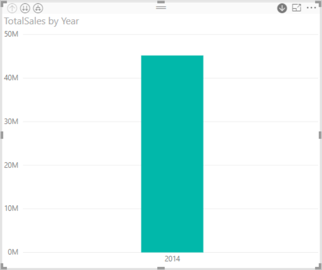

Med läget för ökad detaljnivå aktiverat klickar du på stapeln i diagrammet för att gå nedåt en nivå i hierarkin. Tre staplar för data för de tillgängliga kvartalen visas. Bland ikonerna uppe till vänster väljer du alternativet för att **expandera allt nedåt en nivå i hierarkin**. Upprepa detta för att komma till nivån längst ner i hierarkin som visar resultat för varje månad.

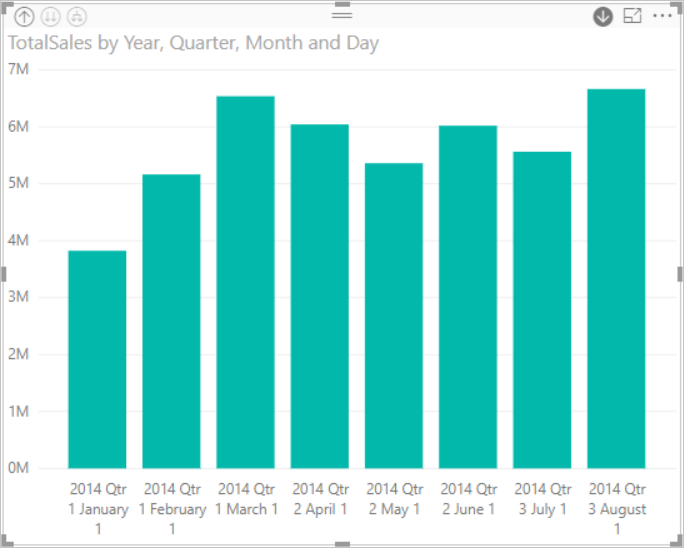

Förutom visualiseringen kan vi se att hierarkin återspeglas i de data som återges för varje rapport. I följande tabell visas resultaten för att **Visa data** i en rapport med ökad detaljnivå från en månad eller alla månader. 

Observera att informationen är den samma för kvartals- och årsrapporter, men när du ökar detaljnivån till nivån för **Värden** ser du att den enkla rapporten är mer specifik, och att rapporten för alla månader innehåller mer data.

|Läget Expandera|År|Kvartal|Månad|Dag|
| ---|:---:|:---:|:---:|---|
|Enkel|||||
|Alla|||||

### Hierarkiska kategoridata
Data som har modellerats från samlingar och delsamlingar är hierarkiska. Ett bra exempel på detta är platsdata. Anta att du har en tabell i en datakälla med kolumner för land, region, stad och postnummer. Data som delar samma land, region och stad är hierarkiska.

I det här exemplet kan du följa med i [exemplet för detaljhandelsanalys](../sample-datasets.md). Skapa en visualisering av ett stående stapeldiagram med fokus på **Totalt antal enheter i år** (Värden) enligt **Område**, **Stad**, **Postnummer** och **Namn** (Grupp).  

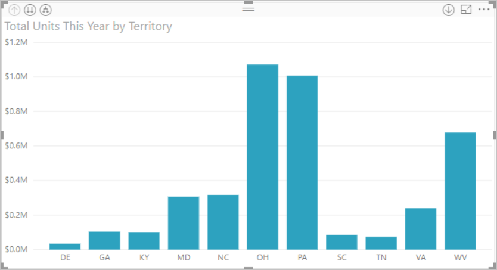

Se till att läget för ökad detaljnivå är aktiverat. Bland ikonerna längst upp till vänster väljer du alternativet för att **expandera allt nedåt en nivå i hierarkin** tre gånger.
Du ska nu vara på nivån längst ner i hierarkin, som visar resultat för område, stad och postnummer.

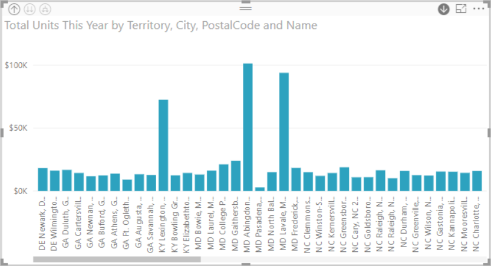

Förutom visualiseringen kan vi se att hierarkin återspeglas i de data som återges för varje rapport. I följande tabell visas resultaten för att **Visa data** i en rapport med ökad detaljnivå för ett område och alla områden. När du ökar detaljnivån kan du se hur den enkla rapporten blir mer specifik och att rapporten med alla områden innehåller mer data.

| Läget Expandera|Område|Stad|Postnummer|Namn|
| ---|:---:|:---:|:---:|---|
|Enkel|||||
|Alla|||||

## Överväganden och begränsningar
* Om tillägget av ett datumfält i en visualisering inte skapar en hierarki, kan det bero på att ”datum”-fältet faktiskt inte har sparats som ett datum. Om du äger datauppsättningen, öppna den i vyn *Data* i Power BI Desktop, välj den kolumn som innehåller datum och välj fliken Modellering och ändra **Datatyp** till **Datum** eller **Datum/Tid**. Om rapporten har delats med dig, kontakta ägaren om du vill begära ändringen.  
  
  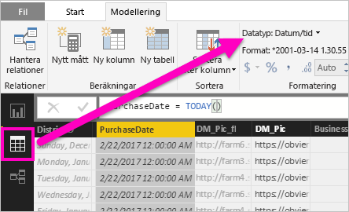

## Nästa steg
[Visualiseringar i Power BI-rapporter](../visuals/power-bi-report-visualizations.md)

[Power BI-rapporter](end-user-reports.md)

[Power BI – grundläggande begrepp](end-user-basic-concepts.md)

Har du fler frågor? [Prova Power BI Community](http://community.powerbi.com/)

