# Snabbstart – Hitta rätt i Power BI-tjänsten

Nu när du har grunderna i Power BI ska vi se oss omkring i **Power BI-tjänsten**. Som vi tidigare nämnt kanske någon i ditt team mer eller mindre uteslutande arbetar med att kombinera data och skapa rapporter för andra i **Power BI Desktop**. Du å andra sidan kanske i princip bara arbetar i Power BI-tjänsten, där du visar och interagerar med innehåll som skapats av andra (**användningsupplevelsen**) eller hämtar data och skapar egna rapporter och instrumentpaneler (**genereringsupplevelsen**). I den här snabbstarten ska du importera exempeldata och använda dem för att hitta rätt i Power BI-tjänsten. 
 
## Förutsättningar

- Om du inte har registrerat dig för Power BI [registrerar du dig för en kostnadsfri utvärderingsversion](https://app.powerbi.com/signupredirect?pbi_source=web) innan du börjar.

- Läs [Grundläggande begrepp för Power BI-tjänsten](end-user-basic-concepts.md).

## Öppna Power BI-tjänsten och hämta data
Vi ska använda exempeldata när vi navigerar i och demonstrerar Power BI-tjänsten. Det finns många olika exempeldata som du kan använda för att utforska tjänsten. Den här gången ska vi använda data om butiker i detaljhandeln.    
1. Öppna app.powerbi.com och välj länken för **Exempel**. 

    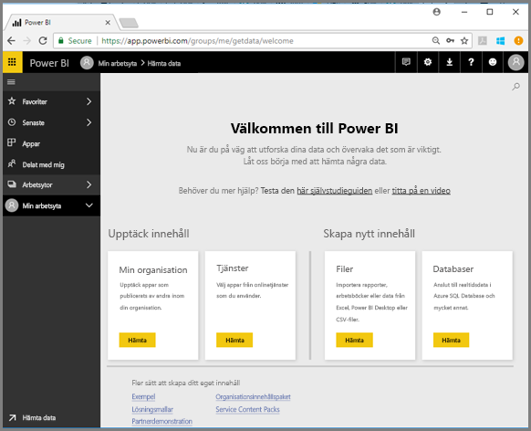

2. Välj **Exempel på detaljhandelsanalys > Anslut**.

    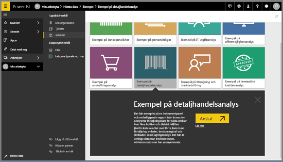

    Power BI-tjänsten importerar exemplet och visar instrumentpanelen. Instrumentpaneler är något som särskiljer Power BI-tjänsten från Power BI Desktop. Exemplet innehåller också en rapport och en datauppsättning som vi ska titta på senare.

    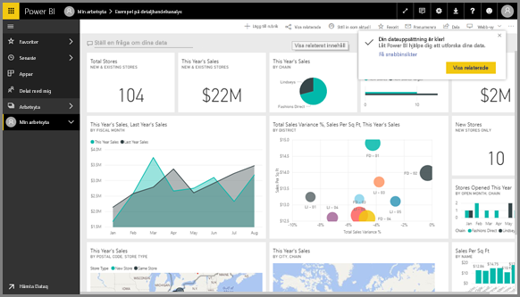

Låt Amanda visa dig navigeringsmiljön för Power BI-tjänsten.  Prova sedan själv genom att följa de stegvisa anvisningarna under videon.

<iframe width="560" height="315" src="https://www.youtube.com/embed/G26dr2PsEpk" frameborder="0" allowfullscreen></iframe>

## Visa innehåll (instrumentpaneler, rapporter, arbetsböcker, datauppsättningar, arbetsytor, appar)
Låt oss börja med att titta på hur grundläggande innehåll är organiserat (instrumentpaneler, rapporter, datauppsättningar, arbetsböcker). Innehållet visas på en arbetsyta. Än så länge har du bara en arbetsyta, kallad **Min arbetsyta**. På Min arbetsyta lagrar allt innehåll som du äger. Du kan se det som det personliga utvecklingsutrymme eller ett område för ditt eget innehåll. Du kan dela innehåll från Min arbetsyta med kollegor. I Min arbetsyta är innehållet uppdelat i 4 flikar: instrumentpaneler, rapporter, arbetsböcker och datauppsättningar.

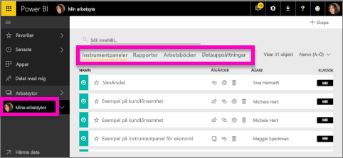

Välj en arbetsyta i det vänstra navigeringsfönstret. Tabeller för det tillhörande innehållet (instrumentpaneler, rapporter, arbetsböcker och datauppsättningar) fyller Power BI-arbetsytan till höger.

Om du är en ny användare ser du bara en arbetsyta – **Min arbetsyta**.

På dessa flikar (även kallade *innehållsvyer*) visas information om innehållet samt åtgärder som du kan utföra med innehållet.  Från fliken Instrumentpaneler kan du till exempel öppna en instrumentpanel, dela, ta bort, söka, skapa nytt innehåll, sortera och mycket mer.

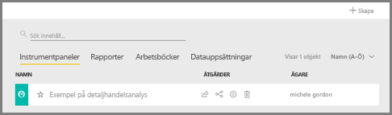

Öppna instrumentpanelen genom att välja namnet på instrumentpanelen.

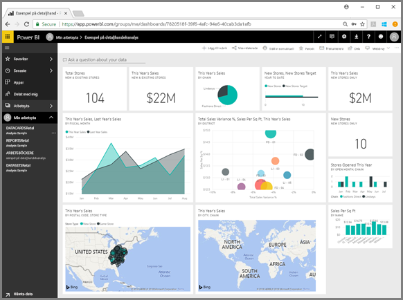

## Lägga till en instrumentpanel och en rapport som favoriter
Med **Favoriter** kan du snabbt komma åt det innehåll som är viktigast för dig.  

1. Välj **Favorit** i det övre högra hörnet när instrumentpanelen är öppen.
   
   
   
   **Favorit** ändras till **Ej favorit** och stjärnikonen blir gul.
   
   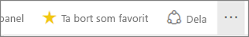

2. Om du vill visa en lista över allt innehåll som du har lagt till som favoriter i det vänstra navigeringsfältet väljer du pilen till höger om **Favoriter**. Eftersom det vänstra navigeringsfältet är en permanent funktion i Power BI-tjänsten har du åtkomst till den här listan från valfri plats i Power BI-tjänsten.
   
    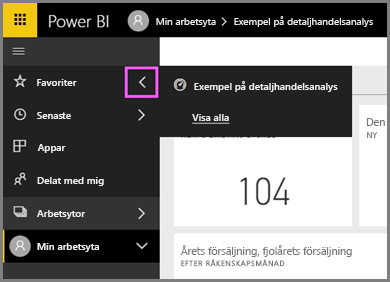
   
    Än så länge har vi bara en favorit. Favoriter kan vara instrumentpaneler, rapporter eller appar.  

1. Det går även att favoritmarkera en instrumentpanel eller en rapport på arbetsyteflikarna **Instrumentpaneler** eller **Rapporter**.  Öppna fliken **Rapporter** och välj stjärnikonen till vänster om rapportnamnet.
   
   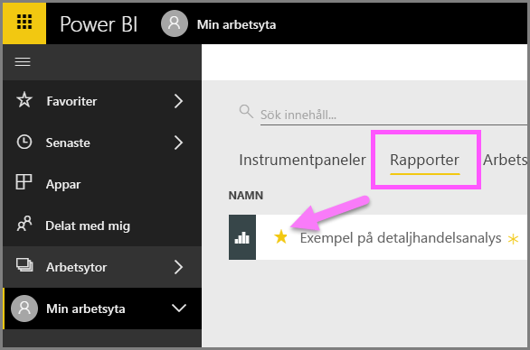

3. Öppna *fönstret* **Favoriter** genom att välja **Favoriter** i det vänstra navigeringsfönstret eller genom att välja stjärnikonen .
   
   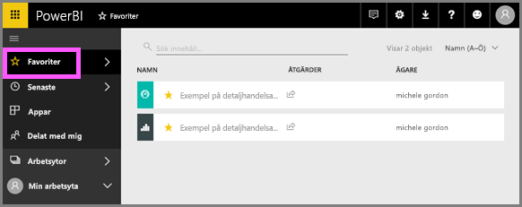
   
   Nu har du två favoriter, en instrumentpanel och en rapport. Härifrån kan du öppna, söka efter, ta bort en favorit eller dela innehåll med kollegor.

4. Öppna rapporten i rapportredigeraren genom att välja rapportnamnet.

    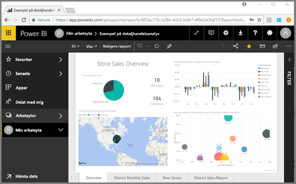

Läs mer i [Favoriter](end-user-favorite.md)

## Leta upp ditt senaste innehåll

1. På samma sätt som med favoriter kan du snabbt se det innehåll du senast arbetat med var du än är i Power BI-tjänsten genom att välja pilen bredvid **Senaste** i det vänstra navigeringsfönstret.

   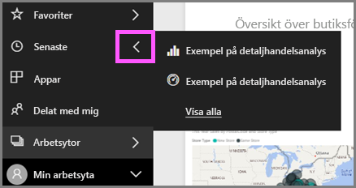

    Öppna innehållet genom att välja det från den utfällbara menyn.

2. Ibland vill du inte öppna det senaste innehållet, utan vill i stället visa information eller utföra andra åtgärder, till exempel dela, köra Insights eller exportera till Excel. I dessa fall öppnar du fönstret **Senaste** genom att välja **Senaste** eller motsvarande ikon i det vänstra navigeringsfönstret. Om du har mer än en arbetsyta innehåller den här listan innehåll från alla dina arbetsytor.

   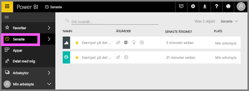

Läs mer i [Senaste i Power BI](end-user-recent.md)

### Söka efter och sortera innehåll
Med innehållsvyn är det lättare att söka efter, filtrera och sortera ditt innehåll. Skriv i sökområdet om du vill söka efter en instrumentpanel, en rapport eller en arbetsbok. Power BI filtrerar fram det innehåll vars namn innehåller din söksträng.

Eftersom du bara har ett exempel behöver du inte söka eller sortera.  Om du har en lång lista över instrumentpaneler, rapporter, arbetsböcker och datauppsättningar är sökning och sortering däremot mycket användbara funktioner.

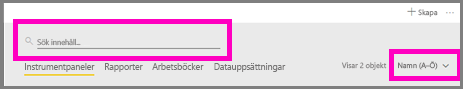

Du kan också sortera innehåll efter namn eller ägare.  

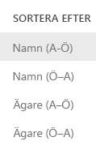

Läs mer i [Power BI-navigering: söka efter, sortera, filtrera](end-user-search-filter-sort.md)

## Rensa resurser
När du har slutfört den här snabbstarten kan du ta bort exempelinstrumentpanelen med detaljhandelsanalys, rapporter och datauppsättningen om du vill.

1. Öppna Power BI-tjänsten (app.powerbi.com) och logga in.    
2. I det vänstra navigeringsfönstret väljer du **Arbetsytor > Min arbetsyta**.  
    Ser du den gula stjärnan som visar att det är en favorit?    
3. På fliken **Instrumentpaneler** väljer du papperskorgens ikon för att **ta bort** bredvid instrumentpanelen för detaljhandelsanalys.    

    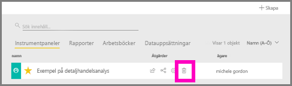

4. Välj fliken **Rapporter** och gör samma sak för rapporten med detaljhandelsanalys.
1. Välj fliken **Datauppsättningar** och gör samma sak för datauppsättningen med detaljhandelsanalys.

## Nästa steg

> [!div class="nextstepaction"]
> [Läsvyn och redigeringsvyn i Power BI-tjänsten](end-user-reading-view.md)