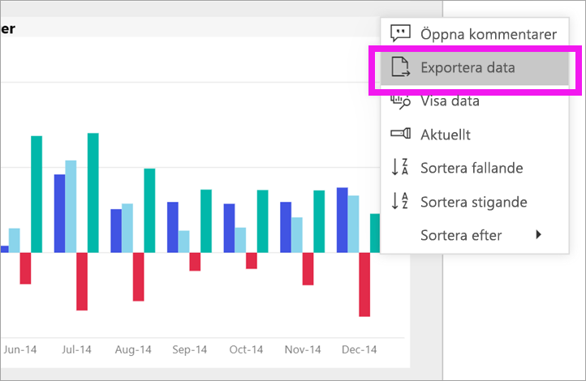
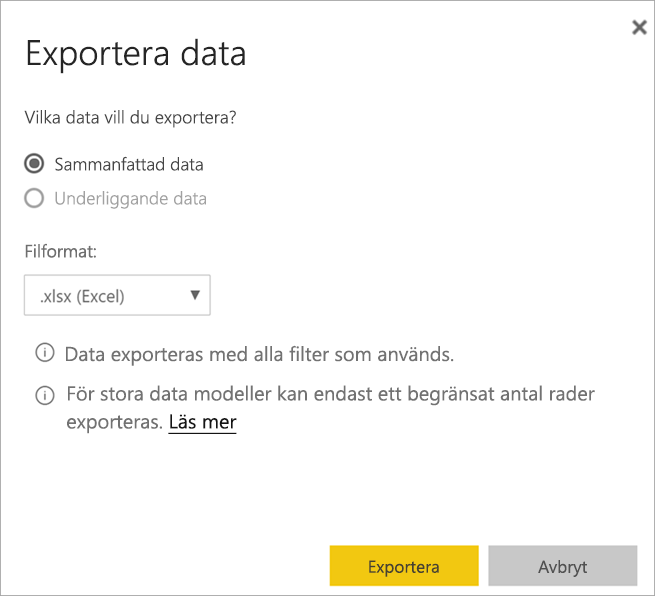
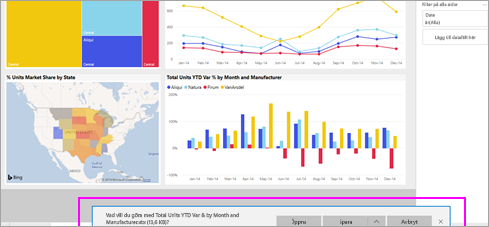

# Exportera data från ett visuellt objekt
Om du vill se de data som används i en visualisering [kan du visa dessa data i Power BI](end-user-show-data.md) eller exportera data till Excel. Alternativet att exportera data kräver en viss typ av licens- och redigeringsbehörigheter till innehållet. Kontakta din Power BI-administratör om du inte kan exportera. 

## Från en visualisering på en Power BI-instrumentpanel

1. Starta på en Power BI-instrumentpanel. Här ska vi använda instrumentpanelen från exempelappen ***Marknadsföring och försäljning***. Du kan [hämta den här appen frånAppSource.com](https://appsource.microsoft.com/en-us/product/power-bi/microsoft-retail-analysis-sample.salesandmarketingsample-preview?flightCodes=e2b06c7a-a438-4d99-9eb6-4324ce87f282).

    

2. Hovra över en visualisering för att visa ellipserna (...) och klicka för att visa åtgärdsmenyn.

    

3. Välj **Exportera till Excel**.

4. Vad som händer härnäst beror på vilken webbläsare du använder. Du kan uppmanas att spara filen eller så kan en länk till den exporterade filen visas längst ned i webbläsaren. 

    

5. Öppna filen i Excel.  

    

## Från en visualisering i en rapport
Du kan exportera data från en visualisering i en rapport som .csv- eller .xlsx-format (Excel). 

1. Välj en panel på instrumentpanelen för att öppna den underliggande rapporten.  I det här exemplet väljer vi samma visualisering som ovan, *totalt antal enheter hittills i år var %.* 

    

    Eftersom den här panelen skapades från exempelrapporten *Försäljning och marknadsföring* öppnas den rapporten. Och den öppnas på sidan som innehåller den valda visualiseringen. 

2. Välj panelen i rapporten. Expandera fönstret **Filter** till höger. Den här visualiseringen har tillämpade filter. Mer information om filter finns i [Använda filter i en rapport.](end-user-report-filter.md)

    

3. Välj ellipserna i det övre högra hörnet i visualiseringen. Välj **Exportera data**.

    

4. Du ser alternativ för att exportera sammanfattade data eller underliggande data. Om du använder exempelappen *Försäljning och marknadsföring* inaktiveras **Underliggande data**. Men du kan stöta på rapporter där båda alternativen är aktiverade. Här förklaras skillnaden.

    **Sammanfattade data**: Välj det här alternativet om du vill exportera data för det som visas i visualiseringen.  Den här typen av export visar bara de data som använts för att skapa visualiseringen. Om visualiseringen har filter tillämpat kommer även de data du exporterar att filtreras. Till exempel, i den här visualiseringen kommer din export endast att innehålla data för 2014 och den centrala regionen, och endast data för fyra av tillverkarna: VanArsdel, Natura, Aliqui och Pirum.
  

    **Underliggande data**: Välj det här alternativet om du vill exportera data för det du ser i visualiseringen **plus** ytterligare data från den underliggande datauppsättningen.  Detta kan omfatta data som finns i datauppsättningen men som inte används i visualiseringen. 

    

5. Vad som händer härnäst beror på vilken webbläsare du använder. Du kan uppmanas att spara filen eller så kan en länk till den exporterade filen visas längst ned i webbläsaren. 

    

6. Öppna filen i Excel. Jämför mängden data som exporteras med de data som vi exporterade från samma visualiseringen på instrumentpanelen. Skillnaden är att denna export inkluderar **underliggande data**. 

    

## Nästa steg

[Visa de data som används för att skapa ett visuellt objekt](end-user-show-data.md)