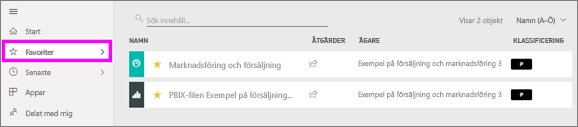
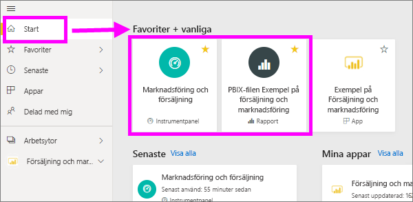
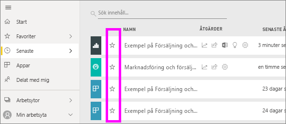
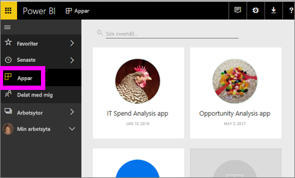
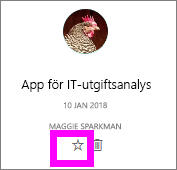
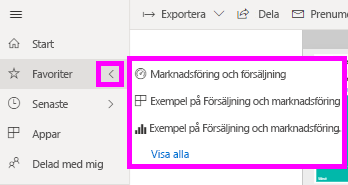
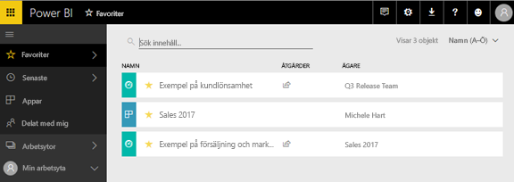
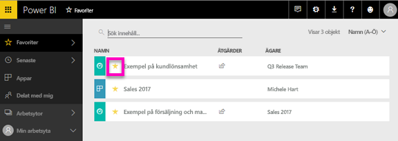

# Favoritmarkera instrumentpaneler, rapporter och appar i Power BI-tjänsten
När du gör innehåll en *favorit*, du kommer att kunna komma åt den snabbt från den **Favoriter** innehållslistan och från **Power BI Start**  >   **Favoriter och vanliga**.  Favoriter är vanligtvis innehåll som du besöker oftast och identifieras med en gul stjärna.

   

   

Du kan också välja en enda instrumentpanel som en [aktuell instrumentpanel](end-user-featured.md) i Power BI-tjänsten.

## Lägg till en instrumentpanel eller en rapport som en *favorit*

1. Öppna en instrumentpanel eller en rapport som du använder ofta. Även innehåll som har delats med dig kan göras till en *favorit*.

2. Övre menyfliksområdet i Power BI-tjänsten, väljer du **favorit** eller stjärn  ikon.
   
   
   
   Du kan också favoritmarkera en instrumentpanel eller rapport från var som helst Se stjärnikonen, till exempel Start, senaste, appar och delat med mig. 
   
   

## Lägg till en app som *favorit*

1. I navigeringsfönstret, Välj **appar**.

   

2. Hovra över en app för att visa mer information.  Välj stjärnikonen   för att ange som favorit.
   
   

## Arbeta med *favoriter*
1. För att komma åt dina Favoriter, väljer du den utfällbara pilen till höger om **Favoriter**.  Härifrån kan du välja en favorit och öppna den. Endast fem favoriter visas (i alfabetisk ordning). Om du har fler än fem väljer **se alla** för att öppna listan Favoriter innehåll (se #2 nedan). 
   
   
2. Se **alla** det innehåll som du har lagt till som favoriter i navigeringsfönstret väljer **Favoriter** eller Favoriter  ikon.  
   
    
   
   Härifrån kan du vidta åtgärder: öppna, identifiera ägare och även dela med dina kollegor.

## Ta bort innehåll som favorit
Använder du inte längre en rapport så ofta som du brukade?  Du kan bort den från favoriter. När du tar bort innehåll från listan över favoriter så tas den bort från listan men inte från Power BI.

1. I det vänstra navigeringsfönstret, väljer du **favoriter** för att öppna skärmen **favoriter**.
   
   
2. Välj den gula stjärnan bredvid innehållet för ta bort innehållet som favorit.

> [!NOTE]
> Du kan även ta bort en instrumentpanel, rapport eller app. Du behöver bara öppna och avmarkera den gula ikonen.   
> 
> 
## Begränsningar och överväganden
För tillfället kan du favoritmarkera en app och den här automatiskt Favoriter alla rapporter och instrumentpaneler för appen. Det går inte att favoritmarkera appen för enskilda rapporter eller instrumentpaneler. 

## Nästa steg
[Power BI – grundläggande begrepp](end-user-basic-concepts.md)

Har du fler frågor? [Prova Power BI Community](http://community.powerbi.com/)

