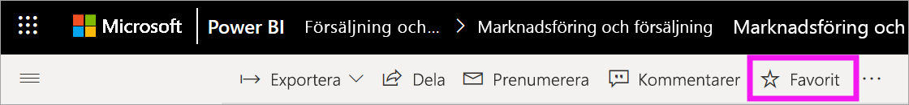
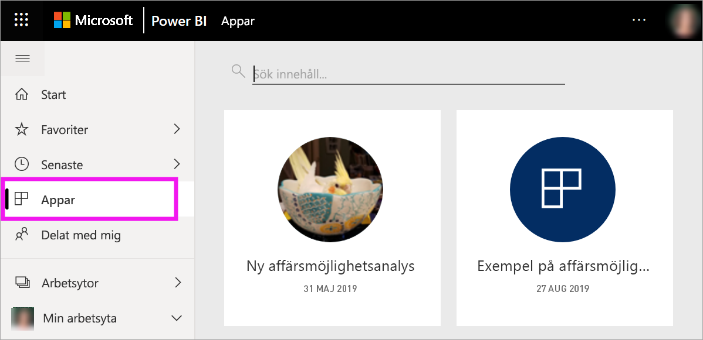
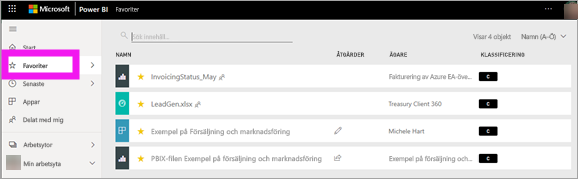
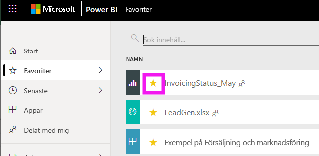

# Favoritmarkera instrumentpaneler, rapporter och appar i Power BI-tjänsten
När du gör innehåll till en *favorit* kan du komma åt det snabbt från innehållslistan i **Favoriter** samt från **Power BI-start** > **Favoriter + vanliga**. Favoriter är vanligtvis innehåll som du besöker oftast och som identifieras med en gul stjärna.

   

   

Du kan även välja en enskild instrumentpanel som en [aktuell instrumentpanel](end-user-featured.md) i Power BI-tjänsten.

## Lägg till en instrumentpanel eller en rapport som en favorit

1. Öppna en instrumentpanel eller en rapport som du använder ofta. Även innehåll som har delats med dig kan göras till en favorit.

2. På den övre menyraden i Power BI-tjänsten väljer du **Gör till favorit** eller stjärnikonen .
   
   
   
   Du kan även göra en instrumentpanel eller en rapport till favorit överallt där stjärnikonen finns, däribland Start, Senaste, Appar och Delat med mig. 
   
   

## Lägg till en app som favorit

1. Välj **Appar** i navigeringsfönstret.

   

2. Hovra över en app för att visa mer information. Välj stjärnikonen  för att ange som favorit.
   
   

## Arbeta med favoriter
1. Om du vill få åtkomst till dina favoriter väljer du den utfällbara pilen till höger om **Favoriter**. Härifrån kan du välja en favorit och öppna den. Upp till fem favoriter visas i alfabetisk ordning. Om du har fler än fem väljer du **Visa alla** för att öppna innehållslistan med favoriter. 
   
   
2. Om du vill se allt innehåll som du har lagt till som favoriter, går du till navigeringsfönstret och väljer **Favoriter** eller  för favoriterna. 
   
    
   
   Härifrån kan du vidta åtgärder. Du kan öppna en favorit, identifiera ägare och även dela favoriter med dina kollegor.

## Ta bort innehåll som favorit
Om du inte längre använder en rapport så ofta som du brukade kan du ta bort den som favorit. När du tar bort innehåll från listan över favoriter så tas den bort från listan men inte från Power BI.

1. I navigeringsfönstret väljer du **Favoriter** för att öppna skärmen **Favoriter**.
   
   
2. Välj den gula stjärnan bredvid innehållet du vill ta bort som favorit.

> [!NOTE]
> Du kan även ta bort en instrumentpanel, rapport eller app som favorit. Du behöver bara öppna och avmarkera den gula ikonen. 
> 
> 
## Begränsningar och överväganden
För närvarande kan du göra en app till favorit, så gör det automatiskt alla rapporter och instrumentpaneler för den appen till favoriter. Det går inte att göra enskilda rapporter eller instrumentpaneler för en app till favoriter. 

## Nästa steg
- [Power BI: Grundläggande begrepp](end-user-basic-concepts.md)
- Har du fler frågor? Testa [Power BI Community](https://community.powerbi.com/).

