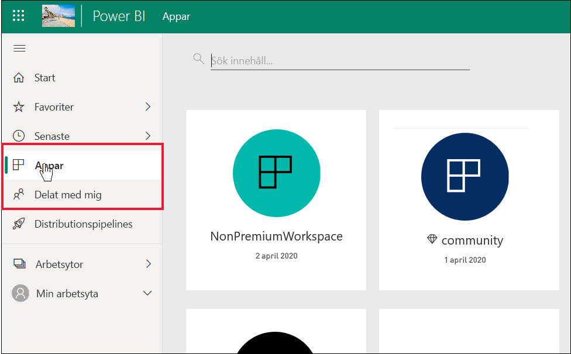

# Lista med Power BI-funktioner för *konsumenter* och andra kostnadsfria användare

[!INCLUDE[consumer-appliesto-ynnn](../includes/consumer-appliesto-ynnn.md)]

Som *användare* så använder du Power BI-tjänsten till att utforska rapporter och instrumentpaneler i syfte att fatta affärsbeslut. Dessa rapporter och instrumentpaneler skapas av *designers* som har en Power BI *Pro*-licens. Pro-användare kan dela innehåll med sina kollegor och styra vad kollegorna får göra med innehållet. Ibland kan designers dela innehåll genom att skicka länkar till dig, och ibland installeras och visas innehållet automatiskt i Power BI under **Appar** eller **Delat med mig**.

Designers har många olika sätt att dela innehåll. Den här artikeln är dock till för *Power BI-konsumenter*, och därför beskrivs bara hur konsumenter får och interagerar med innehåll. Mer information om andra sätt att dela innehåll finns i [Sätt att dela ditt arbete i Power BI](../service-how-to-collaborate-distribute-dashboards-reports.md).

I [föregående artikel](end-user-license.md) gick vi igenom de olika typerna av Power BI-licenser (kostnadsfria och Pro) och Power BI-prenumerationer (Premium), och du fick lära dig att leta rätt på vilken licens och prenumeration du använder. I den här artikeln går vi igenom vilka Power BI-funktioner som är tillgängliga för dig baserat på din licens och prenumeration.   

<art>

## Snabb genomgång av terminologin
Vi går igenom några Power BI-begrepp innan vi börjar med listan. Det här är en snabb genomgång, om du behöver mer information kan du besöka [Licenser och prenumerationer för användare](end-user-license.md) eller [Grundläggande Power BI-begrepp](end-user-basic-concepts.md).

### Arbetsytor och roller
Det finns två typer av arbetsytor: **Min arbetsyta** och apparbetsytor. Det är bara du som har åtkomst till **Min arbetsyta**. Vid samarbete och delning måste innehållsdesignern använda en apparbetsyta. 

Power BI-designers använder *roller* för arbetsytor till att styra vem som kan göra vad på arbetsytan. *Konsumenter* tilldelas vanligtvis rollen **Läsare**. 

### Premium-kapacitetsprenumeration
När en organisation har en Premium-kapacitetsprenumeration kan administratörer och Pro-användare tilldela arbetsytor till *Premium-kapaciteten*. En arbetsyta i en Premium-kapacitet är ett utrymme där Pro-användare kan dela och samarbeta med användare med kostnadsfria licenser, utan att dessa användare behöver ha en Pro-licens. På sådana arbetsytor har kostnadsfria användare utökade behörigheter (se listan nedan). 

### Licenser 
Alla Power BI-tjänstanvändare har antingen en kostnadsfri licens eller en Pro-licens. Vissa funktioner är reserverade för användare med Pro-licenser.

- **Kostnadsfri licens** – tilldelas vanligtvis till *konsumenter* i en organisation. Används också av alla som registrerar sig för Power BI som en privatperson och vill testa [Power BI-tjänsten i fristående läge](../service-self-service-signup-for-power-bi.md).  
- **Pro-licens** – tilldelas vanligtvis till designers, analytiker och utvecklare i en organisation.   
- **Kostnadsfri licens + Premium-kapacitet** – gör att kostnadsfria användare (*konsumenter*) kan visa och interagera med innehåll som Pro-användare har skapat i Premium-kapacitet och sedan delat. På så sätt kan Pro-användare samarbeta med kostnadsfria användare på arbetsytan eller via **Delat med mig**.

För kostnadsfria användare är det organisationens Premium-kapacitetsprenumeration som ger superkrafter. Så länge dina Pro-kollegor använder arbetsytor i Premium-kapaciteten till att dela innehåll så kan du som kostnadsfri användare visa innehållet och samarbeta med dem.  **På så sätt blir den kostnadsfria användaren en *Power BI-konsument* med möjlighet att ta emot och dela innehåll för att fatta affärsbeslut.** 

## Lista med Power BI-funktioner för *konsumenter* och kostnadsfria användare
I följande diagram ser du vilka uppgifter som kan utföras av en *konsument* i en organisation som har en Premium-prenumeration.    

Den första kolumnen representerar en kostnadsfri användare som arbetar med innehåll i **Min arbetsyta**. Den här användaren kan inte samarbeta med kolleger på arbetsytor. Kollegor kan inte dela innehåll direkt med den här användaren och användaren kan inte dela från **Min arbetsyta**. 

Den andra kolumnen representerar en *konsument*.  En konsument:

- har en kostnadsfri användarlicens
- ingår i en organisation som har en Premium-kapacitetsprenumeration
- får innehåll (appar, instrumentpaneler, rapporter) från Pro-användare som delar innehållet via apparbetsytor i en Premium-kapacitet
- tilldelas rollen **Läsare** för dessa apparbetsytor. 

### Förklaring
 funktionen är tillgänglig i det aktuella scenariot    
 funktionen är inte tillgänglig i det aktuella scenariot    
 **** funktionen är bara tillgänglig i **Min arbetsyta**. Innehåll i **Min arbetsyta** är för ägarens personliga användning och kan inte delas eller visas av någon annan i Power BI.    
 \* åtkomst till den här funktionen kan aktiveras eller inaktiveras av en Pro-användare eller en administratör.    
   

### Funktionslista

|Funktioner   | Scenario 1: Kostnadsfri Power BI-användare som inte har åtkomst till innehåll i en Premium-kapacitet.    | Scenario 2: Kostnadsfri Power BI-användare med behörigheten **Läsare** för innehåll som lagras i en Premium-kapacitet. Den här personen är en *Power BI-konsument*. |
|---|---|---|
|**Appar** 
|Installeras automatiskt |  | *| 
|Öppna |  |   | 
|Favorit |  |   |
 |Redigera, uppdatera, dela om, publicera om |  |   |
 |Skapa ny app |  |   |
 |Appsource: ladda ned och öppna |   | | 
|Organisationsarkiv: ladda ned och öppna|  |  |
 |**Apparbetsytor**
| Skapa, redigera eller ta bort arbetsytor och innehåll  |   | |
|Lägga till rekommendationer |   | | 
|Öppna och visa  |   |    | 
| Läs data som lagrats på arbetsytedataflöden | ||
|**Instrumentpaneler**
|Ta emot, visa och interagera med instrumentpaneler från kollegor |  |    | 
| Skicka aviseringar till paneler  |   |    | 
| Visa och svara på kommentarer från andra: lägga till egna kommentarer  |   |  *  | 
| Spara en kopia |  | | 
|Kopiera visuella objekt som bilder | ||
|Skapa, redigera, uppdatera och ta bort |  | | 
|Exportera panel till Excel | | |
|Favorit || |
|Funktion | ||
|Helskärmsläge och fokusläge | | |
|Global sökning |* |* |
|Insikter på paneler |     | *|
|  Frågor och svar: använda på instrumentpaneler  |* |* |
|Frågor och svar: lägga till rekommenderade och sparade frågor |   | |
|Frågor och svar: granska ställda frågor |   | |  
|Prestandakontroll |  | |
|Fästa paneler från Frågor och svar eller rapporter |  | | 
|Skriv ut |* |* |
|Uppdatera |  | | 
|Dela igen |   | | 
|Skapa prenumeration åt sig själv |* |*  |
|Skapa prenumeration åt andra |   | | 
|**Datauppsättningar**
|  Lägga till, ta bort, redigera  |    |   |   
| Skapa en rapport på en annan arbetsyta baserat på en datamängd på den aktuella arbetsytan |   | |  
|  Insikter om datamängder  |   || 
|Uppdatera schema |  || 
|**Rapporter**
|Ta emot rapporter från kollegor |  |    | 
| Samarbeta med kollegor i samma version av en rapport | |    | 
| Analysera rapport i Excel  |*  |*  | 
| Visa bokmärken som andra har skapat och lägga till egna bokmärken  | |  |
| Visa och svara på kommentarer från andra: lägga till nya kommentarer  | |  |
|Ändra dimensioner för visning   |  |   | 
| Spara en kopia | |*  
|Kopiera visuella objekt som bilder* |
| Visuella rapportobjekt med korsmarkering och korsfiltrering   | |  |
|  Öka detaljnivå   |  |  |
| Visning av detaljerad information |* |* |
|  Bädda in (publicera på webben, göra offentligt) | * | |  
|  Exportera sammanfattade data från visuella rapportobjekt*  | | |
|Exportera underliggande data från visuella rapportobjekt* |  |  | 
|  Favoritmarkera rapporten  | | |
|  Filter: ändra typer  |* |* |
|  Filter: interagera   || |
|  Filter: beständiga  |* |* |
| Sortera efter filterfönstret |* |* |
| Helskärmsläge och fokusläge   | | |
|  Insikter om rapporter1  |   || 
| Ursprungsvy  | | |
|PDF: skapa från rapportsidor | |  |
|Prestandakontroll || |
| PowerPoint: skapa från rapportsidor*   | | |
|  Marknadsföra innehåll på startsidan  |   | | 
| Skriva ut rapportsidor* | | |
|Interagera med visuella Frågor och svar-objekt | | |
|QR-kod | | |
|  Uppdatera  | | |
|  Dela innehåll med externa användare  |   | | 
| Dela: tillåta att andra delar objekt igen |   | | 
|Visa som tabell (visa data)| | |
|  Utsnitt: lägga till eller ta bort  | | |
| Interagera med utsnitt | | |
|  Sortera visuella rapportobjekt  | | |
|  Skapa prenumerationer på rapporter åt dig själv* | | |
|  Skapa prenumerationer på rapporter åt andra  |   | | 
|  Visa relaterade | | |
|  Visuella objekt: ändra typer i rapporter  |* |* |
|  Ändra visuella interaktioner  |  | |
|  Visuella objekt: lägga till nytt  |  | |
|  Visuella objekt: lägga till nya fält  |   | |
|Visuella objekt: ändra typ |  | |
| Visuella objekt: hovra för att visa detaljer och knappbeskrivningar  |  | |

1. Endast tillgängligt i innehållsvyn **Delat med mig**. 

## Nästa steg
[Power BI för *konsumenter*](end-user-consumer.md)    
