# Visa innehållet i detalj: fokusläge och fullskärmsläge

<iframe width="560" height="315" src="https://www.youtube.com/embed/dtdLul6otYE" frameborder="0" allowfullscreen></iframe>

Fokusläge och fullskärmsläge är två olika sätt att se mer information i dina visuella objekt, rapporter och instrumentpaneler.  Den största skillnaden är att fullskärmsläget inte visar de fönster som omger ditt innehåll, medan du i fokusläget fortfarande kan interagera med dina visuella objekt. Låt oss ta en närmare titt på likheterna och skillnaderna.  

|Innehåll    | Fokusläge  |Helskärmsläge  |
|---------|---------|----------------------|
|Instrumentpanel     |   Inte möjligt     | ja |
|Rapportsida   | Inte möjligt  | ja|
|Rapportvisualisering | ja    | ja |
|Instrumentpanel | ja    | ja |
|Windows 10 Mobile | Inte möjligt | Ja |

## Vad är fullskärmsläge?

Se ditt innehåll i Power BI-tjänsten (instrumentpaneler, rapportsidor, paneler och visualiseringar) utan störande menyer och navigeringsfält.  Du får en oförstörd, fullständig översikt över ditt innehåll på ett överblick, vid alla tidpunkter. Detta kallas ibland för TV-läge.   

Om du vill öppna fullskärmsläget väljer du ikonen **fullskärm**  i Power BI-tjänstens menyrad ovanför din instrumentpanel, rapport, panel i fokusläge eller ett visuellt objekt i fokusläge.  Ditt valda innehåll fyller hela skärmen.
Om du använder Power BI Mobile är [fullskärm är tillgängligt för mobila Windows 10-appar](./mobile/mobile-windows-10-app-presentation-mode.md). 

Några användningsområden för fullskärmsläge:

* presentera instrumentpanelen, panelen, visuella objekt eller en rapport under ett möte eller en konferens
* visa bilden på kontoret på en dedikerad stor bildskärm eller projektor
* visa på en liten skärm
* granska i låst läge – du kan röra skärmen eller musen över panelerna utan att öppna den underliggande rapporten eller instrumentpanelen

## Vad är läget Fokus?
Med läget ***Fokus*** kan du expandera (fälla ut) ett visuellt objekt eller en panel för att se mer information.  Du kanske har en instrumentpanel eller rapport med mycket innehåll och du vill zooma in på ett enskilt visuellt objekt.  Det här är ett perfekt användningsområde för fokusläget.  

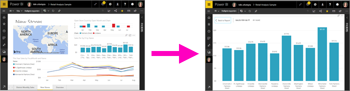

I fokusläget kan en Power BI-*användare* interagera med de filter som tillämpades när det visuella objektet skapades.  Du kan använda fokusläget i BI-tjänsten på en instrumentpanel eller i en rapportvisualisering.

## Arbeta i fullskärmsläge
Om du vill öppna en instrumentpanel eller en rapportsida i fullskärmsläge, väljer du fullskärmsikonen  i det översta navigeringsfältet. När du är i fullskärmsläge visas en snabbmeny när du flyttar musen eller markören. Eftersom fullskärmsläget används för en mängd olika innehåll kan alternativen i snabbmenyn skilja sig åt, men de är ganska självförklarande.  Du kan hovra över en ikon för att se en beskrivning av den.

Menyn för instrumentpaneler    
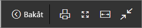    

Menyn för rapportsidor    
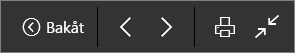    

  * 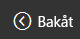    
  Använd knappen **Tillbaka** för att gå till föregående sida i webbläsaren. Om föregående sida var en Power BI-sida, visas även den i fullskärmsläge.  Fullskärmsläget behålls tills du avslutar.

  *     
  Använd den här knappen om du vill skriva ut din instrumentpanel eller rapportsida i fullskärmsläge.

  *     
    Använd knappen **Anpassa till skärm** för att visa instrumentpanelen i största möjliga storlek utan att behöva använda rullningslisterna.  

    

  *        
    Ibland bryr man sig inte om rullningslisterna utan vill att instrumentpanelen ska fylla hela bredden på det tillgängliga utrymmet. Välj knappen **Anpassa till bredd**.    

    

  *        
    Använd de här pilarna i helskärmsrapporter för att gå mellan sidorna i rapporten.    
  * Om du vill avsluta fullskärmsläget väljer du ikonen **Avsluta fullskärmsläge**.

      

## Arbeta i fokusläge
Det finns två sätt att öppna fokusläget på: ett för instrumentpaneler och ett för rapportvisualiseringar.

### Fokusläge i instrumentpaneler
1. Öppna en instrumentpanel i Power BI-tjänsten.

2. Hovra över instrumentpanelen eller rapportvisualiseringen, välj ellipsen (...) och välj sedan **Öppna i fokusläge**.

    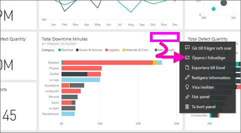.

2. Panelen öppnas och fyller hela rapportarbetsytan.

   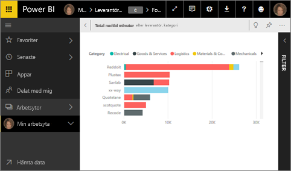

3. Expandera fönstret Filter om du vill se alla filter för den här visualiseringen.

   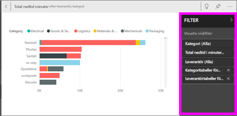

4. Utforska ytterligare genom att [ändra filtren](end-user-report-filter.md) och se intressanta upptäckter i dina data.  

5. Lämna fokusläget och återgå till instrumentpanelen genom att välja **Avsluta fokusläge** (i det övre vänstra hörnet av visualiseringen).

    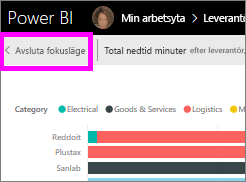    

## Fokusläge för rapportvisualiseringar
1. Öppna en rapport i Power BI-tjänsten.  I det här exemplet demonstrerar vi hur du gör med hjälp av exemplet på detaljhandelsanalys.

1. När rapporten har öppnats väljer du **fliken Månadsförsäljning för distrikt**.

2. Hovra över ett ytdiagram i det nedre vänstra hörnet och välj ikonen för **fokusläget** .  

   
2. Visualiseringen öppnas och fyller hela arbetsytan.

   
3. Du kan också expandera fönstret Filter om du vill interagera med de filter som tillämpats på visualiseringen. Analysera datan efter nya insikter och svar på frågor. Som *användare* kan du inte lägga till nya filter, ändra vilka fält som används i visualiseringarna eller skapa nya visualiseringar.  Eventuella ändringar du gör i befintliga filter sparas dock när du avslutar Power BI. Om du inte vill att Power BI ska spara dina ändringar väljer du **Återställ till standard**. 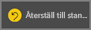  

   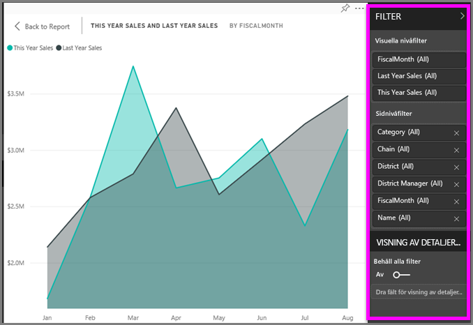

5. Lämna fokusläget och gå tillbaka till rapporten genom att välja **Tillbaka till rapporten** (i det övre vänstra hörnet av visualiseringen).

    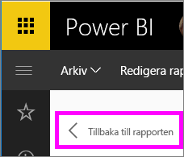  

## Överväganden och felsökning
* När du använder fokusläget med en visualisering i en rapport, kan du visa och ändra alla filter: Visuell nivå, Sidnivå, Visning av detaljerad information och Rapportnivå.    
* När du använder fokusläget med en visualisering i en instrumentpanel, kan du endast visa och ändra filtret för den visuella nivån.

## Nästa steg
[Visa inställningar för rapporter](end-user-report-view.md)