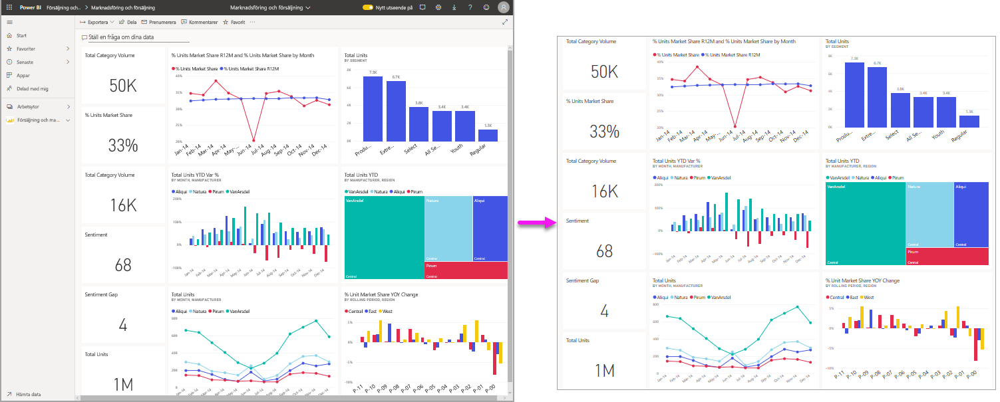
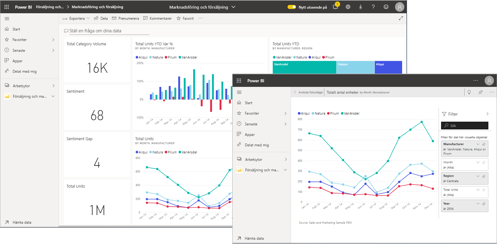
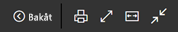
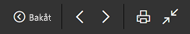
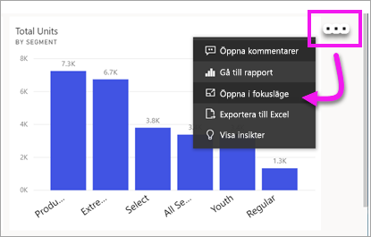
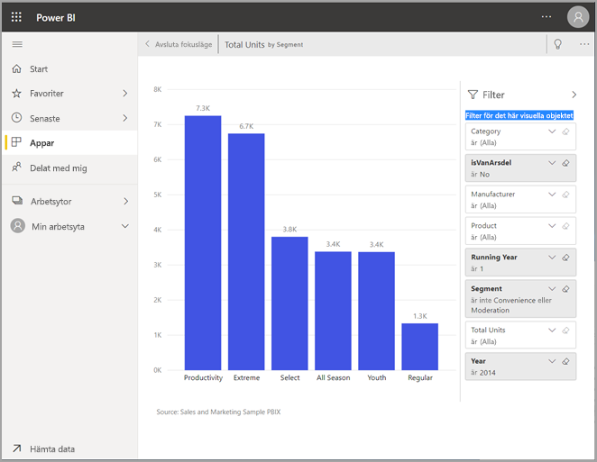
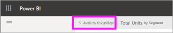
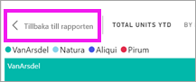

# Visa innehållet i detalj: fokusläge och fullskärmsläge

[!INCLUDE [consumer-appliesto-yynn](../includes/consumer-appliesto-yynn.md)]

[!INCLUDE [power-bi-service-new-look-include](../includes/power-bi-service-new-look-include.md)]    

<iframe width="560" height="315" src="https://www.youtube.com/embed/dtdLul6otYE" frameborder="0" allowfullscreen></iframe>

Fokusläge och fullskärmsläge är två olika sätt att se mer information i dina visuella objekt, rapporter och instrumentpaneler.  Den största skillnaden är att fullskärmsläget inte visar de fönster som omger ditt innehåll, medan du i fokusläget fortfarande kan interagera med dina visuella objekt. Låt oss ta en närmare titt på likheterna och skillnaderna.  

|Innehåll    | Fokusläge  |Helskärmsläge  |
|---------|---------|----------------------|
|Instrumentpanel     |   Inte möjligt     | ja |
|Rapportsida   | Inte möjligt  | ja|
|Visuellt rapportobjekt | ja    | ja |
|Instrumentpanel | ja    | Inte möjligt |
|Windows 10 Mobile | Inte möjligt | Ja |

## Vad är fullskärmsläge?

Visa ditt innehåll i Power BI-tjänsten (instrumentpaneler, rapportsidor och visuella objekt) utan störande menyer och navigeringsfönster.  Du får en oförstörd, fullständig översikt över ditt innehåll på ett överblick, vid alla tidpunkter. Detta kallas ibland för TV-läge.   

Om du använder Power BI Mobile är [fullskärm är tillgängligt för mobila Windows 10-appar](./mobile/mobile-windows-10-app-presentation-mode.md). 

Några användningsområden för fullskärmsläge:

* presentera instrumentpanelen, visuella objekt eller en rapport under ett möte eller en konferens
* visa bilden på kontoret på en dedikerad stor bildskärm eller projektor
* visa på en liten skärm
* granska i låst läge – du kan röra skärmen eller musen över panelerna utan att öppna den underliggande rapporten eller instrumentpanelen

## Vad är läget Fokus?

Med läget ***Fokus*** kan du expandera (fälla ut) ett visuellt objekt eller en panel för att se mer information.  Du kanske har en instrumentpanel eller rapport med mycket innehåll och du vill zooma in på ett enskilt visuellt objekt.  Det här är ett perfekt användningsområde för fokusläget.  

I fokusläget kan en Power BI-*användare* interagera med de filter som tillämpades när det visuella objektet skapades.  Du kan använda fokusläget i BI-tjänsten på en instrumentpanel eller i en rapportvisualisering.

## Arbeta i fullskärmsläge

Helskärmsläge är tillgängligt för instrumentpaneler, rapportsidor och visuella objekt för rapporter. 

- Om du vill öppna en instrumentpanel i helskärmsläge väljer du helskärmsikonen  på den översta menyraden. 

- Om du vill öppna en rapportsida i helskärmsläge väljer du **Visa** > **Helskärm**.

    

- Om du vill visa ett visuellt objekt i helskärmsläge öppnar du det först i fokusläge och väljer sedan **Visa** > **Helskärm**.  

Ditt valda innehåll fyller hela skärmen.    När du är i fullskärmsläge visas en snabbmeny när du flyttar musen eller markören. Eftersom fullskärmsläget används för en mängd olika innehåll kan alternativen i snabbmenyn skilja sig åt, men de är ganska självförklarande.  Du kan hovra över en ikon för att se en beskrivning av den.

Menyn för instrumentpaneler    
    

Menyn för rapportsidor och visuella objekt för rapporter    
    

  *     
  Använd knappen **Tillbaka** för att gå till föregående sida i webbläsaren. Om föregående sida var en Power BI-sida, visas även den i fullskärmsläge.  Fullskärmsläget behålls tills du avslutar.

  *     
  Använd den här knappen om du vill skriva ut din instrumentpanel eller rapportsida i fullskärmsläge.

  *     
    Använd knappen **Anpassa till skärm** för att visa instrumentpanelen i största möjliga storlek utan att behöva använda rullningslisterna.  

    

  *        
    Ibland bryr man sig inte om rullningslisterna utan vill att instrumentpanelen ska fylla hela bredden på det tillgängliga utrymmet. Välj knappen **Anpassa till bredd**.    

    

  *        
    Använd de här pilarna i helskärmsrapporter för att gå mellan sidorna i rapporten.    
  *      
  Om du vill avsluta fullskärmsläget väljer du ikonen **Avsluta fullskärmsläge**.

      

## Arbeta i fokusläge

Fokusläge är tillgängligt för paneler på instrumentpaneler och visuella objekt för rapporter. 

- Om du vill öppna en panel på instrumentpanelen i fokusläge hovrar du över en panel på instrumentpanelen eller ett visuellt objekt för rapporter och väljer **Fler alternativ** (...) följt av **Öppna i fokusläge**.

    .. 

- Om du vill öppna ett visuellt objekt för rapporter i fokusläge hovrar du över det visuella objektet och väljer ikonen för **fokusläge** .  

   

Det visuellt objektet öppnas och fyller hela arbetsytan. Obs! Du har fortfarande ett **Filter**-fönster du kan använda för att interagera med det visuella rapportobjektet. Fönstret **Filter** och navigeringsfönstret kan minimeras.

   

     

Utforska ytterligare genom att [ändra filtren](end-user-report-filter.md) och se intressanta upptäckter i dina data.  

Analysera datan efter nya insikter och svar på frågor. Som *användare* kan du inte lägga till nya filter, ändra vilka fält som används i de visuella objekten eller skapa nya visuella objekt.  Du kan dock interagera med de befintliga filtren. 

Det går inte att spara ändringarna för en panel på instrumentpanelen. För ett visuellt objekt för rapporter sparas dock eventuella ändringar som du gör i befintliga filter när du avslutar Power BI. Om du inte vill att Power BI ska spara dina ändringar väljer du **Återställ till standard**.   

Lämna fokusläget och återgå till instrumentpanelen genom att välja antingen **Avsluta fokusläge** eller **Tillbaka till rapporten** (i det övre vänstra hörnet av det visuella objektet).

    

  

## Överväganden och felsökning

* När du använder fokusläget med ett visuellt objekt i en rapport, kan du visa och ändra alla filter: Visuell nivå, Sidnivå, Visning av detaljerad information och Rapportnivå.    
* När du använder fokusläget med ett visuellt objekt i en instrumentpanel, kan du endast visa och ändra filtret för den visuella nivån.

## Nästa steg

[Visa inställningar för rapporter](end-user-report-view.md)