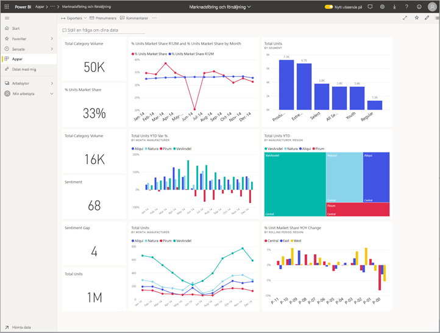
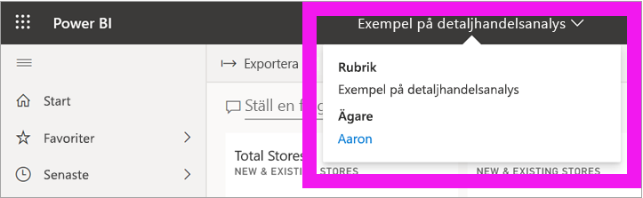
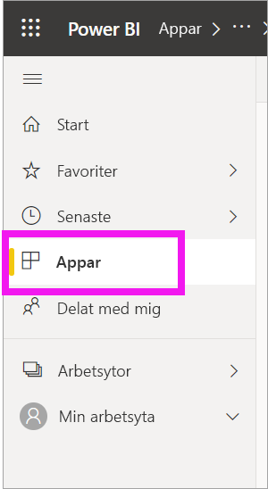
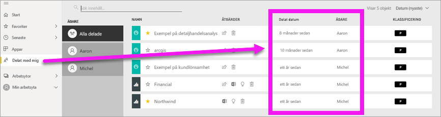
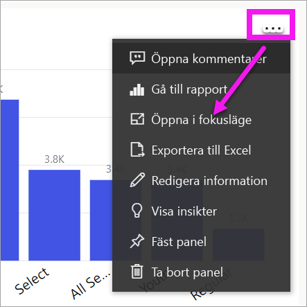
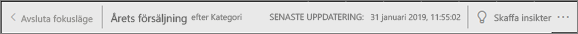
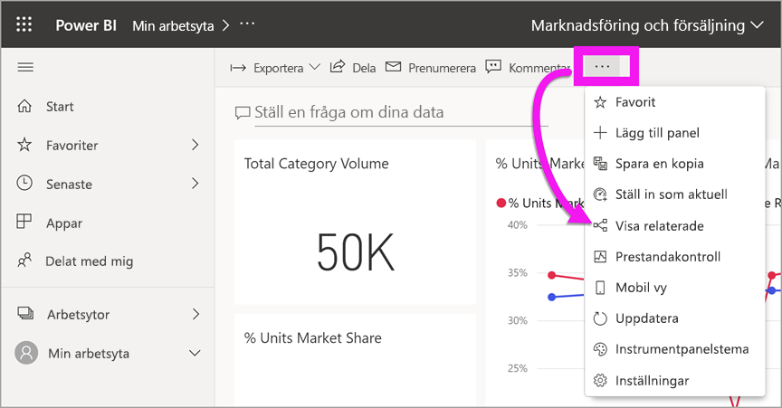
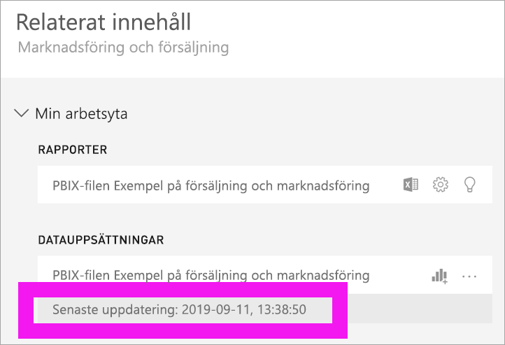

# Ditt innehåll är aktuellt och uppdaterat

[!INCLUDE [power-bi-service-new-look-include](../includes/power-bi-service-new-look-include.md)]

Som *konsument* kan du arbeta med innehåll som skapats av *designer* och delats med dig. Du kanske undrar om det innehållet är aktuellt och uppdaterat eller du kanske bara vill veta när innehållet senast uppdaterades. Att veta att du arbetar med senaste innehållet ger dig tillförsikt.  
 

Att veta att du använder den senaste informationen är ofta avgörande för att kunna fatta rätt beslut. Vad kan du göra för att säkerställa att du använder det senaste innehållet? I de flesta fall behöver du inte göra något alls. Appar som har delats med dig uppdateras automatiskt enligt ett schema som angetts av appdesignern. Samma sak gäller för instrumentpaneler och rapporter som har delats med dig – antingen manuellt eller med hjälp av ett automatiserat uppdateringsschema ser designern till att innehållet är aktuellt.  

Kontakta designern om du har frågor om hur aktuella data är.

## Så här hittar du designerns eller ägarens namn

### Instrumentpanel eller rapport

Du hittar namnet på ägaren från namnlisten för instrumentpaneler och rapporter. Välj namnet på rapporten eller instrumentpanelen för att visa ytterligare information, däribland **ägaren**.

### Appar

Appskärmen visar både namnet på designern samt det datum då appen senast uppdaterades.  

1. Välj **Appar** i navigeringsfönstret.

    

2. Hovra över appen för att visa rubrik, aktualitetsdatum och namn på designern. 

    

### Delat med mig
På skärmen **Delat med mig** ser du namnet på innehållsägaren samt det datum då innehållet senast delades med dig.

 

## Så här kontrollerar du datum för den senaste uppdateringen
Om du är intresserad kan du kontrollera datumet för den senaste uppdateringen för det mesta innehåll. 

### Paneler på instrumentpanelen
För paneler på instrumentpanelen ska du titta på panelen i fokusläge om du vill se tidstämpeln för den senaste uppdateringen.

1. Välj **Fler alternativ** (...) på en panel på instrumentpanelen och sedan **Öppna i fokusläge**.

    

2. Datum för den senaste uppdateringen visas i det övre högra hörnet. Om du inte ser det kan du behöva expandera webbläsaren så att den blir bredare. 

    

### Instrumentpaneler och rapporter
Ett annat sätt att kontrollera uppdateringsdatumet är att använda **Visa relaterade**.  **Visa relaterade** är tillgängligt om du väljer **Fler alternativ** (…) på den övre menyraden i Power BI.

Fönstret **Relaterat innehåll** visar information om den senaste uppdateringen för instrumentpanelens eller rapportens underliggande datauppsättning.

## Vad händer om en app tas bort av designern

Om en designer tar bort en app, tas instrumentpaneler och rapporter som är associerade med appen automatiskt bort från din Power BI-arbetsyta. De är inte längre tillgängliga och appen visas inte i containern Appar eller någon annanstans i navigeringsfönstret.

## Prenumerera för att se ändringar
Ett annat sätt att hålla dig uppdaterad är att prenumerera på en rapport eller instrumentpanel. I stället för att logga in och öppna en rapport eller instrumentpanel kan du få Power BI att skicka en ögonblicksbild enligt ett schema som du anger.  Mer information finns i [prenumerera på instrumentpaneler och rapporter](end-user-subscribe.md).

## Ange dataaviseringar
Vill du bli meddelad om data ändras över eller utöver en gräns som du ställer in? [Skapa en dataavisering](end-user-alerts.md).  Det är lätt att hålla dig uppdaterad med hjälp av dataaviseringar. Med dataaviseringar anger du att Power BI ska skicka dig ett e-postmeddelande om ett värde i en rapport passerar ett visst tröskelvärde.  Om lagerstatus till exempel faller under 25 enheter eller om försäljningen överstiger ett mål.  

## Nästa steg
[Skapa en dataavisering](end-user-alerts.md)    
[Prenumerera på instrumentpaneler och rapporter](end-user-subscribe.md)    
[Visa relaterat innehåll](end-user-related.md)    
