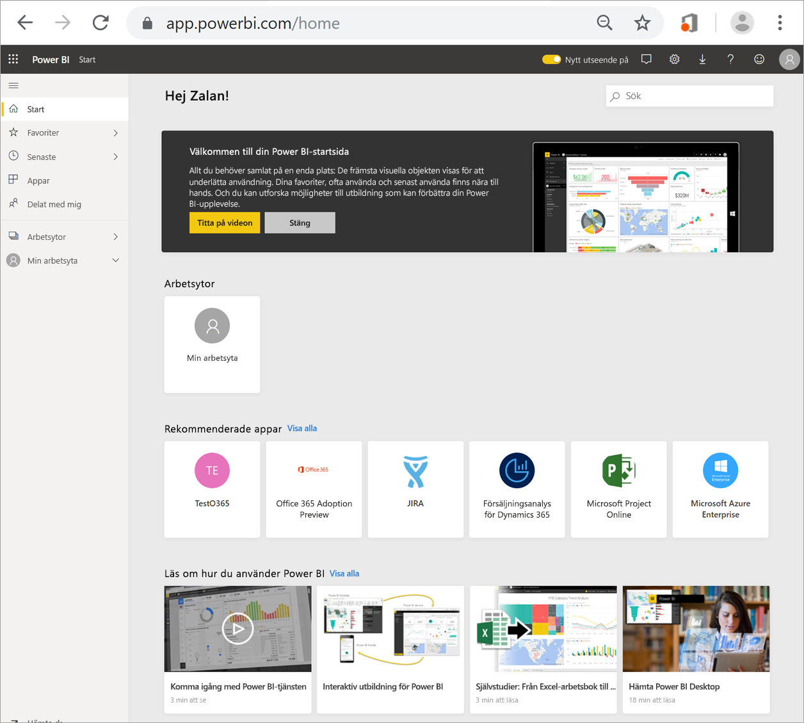

# Leta upp dina instrumentpaneler, rapporter och appar

[!INCLUDE[consumer-appliesto-yynn](../includes/consumer-appliesto-yynn.md)]
I Power BI syftar termen *innehåll* på appar, instrumentpaneler och rapporter. Innehållet skapas av Power BI-*designers* som delar det med kollegor som du. Ditt innehåll är tillgängligt och kan visas i Power BI-tjänsten. Den bästa platsen att börja arbeta med Power BI är från Power BI **Hem**.

## Utforska Power BI-start
När du har loggat in på Power BI-tjänsten väljer du **Hem** i navigeringsfönstret. 

Power BI och visar din arbetsyta såsom det visas på följande bild.
 

I Power BI-start finns tre olika sätt att hitta och visa ditt innehåll. Alla tre metoderna ger åtkomst till samma pool med innehåll och är bara olika sätt att komma åt det innehållet. Ibland är sökning det enklaste och snabbaste sättet att hitta något. Vid andra tillfällen är det bästa alternativet att välja ett *kort* på Hem-arbetsytan.

- Hem-arbetsytan visar och organiserar ditt favoritinnehåll och ditt senaste innehåll samt rekommenderat innehåll och utbildningsresurser. Varje innehållsdel visas som ett *kort* med en rubrik och ikon. Om du väljer ett kort öppnas det innehållet.
- På vänster sida finns ett navigeringsfönster som kallas navigeringsfältet. I det här fönstret organiseras ditt innehåll lite annorlunda: efter Favoriter, Senaste, Appar och Delat med mig. Härifrån kan du visa listor med innehåll och välja det som ska öppnas.
- I det övre högra hörnet kan du använda rutan för global sökning till att söka efter innehåll baserat på rubrik, namn eller nyckelord.

I följande ämnen granskas vart och ett av dessa alternativ för sökning efter och visning av innehåll.

## Hem-arbetsytan
På Hem-arbetsytan kan du visa allt innehåll som du har behörighet att använda. Först finns har du kanske inte så mycket innehåll på Hem-arbetsytan (se bilden ovan), men det ändras när du börjar använda Power BI med dina kollegor.

Hem-arbetsytan uppdateras också med rekommenderat innehåll och utbildningsresurser. 
 
När du arbetar i Power BI-tjänsten får du instrumentpaneler, rapporter och appar från kollegor, och sedan fylls Power BI-start i. Med tiden kan den likna följande.

 
Följande ämnen tar en närmare titt på den här Hem-arbetsytan, uppifrån och ned.

## Det viktigaste innehållet finns nära till hands

### Favoriter och vanliga
Det här översta avsnittet innehåller länkar till det innehåll som du besöker oftast eller som du har taggat som [aktuellt eller favorit](end-user-favorite.md). Observera att flera kort har gula stjärnor. De två apparna och instrumentpanelen har taggats som favoriter. 

Dessutom kan du tagga innehåll som [Aktuellt](end-user-featured.md). Välj den instrumentpanel eller den rapport som du tror att du oftast kommer att använda och ange den som ditt *aktuella* innehåll. Varje gång du öppnar Power BI-tjänsten visas din aktuella instrumentpanel först. 

### Senaste och Mina appar
I nästa avsnitt visas det innehåll som du har besökt senast. Lägg märke till tidsstämpeln på varje kort. I avsnittet **Mina appar** visas appar som har delats med dig eller som du har [laddat ned från AppSource](end-user-apps.md). De senaste apparna visas där. Du kan välja **Visa alla** för att visa en lista över alla appar som delas med dig.

### Arbetsytor
Varje Power BI-tjänstanvändare har en **Min arbetsyta**. **Min arbetsyta** har innehåll om du har laddat ned Microsoft-exempel eller skapat egna instrumentpaneler, rapporter eller appar. För många *användare* kommer **Min arbetsyta** att vara tom och förbli tom.  

Varje gången du [Laddar ner en app](end-user-app-marketing.md) eller om en [app delas med dig](end-user-apps.md), skapas en ny arbetsyta.  Öppna en *apparbetsyta* genom att välja den på din Hem-arbetsyta. 

Appen öppnas på din arbetsyta och du kan se namnet på arbetsytan som visas i navigeringsfönstret. I arbetsytorna separerar Power BI-tjänsten ditt innehåll efter typ: instrumentpaneler och rapporter. I vissa fall har du också arbetsböcker och datauppsättningar. Den här organisationen visas när du väljer en arbetsyta. I det här exemplet innehåller arbetsytan **Trädgårdsskötselkedja** fyra instrumentpaneler och två rapporter.

### Delat med mig
Kollegor delar appar med dig, men de kan även dela enskilda instrumentpaneler och rapporter. I avsnittet **Delat med mig** ser du att det finns tre instrumentpaneler och tre rapporter som dina kollegor har delat med dig.

### Rekommenderade appar
Baserat på dina aktivitets- och kontoinställningar visar Power BI en uppsättning rekommenderade appar. När du väljer ett appkort öppnas appen.
 
### Inlärningsresurser
Längst ned på Hem-arbetsytan finns en uppsättning utbildningsresurser. De exakta resurser som visas beror på din aktivitet, dina inställningar samt Power BI-administratören. 
 
## Utforska navigeringsfönstret

I navigeringsfönstret klassificeras ditt innehåll på ett sätt som gör att du snabbt hittar det du behöver.  

Använd navigeringsfönstret för att hitta och flytta mellan instrumentpaneler, rapporter och appar. Ibland går det snabbast att använda navigeringsfönstret för att komma till innehåll. Navigeringsfönstret finns där när du öppnar startsidan och förblir kvar när du öppnar andra områden i Power BI-tjänsten. Det kan minimeras genom att välja ikonen Dölj  .
  
Navigeringsfönstret organiserar ditt innehåll i containrar som liknar det du redan har sett på startarbetsytan: Favoriter, senaste, appar, delade med mig och arbetsytor. Med hjälp av utfällbara menyer kan du visa endast det senaste innehållet i var och en av de här containrarna, eller så kan du gå till innehållslistor och se allt innehåll för varje containerkategori.
 
- Om du vill öppna ett av de här innehållsavsnitten och visa en lista över alla objekt väljer du rubriken.
- Om du vill se det senaste i varje container väljer du den utfällbara menyn ( **>** ).

    

 
Navigeringsfönstret är ett annat sätt att snabbt hitta det innehåll som du vill ha. Innehållet är ordnat på ett sätt som liknar Hem-arbetsytan, men det visas i listor i stället för på kort. 

## Söka igenom allt ditt innehåll
Ibland är det snabbaste sättet att hitta ditt innehåll att söka efter det. Till exempel har du kanske upptäckt att en instrumentpanel som du inte har använt på ett tag inte visas på Hem-arbetsytan. Eller så minns du kanske att din kollega Aaron har delat något med dig, men du kommer inte ihåg vad det heter eller vilken typ av innehåll han har delat, huruvida det var en instrumentpanel eller en rapport. Eller så kanske du har så mycket innehåll att det är enklare att söka än att bläddra eller sortera. 
 
Sökfältet finns i det övre högra avsnittet på startmenyraden. Du kan ange den instrumentpanelens fullständiga namn eller delar av det när du söker efter den. Dessutom kan du ange kollegans namn och söka efter innehåll som han eller hon har delat med dig. Sökningen omfångsbegränsas till att söka efter matchningar i allt innehåll som du äger eller har åtkomst till.

## Nästa steg
Översikt över [grundläggande begrepp i Power BI](end-user-basic-concepts.md)
