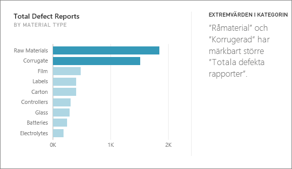
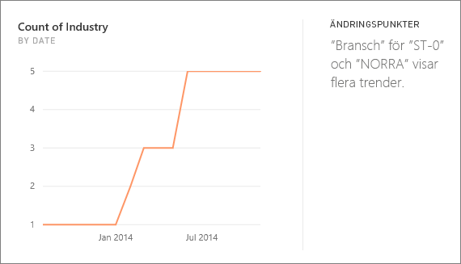
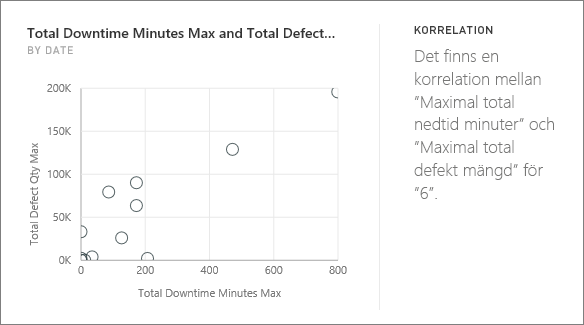
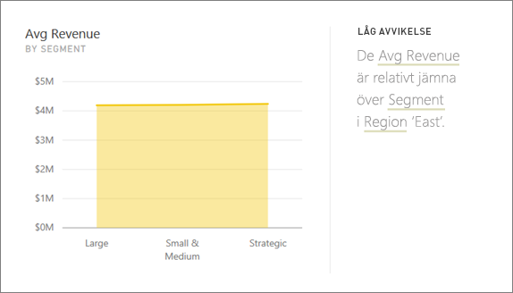
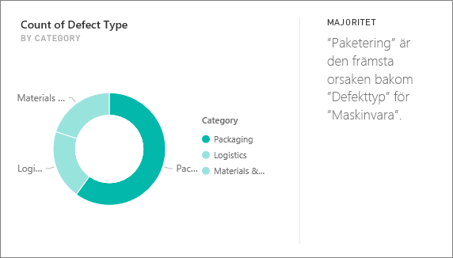
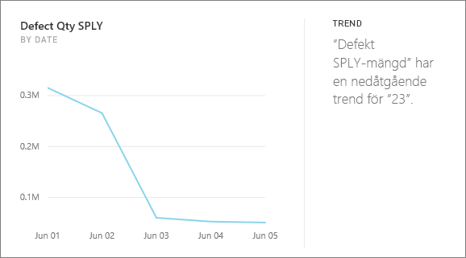
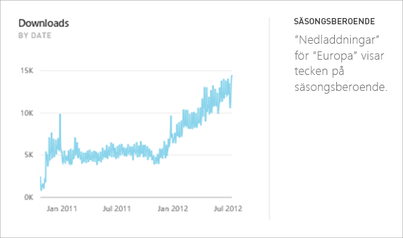
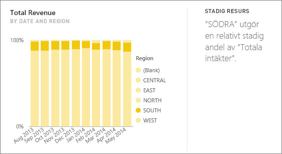
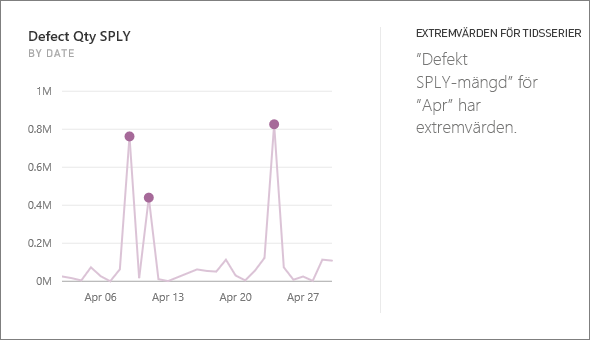

# Typer av insikter som stöds av Power BI

Du kan be Power BI att titta igenom dina data för att hitta intressanta trender och mönster. Dessa trender och mönster presenteras i form av visuella objekt som kallas *insikter*. 

Information om hur du använder insikter finns i avsnittet om [Power BI-insikter](end-user-insights.md)

## Hur fungerar insikter?
Power BI söker snabbt igenom delmängder av din datauppsättning. Under sökningen används en uppsättning sofistikerade algoritmer för att identifiera potentiellt intressanta insikter. Power BI-*konsumenter* kan köra insikter på paneler på instrumentpanelen.

## Terminologi
I Power BI används statistiska algoritmer för att få insikter. Algoritmerna visas och beskrivs i nästa avsnitt i den här artikeln. Innan vi kommer till algoritmerna ska vi gå igenom definitionerna för vissa termer som du kanske inte känner till. 

* **Mått** – ett mått är ett kvantitativt fält (numeriskt) som kan användas för beräkningar. Vanliga beräkningar är summa, medelvärde och minimum. Anta att vi till exempel har ett företag som tillverkar och säljer skateboards. Då kan våra mått vara antalet sålda skateboards och genomsnittlig vinst per år.  
* **Dimension** – dimensioner är kategoriska data (text). En dimension beskriver en person, ett objekt, en artikel, en produkt, en plats och en tidpunkt. I en datamängd är dimensioner ett sätt att gruppera *mått* i användbara kategorier. För vårt skateboardföretag kan vissa dimensioner innefatta att titta på försäljningen (ett mått) efter modell, färg, land eller marknadsföringskampanj.   
* **Korrelation** – en korrelation anger hur sakers beteenden är relaterade till varandra.  Om saker har liknande mönster för ökning och minskning är de positivt korrelerade. Och om mönstren visar ett motsatt förhållande är de negativt korrelerade. Om vår försäljning av röda skateboards ökar varje gång vi kör en tv-reklamkampanj innebär det att försäljningen av röda skateboards och tv-kampanjen är positivt korrelerade.
* **Tidsserie** – en tidsserie är ett sätt att visa successiva datapunkter. Dessa datapunkter kan anges i steg, till exempel sekunder, timmar, månader eller år.  
* **Kontinuerlig variabel** – en kontinuerlig variabel kan vara ett värde mellan dess lägsta och högsta gräns, annars är det en diskret variabel. Exempel är temperatur, vikt, ålder och tid. Kontinuerliga variabler kan innehålla bråktal eller delar av värdet. Det totala antalet sålda blå skateboards är en diskret variabel eftersom vi inte kan sälja hälften av en skateboard.  

## Vilka typer av insikter kan vi hitta?
Dessa algoritmer används i Power BI. 

### Kategoriavvikare (upp/ned)
Markerar fall där en eller två kategorier har mycket större värden än andra kategorier.  

### Ändra punkterna i en tidsserie
Visar om det finns betydande förändringar i trender i en tidsserie med data.

### Korrelation
Identifierar fall där flera mått visar ett liknande mönster eller en trend när de ritas mot en kategori eller ett värde i datamängden.

### Låg varians
Identifierar fall där datapunkter för en dimension inte är långt från medelvärdet, så att "variansen" är lågt. Anta att du har måttet "försäljning" och dimensionen "region". Och när du tittar på regionen ser du att det är en väldigt liten skillnad mellan datapunkterna och deras medelvärde. Insikten utlöses när försäljningsvariansen för alla regioner ligger under tröskelvärdet. Det sker, med andra ord, när försäljningen är i stort sett likadan i alla regioner.

### Majoritet (viktiga faktorer)
Söker efter fall där en majoritet av ett totalt värde kan bero på en enda faktor vid uppdelat efter en annan dimension.  

### Övergripande trender i tidsserier
Identifierar trender uppåt eller nedåt i tidsseriedata.

### Säsongsberoende i tidsserier
Söker efter periodiska mönster i tidsseriedata, till exempel säsongsvärdet för varje vecka, månad eller år.

### Stadig resurs
Visar fall där det finns en överordnad-underordnad korrelation mellan andelen av det underordnade värdet i förhållande till det övergripande värdet för det överordnade över en kontinuerlig variabel. Den stabila resursinsikten gäller kontexten för ett mått, en dimension och en annan datum/tidsdimension. Den här insikten utlöses när ett visst dimensionsvärde, t.ex. "nordöstra regionen", har en stadig procentandel av den övergripande försäljningen för den datum/tidsdimensionen.

Den stabila resursinsikten liknar insikten med låg varians, eftersom båda två relaterar till bristen på varians för ett värde över tid. De stabila resursinsiktsmåtten mäter dock bristen på varians i den **övergripande procentandelen** över tid, medan insikten med låg varians mäter bristen på varians för de absoluta mätvärdena i en dimension.

### Extremvärden för tidsserier
För data över en tidsserie, identifierar när det finns specifika datum- och tidsvärden som skiljer sig från andra datum-/tidsvärden.

## Nästa steg
[Power BI-insikter](end-user-insights.md)

Har du fler frågor? [Prova Power BI Community](https://community.powerbi.com/)

