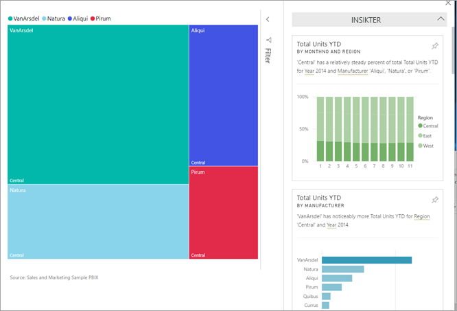
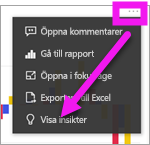
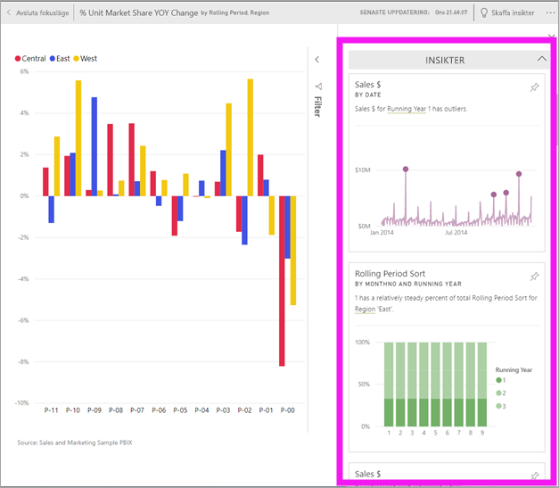
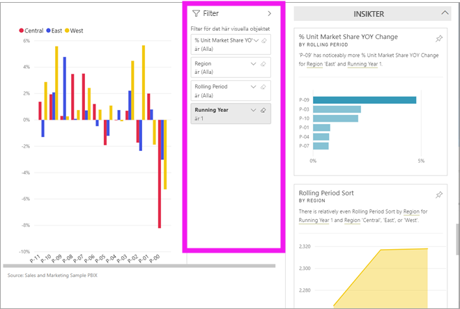
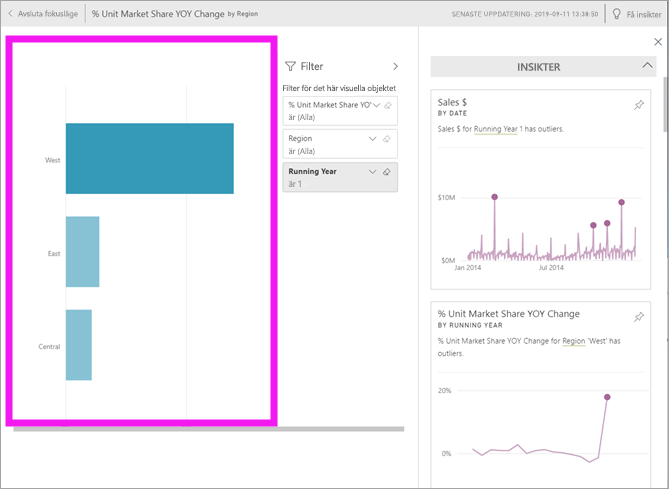

# Visa datainsikter på instrumentpanelens paneler med Power BI
Varje [panel](end-user-tiles.md) för visuella objekt på instrumentpanelen är en dörr in till datagranskning. När du väljer en panel öppnas en rapport eller [Frågor och svar](end-user-q-and-a.md) där du kan filtrera och sortera och fördjupa dig i datauppsättningen bakom rapporten. Och när du kör insikter, gör Power BI datagranskningen åt dig.

Kör insikter om du vill generera intressanta interaktiva visuella objekt utifrån dina data. Insikter kan köras på en specifik panel på instrumentpanelen och du kan till och med köra insikter på en insikt!

Funktionen insikter bygger på en växande [uppsättning avancerade analytiska algoritmer](end-user-insight-types.md) utvecklade tillsammans med Microsoft Research som vi kommer att fortsätta att använda så att flera användare kan söka efter insikter i sina data på nya och intuitiv sätt.

## Kör insikter på en panel på instrumentpanelen
När du kör insikter på en panel på instrumentpanelen, söker Power BI exakt de data som används för att skapa denna enskilda panel. 

1. [Öppna en instrumentpanel](end-user-dashboards.md).
2. Hovra över en panel. välj ellipserna (...) och välj **Visa insikter**. 

    

3. Panelen öppnas i [Fokusläge](end-user-focus.md) med detta insiktskort visat längst till höger.    
   
        
4. Fångar ett insiktskort ditt intresse? Välj insiktskortet för att gå djupare. Vald insikt visas till vänster och nya insiktskort som endast baseras på data i denna enda insikt visas till höger.    

 ## Interagera med Insight-korten
När du har en insikt öppen, kan fortsätta att utforska.

   * Filtrera det visuella objektet på arbetsytan.  Välj pilen i det övre högra hörnet för att expandera filterfönstret om du vill visa filtren.

      
   
   * Kör insikter på själva insiktskortet. Detta kallas ofta **relaterade insikter**. Välj ett insiktskort för att göra det aktivt. Det visas på rapportarbetsytan.
   
      
   
   * I det övre högra hörnet väljer du ikonen med glödlampan  eller **Hämta insikter**. Insikten visas till vänster och nya kort som endast baseras på data i denna enda insikt visas till höger.
     
     
     
Om du vill återgå till din rapport väljer du **Avsluta Fokusläge** i det övre vänstra hörnet.

## Överväganden och felsökning
- **Visa insikter** fungerar inte med alla typer av paneler på instrumentpanelen. Det är till exempel inte tillgängligt för anpassade visuella objekt.<!--[custom visuals](end-user-custom-visuals.md)-->

## Nästa steg
Lär dig mer om [tillgängliga typer av Quick Insights](end-user-insight-types.md)

