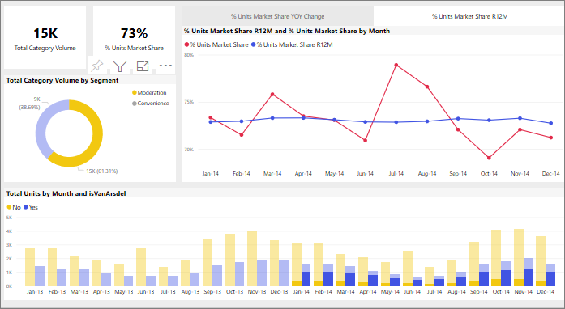

# Hur visuella objekt korsfiltrerar varandra i en Power BI-rapport
En av de viktigaste funktionerna i Power BI är det sätt på vilket alla visuella objekt på en rapportsida är sammankopplade. Om du väljer en datapunkt på ett av de visuella objekten kan alla andra visuella objekt på sidan som innehåller dessa data ändras, baserat på det valet. 

## Hur visuella objekt interagerar med varandra

När en datapunkt väljs i ett visuellt objekt på en rapportsida sker som standard korsfiltrering eller korsmarkering av de andra visuella objekten på sidan. Exakt hur visuella objekt på en sida interagerar anges av rapport-*designern*. *Designers* har alternativ för att aktivera eller inaktivera visuella interaktioner och att ändra standardbeteenden för korsfiltrering, korsmarkering och [detaljgranskning](end-user-drill.md). 

Om du inte har kommit i kontakt med hierarkier eller granskning tidigare kan du lära dig allt om dem genom att läsa artikeln om [detaljgranskning i Power BI](end-user-drill.md). 

Korsfiltrering och korsmarkering kan vara användbart för att identifiera hur ett värde i dina data bidrar till ett annat. Om du till exempel väljer segmentet Moderering i ringdiagrammet markeras bidraget från det segmentet till varje kolumn i diagrammet Totalt antal enheter efter månad, och linjediagrammet filtreras.

Se [Om filtrering och markering](end-user-report-filter.md). 

  
> [!NOTE]
> Termerna *Korsfilter* och *Korsmarkering* används för att särskilja det beteende som beskrivs här från vad som händer när du använder fönstret **Filter** till att filtrera och markera visuella objekt.  

## Överväganden och felsökning
- Om din rapport har ett visuellt objekt som stöder [detaljgranskning](end-user-drill.md) så har detaljgranskning av ett visuellt objekt som standard ingen inverkan på andra visuella objekt på rapportsidan.     
- Om du använder visuellt objekt A för att interagera med visuellt objekt B tillämpas filter på visuell nivå från visuellt objekt A på visuellt objekt B.

## Nästa steg
[Så här använder du rapportfilter](../power-bi-how-to-report-filter.md)
