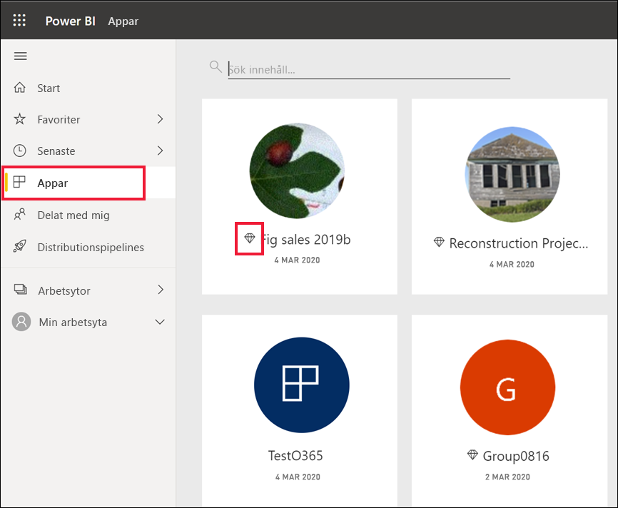
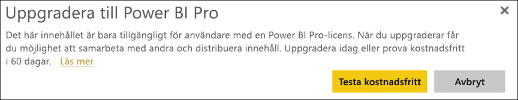

# Licenser och prenumerationer för *konsumenter*

[!INCLUDE[consumer-appliesto-ynnn](../includes/consumer-appliesto-ynnn.md)]

Som [*konsument*](end-user-consumer.md) använder du Power BI-tjänsten till att utforska rapporter och instrumentpaneler i syfte att fatta datadrivna affärsbeslut. Om du har använt Power BI ett tag, eller om du har pratat med dina *designerkollegor*, har du förmodligen upptäckt att det finns en del funktioner som bara fungerar om du har en viss typ av licens, prenumeration eller behörighet. 

Det du kan göra i Power BI-tjänsten beror på tre saker:
-    vilken typ av licens och prenumeration du använder
-    var innehåll lagras
-    de roller och behörigheter du har tilldelats

I den här artikeln beskriver vi funktionerna i varje licenstyp och hur *den plats där innehåll lagras* kan påverka *vad du kan göra med det*. Du lär dig även hur du letar rätt på din licens och prenumeration samt tar reda på var ditt innehåll lagras. Mer information om roller och behörigheter finns i [arbetsyteroller](end-user-workspaces.md).

## Licenser

Alla Power BI-tjänstanvändare använder antingen en *kostnadsfri* licens eller en *Pro*-licens. Om du är Power BI-*konsument* använder du förmodligen en kostnadsfri licens som hanteras av din Power BI-klientadministratör. 

Det går att ha fler än en licens på samma gång.  Tjänsten levererar alltid en upplevelse som motsvarar den bästa licens som du för närvarande har. 

## Power BI Premium-kapacitet

Premium är en organisationsprenumeration som tillhandahåller ett annat sätt att lagra innehåll – i en dedikerad kapacitet. Med Premium kan alla med behörigheter, både inom och utanför organisationen, se ditt Power BI-innehåll utan att köpa individuella Power BI Pro-licenser. 

Premium möjliggör omfattande distribution av innehåll från Pro-användare utan att de mottagare som visar innehållet behöver ha Pro-licenser. Pro-licenser krävs för innehållsdesigners. Utvecklarna ansluter till datakällor, modellerar data och skapar rapporter och instrumentpaneler som paketeras som arbetsyteappar. Användare som saknar Pro-licens kan trots detta få åtkomst till en arbetsyta med Power BI Premium-kapacitet, så länge som de är tilldelade en [roll på arbetsytan](end-user-workspaces.md).

På dessa arbetsytor tilldelar designers roller såsom **Tittare**, **Deltagare**, **Medlem** och **Administratör**, som avgör i vilken utsträckning kollegor kan interagera med innehållet. Mer information finns i [behörigheter och roller för arbetsytor](end-user-workspaces.md). 

Mer information om Premium-kapacitet finns i [Vad är Microsoft Power BI Premium?](../admin/service-premium-what-is.md).

## Ta reda på vilka licenser du har

Besök [din Microsoft **Mitt konto**-sida](https://portal.office.com/account) för att se vilka licenser som har tilldelats till dig.  Välj fliken för **Prenumerationer**.

Den första användaren, Pradtanna, har Office 365 E5, som innehåller en Power BI Pro-licens.

Den andra användaren, Zalan, har en kostnadsfri Power BI-licens. 

## Ta reda på om du har åtkomst till Premium-kapacitet

Kontrollera sedan om du ingår i en organisation som har Premium-kapacitet. Alla användare ovan, både med Pro-licens och kostnadsfri licens, kan tillhöra en organisation som har Premium-kapacitet.  Vi undersöker det här för den andra användaren, Zalan.  

Vi kan avgöra om Zalans organisation har Premium-kapacitet genom att leta upp mängden tillgängligt lagringsutrymme. 

- Välj **Min arbetsyta** i Power BI-tjänsten och sedan kugghjulsikonen uppe till höger. Välj **Hantera personlig lagring**.

    

    Om du ser mer än 10 GB är du medlem i en organisation som har en Premium-prenumeration. Bilden nedan visar att Zalans organisation har upp till 100 GB lagringsutrymme.  

    

Observera att en Pro-användare redan har delat en arbetsyta med Zalan. Diamantikonen anger att den här arbetsytan lagras i Premium-kapacitet. 

## Identifiera innehåll som hanteras i Premium-kapacitet

Ett annat sätt att ta reda på om din organisation har Premium-kapacitet är att leta efter appar och apparbetsytor med en diamantikon. Diamanten anger att innehållet lagras i Premium-kapacitet. 

I bilden nedan lagras tre av apparna i Premium-kapacitet.

    
Som användare med en kostnadsfri licens, förutsatt att *designern* placerar arbetsytan i en dedikerad Premium-kapacitet, har du möjligheten att **på den arbetsytan** visa delat innehåll, samarbeta med kollegor, arbeta med appinstrumentpaneler och rapporter och annat. Omfattningen av dina behörigheter anges av din Power BI-administratör och av innehållsdesignern. 

   

## Färdigställa allt

När en organisation köper en Premium-prenumeration tilldelar administratören normalt Pro-licenser till de anställda som ska arbeta i Premium-kapacitet samt skapa och dela innehåll. Pro-användarna skapar [arbetsytor](end-user-workspaces.md) och lägger till innehåll (instrumentpaneler, rapporter, appar) på dessa arbetsytor. För att låta användare med kostnadsfri licens samarbeta på dessa arbetsytor tilldelar administratören eller Pro-användaren arbetsytorna till *dedikerad kapacitet*.    
 

|Licenstyp  |delad kapacitet  |dedikerad kapacitet  |
|---------|---------|---------|
|**Kostnadsfri**     |  För användning som en personlig sandbox-miljö där du skapar innehåll för dig själv och interagerar med det innehållet. Det här är ett utmärkt sätt att prova på Power BI-tjänsten. Du kan inte använda innehåll från någon annan eller dela ditt innehåll med andra 1     |   Interagera med innehåll som har tilldelats dedikerad kapacitet och som delas med dig. Användare med kostnadsfri licens eller Pro-licens kan samarbeta utan att användarna med kostnadsfri licens behöver ha Pro-konton.      |
|**Pro**     |  Samarbeta med andra Pro-användare genom att skapa och dela innehåll.        |  Samarbeta med användare med kostnadsfri licens och Pro-licens genom att skapa och dela innehåll.       |

1 Se [Överväganden och felsökning](#considerations-and-troubleshooting). 

I diagrammet nedan representerar den vänstra sidan Pro-användare som skapar och delar innehåll på apparbetsytor. 

- **Arbetsyta A** skapades i en organisation som inte har Premium-kapacitet. 

- **Arbetsyta B** skapades i en organisation som har en Premium-prenumeration, och arbetsytan sparades med i dedikerad kapacitet. Den här arbetsytan har en diamantikon.  

    

Power BI Pro-*designern* kan dela och samarbeta med andra Pro-användare via vilken som helst av arbetsytorna. Men det enda sättet för Power BI Pro-användare att dela och samarbeta med användare med kostnadsfri licens är att använda Arbetsyta B, som är i en dedikerad Premium-kapacitet.  På arbetsytan tilldelar designern medarbetarna roller. Din roll avgör vilka åtgärder du kan vidta på arbetsytan. Power BI-*konsumenter* tilldelas vanligtvis rollen *Tittare*. Läs mer om roller i [Arbetsytor för Power BI-konsumenter](end-user-workspaces.md).

## Överväganden och felsökning
- Det går att ha fler än en Power BI-licens. Power BI-tjänsten levererar alltid den upplevelse som motsvarar den bästa licens som du för närvarande har. Om du till exempel har både en Pro-licens och en kostnadsfri licens använder Power BI-tjänsten Pro-licensen.

- Om du vill dela och skapa innehåll (instrumentpaneler, rapporter och appar) är du kanske inte Power BI-*konsument*, utan *designer*. Se till att du har en Pro-användarlicens. Du kan registrera dig för en kostnadsfri 60-dagars utvärdering av Power BI Pro genom att välja den dialogruta för uppgradering som visas i Power BI-tjänsten när du försöker använda en Pro-funktion.

    

  När utvärderingen på 60 dagar upphör att gälla ändras din licens tillbaka till en kostnadsfri Power BI-licens. Då har du inte längre tillgång till funktioner som kräver en Power BI Pro-licens. Om du vill fortsätta med en Pro-licens kan du kontakta din administratör eller IT-supportavdelning om att köpa en Power BI Pro-licens. Om du inte har någon administratör eller IT-supportavdelning kan du besöka [sidan med prissättningen för Power BI](https://powerbi.microsoft.com/pricing/).     

- Om du har registrerat dig för en kostnadsfri licens på egen hand, genom att välja en typ av *Testa det kostnadsfritt*-knapp, upphör den aldrig att gälla. Så om du uppgraderar till en Pro-utvärdering eller om din organisation ger dig en Pro-licens, och din utvärdering sedan går ut eller din organisation tar bort din Pro-licens, har du fortfarande tillgång till den kostnadsfria licensen – såvida du inte avbryter licensen. 

- 1 En kostnadsfri användarlicens för Power BI-tjänsten är perfekt för dem som utforskar eller använder den för personlig dataanalys och visualiseringar med hjälp av **Min arbetsyta**. Användare med en fristående, kostnadsfri licens kan inte använda Power BI för att samarbeta med kollegor. Fristående användare med kostnadsfria licenser kan inte visa innehåll som delas av andra eller dela sitt eget innehåll med andra Power BI-användare. 

    

## Nästa steg
- [Är jag Power BI-*konsument*?](end-user-consumer.md)    
- [Läs mer om arbetsytor](end-user-workspaces.md)    
- [Visa Power BI-konsumentfunktioner per licenstyp](end-user-features.md)
