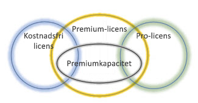
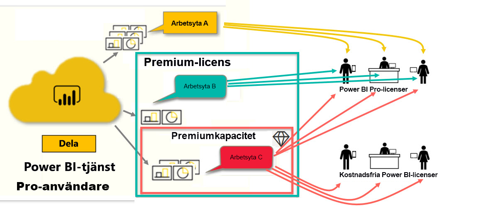
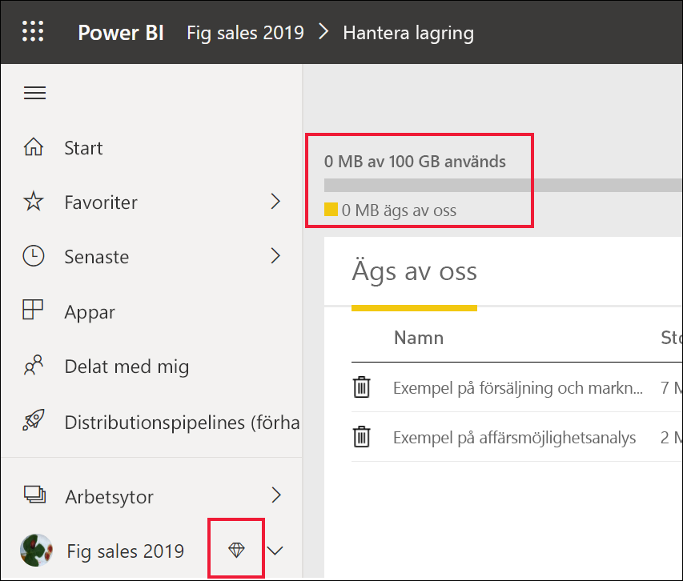

# Typer av Power BI-licenser
Som *användare* så använder du Power BI-tjänsten till att utforska rapporter och instrumentpaneler i syfte att fatta affärsbeslut. Om du har använt Power BI ett tag, eller om du har pratat med dina *designerkollegor*, har du förmodligen upptäckt att det finns en del funktioner som bara fungerar om du har en viss typ av licens. 

I den här artikeln går vi igenom skillnaderna mellan de olika licenstyperna och kombinationerna: kostnadsfri, Pro, Premium och Premium-kapacitet. Du får också lära dig hur du tar reda på vilken kombination du använder.  

Vi börjar med att titta på de två licenskategorierna – användarlicenser och organisationslicenser. Vi börjar med de standardfunktioner som är tillgängliga med licenserna. Sedan tittar vi på hur din Power BI-administratör och innehållsägarna kan använda roller och behörigheter för att ändra standardlicensfunktionerna. 

Även om din licens tillåter något, så kan t.ex. administratören begränsa din förmåga att göra saker som att exportera data, använda frågor och svar med naturligt språk eller publicera på webben. När en rapport*designer* tilldelar en arbetsyta innehåll, så kan den tilldela dig en arbetsyteroll. Rollerna avgör vad du kan och inte kan göra på den arbetsytan. *Designern* kan justera gränserna för licensen ytterligare med hjälp av behörighetsinställningar. Det är, med andra ord, rätt så komplicerat. Förhoppningsvis kan den här artikeln eliminera, om inte all, så åtminstone merparten av denna förvirring.

## Licenser per användare
Den första typen av licens är en licens **per användare**. Alla Power BI-tjänstanvändare har antingen en kostnadsfri licens eller en Pro-licens. Vissa funktioner är reserverade för användare med Pro-licenser.  

- Med en **Power BI Pro-licens** kan användare samarbeta med andra Pro-användare genom att skapa och dela innehåll. Det är bara användare med en Pro-licens kan publicera rapporter, prenumerera på instrumentpaneler och rapporter och samarbeta med kollegor på arbetsytor. 

    

    Power BI Pro är en enskild användarlicens där användarna kan läsa och interagera med rapporter och instrumentpaneler som andra har publicerat i Power BI-tjänsten. Användare med den här licenstypen kan dela innehåll och samarbeta med andra Power BI Pro-användare. Det är bara Power BI Pro-användare som kan publicera och dela innehåll med andra användare eller använda innehåll som andra användare har skapat. Undantaget till detta är innehåll som är värdbaserad i [Power BI Premium-kapacitet](#understanding-premium-and-premium-capacity). Pro-licenser används vanligtvis av *rapportdesigners* och utvecklare. Mer information finns i [Power BI Premium-kapacitet](#understanding-premium-and-premium-capacity) nedan.

- **En fristående kostnadsfri Power BI-licens** är, även om den är kraftfull, främst avsedd för användare som precis har börjat med Power BI eller som skapar innehåll åt sig själva. [Registrera dig själv som enskild individ för Power BI-tjänsten](../service-self-service-signup-for-power-bi.md). En kostnadsfri fristående licens är inte kopplad till någon organisationslicens. 

    En kostnadsfri fristående användarlicens är perfekt för någon som använder Microsofts exempel till att lära sig Power BI. Användare med kostnadsfria fristående licenser kan inte visa innehåll som delas av andra eller dela sitt eget innehåll med andra Power BI-användare. 

    

Hänger du med?  OK. Nu ska vi lägga till ett ytterligare lager, **Premium-kapacitet**.

## Förstå Premium och Premium-kapacitet
Premium är en **organisationslicens**. Tänk på det som att du lägger till ett lager med funktioner ovanpå alla Power BI-licenser **per användare** i organisationen. 

När en organisation köper en Premium-licens tilldelar administratören normalt Pro-licenser till de anställda som ska skapa och dela innehåll. Administratören tilldelar även kostnadsfria licenser till alla som ska använda innehållet. Pro-användarna skapar [arbetsytor](end-user-workspaces.md) och lägger till innehåll (instrumentpaneler, rapporter, appar) på dessa arbetsytor. I syfte att låta andra samarbeta på dessa arbetsytor, så använder Pro-användarna en kombination av *kapacitet*, behörigheter och roller. 

När en organisation köper en Premium-licens får de kapacitet i Power BI-tjänsten som tilldelas dem exklusivt. Den delas inte med andra. Kapaciteten stöds av dedikerad maskinvara som hanteras fullständigt av Microsoft. Organisationer kan välja att använda sin dedikerade kapacitet brett, eller tilldela den till särskilda arbetsytor. En arbetsyta i en Premium-kapacitet är ett utrymme där Pro-användare kan dela och samarbeta med användare med kostnadsfria licenser – utan att dessa användare behöver ha några Pro-konton.  

I Premium-kapaciteter krävs det dock Pro-licenser för alla innehållsutvecklare. Utvecklarna ansluter till datakällor, modellerar data och skapar rapporter och instrumentpaneler som paketeras som arbetsyteappar. Användare utan en Pro-licenser kan fortfarande få åtkomst till arbetsytor i Power BI Premium, förutsatt att innehållet är av Premium-*kapacitet*, och så länge arbetsytans ägare ger dem behörighet.

I diagrammet nedan representerar den vänstra sidan Pro-användare som skapar och delar innehåll på arbetsytor.  
- **Arbetsyta A** skapades i en organisation som inte har Premium. 

- **Arbetsyta B** skapades i en organisation som har en Premium-licens, även om den här specifika arbetsytan inte har sparats med Premium-kapacitet. Arbetsytan är inte försedd med diamantikonen.

- **Arbetsyta C** skapades i en organisation som har en Premium-licens, och som sparats med Premium-kapacitet. Den här arbetsytan är försedd med en diamatikon.  

Power BI Pro-*designern* kan dela och samarbeta med andra Pro-användare via vilken som helst av de tre arbetsytorna. Så länge designern delar arbetsytan med hela organisationen eller tilldelar Pro-användare arbetsyteroller. 

Power BI Pro-*designer* kan bara dela och samarbeta med användare med hjälp av Arbetsyta C. Arbetsytan måste ha tilldelats Premium-kapacitet, så att användare med kostnadsfri licens kan ha åtkomst till arbetsytan. Designern tilldelar medarbetarna roller på arbetsytan: *Administratör*, *Medlem*, *Deltagare* eller *Tittare*. Din roll avgör vilka åtgärder du kan vidta på arbetsytan. Power BI-*konsumenter* tilldelas vanligtvis rollen *Tittare*. Läs mer i [Arbetsytor för Power BI-konsumenter](end-user-workspaces.md).

## Ta reda på vilken licens du har
Det finns flera sätt att visa information om din Power BI-licens. 

Börja med att fastställa vilken **användarlicens** du har.

- I vissa versioner av Microsoft Office ingår en Power BI Pro-licens.  Om du vill se om din version av Office innehåller Power BI går du till [Office-portalen](https://portal.office.com/account) och väljer **Prenumerationer**.

    Den första användaren, Pradtanna, har Office 365 E5, som innehåller en Power BI Pro-licens.

    

    Den andra användaren, Zalan, har en kostnadsfri Power BI-licens. 

    

Kontrollera sedan om ditt konto även har en Premium-licens. Alla användare ovan, både med Pro-licens och kostnadsfri licens, kan tillhöra en organisation som har en Premium-licens.  Vi undersöker det här för den andra användaren, Zalan.  

- Välj **Min arbetsyta** i Power BI-tjänsten och sedan kugghjulsikonen uppe till höger. Välj **Hantera personlig lagring**.

    

    Licenser **per användare**, såväl Pro som kostnadsfria, tillhandahåller 10 GB lagringsutrymme i molnet, vilket kan användas för Power BI-rapporter och Excel-arbetsböcker. Om du ser mer än 10 GB är du medlem i ett organisationskonto med en Premium-licens.

    

    Kom ihåg att Zalans användarprenumeration i Office-portalen hade en kostnadsfri Power BI-licens. Men eftersom hans organisation har köpt en Premium-licens, så är Zalan inte begränsad till 10 GB lagringsutrymme i Power BI-tjänsten. Han har 100 GB tillgängligt. Som *konsument* i en organisation med en Premium-licens har Zalan möjlighet, så länge som *designern* placerar arbetsytan i Premium-kapacitet, att visa delat innehåll, samarbeta med kollegor, arbeta med appar och mycket annat. Omfattningen av behörigheterna anges av Power BI-administratören och av innehållsdesignern. Observera att en Pro-användare redan har delat en arbetsyta med Zalan. Diamantikonen upplyser honom om att den här arbetsytan lagras i Premium-kapacitet. 

   
## Förstå arbetsyteroller
Hittills har vi granskat licenser per användare, Premium-licenser och Premium-kapacitet. Nu ska vi ta en titt på arbetsyte*roller*.

Eftersom det här är en artikel för Power BI-*konsumenter*, så har vi tagit fram följande scenario:

-  Du är en användare med *kostnadsfri* licens i en organisation som har en Power BI Premium-licens. 
- En Power BI Pro-användare har skapat en samling instrumentpaneler och rapporter, och har publicerat den här samlingen som en *app* för hela organisationen.  
- Apparna finns på *arbetsytor* och arbetsytan är av Premium-kapacitet.    
- Den här apparbetsytan har en instrumentpanel och två rapporter.
- Pro-användaren har tilldelat oss rollen **Tittare**.

### Tittarrollen
Med roller kan Power BI-*designers* hantera vem som kan göra vad på en arbetsyta, så att teamen kan samarbeta. En av dessa roller är **Tittare**. 

När arbetsytan är i en Power BI Premium-kapacitet, kan användare med läsarroll få åtkomst till arbetsytan även om de inte har en Power BI Pro-licens. Men eftersom rollen Tittare inte har åtkomst till och inte kan exportera underliggande data, så är det ett säkert sätt att interagera på med instrumentpaneler, rapporter och appar.

> [!TIP]
> Läs mer om de andra rollerna (Administratör, Medlem och Deltagare) i [Skapa en ny arbetsyta](../service-new-workspaces.md).

