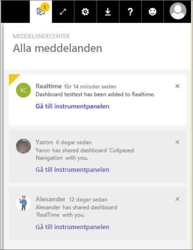

# Visa Power BI-meddelanden

[!INCLUDE [power-bi-service-new-look-include](../includes/power-bi-service-new-look-include.md)]

Meddelandecentret är ett sekventiellt flöde med information som rör din Power BI-upplevelse. Öppna det för att se meddelanden om nya instrumentpaneler som har delats med dig, information om Power BI-händelser och -möten, aviseringar du har ställt in och mer. Du kan [ställa in aviseringar på Power BI-tjänsten](end-user-alerts.md) samt i Power BI-mobilappar.

Titta när Amanda granskar, hanterar och svarar på meddelanden. Följ sedan instruktionerna under videon för att prova själv.    

> [!NOTE]
> Den här videon visar en äldre version av Power BI-tjänsten. 

<iframe width="560" height="315" src="https://www.youtube.com/embed/bZMSv5KAlcE" frameborder="0" allowfullscreen></iframe>

## Se dina meddelanden
1. När du loggar in till Power BI, läggs de nya meddelanden som har skickats till dig när du var offline till ditt flöde. Om du har nya meddelanden, visar Power BI en gul bubbla med antal nya objekt.
   
   
2. Välj **meddelandeikonen** i Power BI-menyraden.
   
   
3. Meddelanden visas med de senaste överst och olästa meddelanden markerade. Meddelanden behålls i 90 dagar, om du inte tar bort dem tidigare eller når maxgränsen på 100.
   
   
4. Välj X-ikonen för att stänga en avisering.

## Nästa steg
* [Dataaviseringar i Power BI-tjänsten](end-user-alerts.md)
* [Ställ in dataaviseringar i iPhone-appen (Power BI för iOS)](mobile/mobile-set-data-alerts-in-the-mobile-apps.md)
* [Ställ in dataaviseringar i Power BI-mobilappen för Windows 10](mobile/mobile-set-data-alerts-in-the-mobile-apps.md)
* Har du fler frågor? [Prova Power BI Community](https://community.powerbi.com/)

