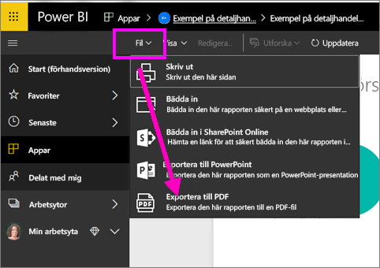
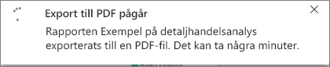
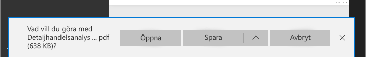

# Exportera rapporter från Power BI till PDF
Med Power BI kan du publicera din rapport till PDF-format och enkelt att skapa ett dokument baserat på din Power BI-rapport. När du **exporterar till PDF** blir varje sida i Power BI-rapporten en separat sida i PDF-dokumentet.

## Så här exporterar du en Power BI-rapport till PDF
Välj en rapport i Power BI-tjänsten för att visa den på arbetsytan. Du kan också välja en rapport från din Start-sida, Appar eller något annat avsnitt i ditt vänstra navigeringsfönstret.

1. Välj **Arkiv** > **Exportera till PDF** på menyraden.

    

    Ett popup-fönster visas där du kan välja **Aktuell vy** eller **Standardvy**.  Med **Aktuell vy** exporteras rapporten i det aktuella tillståndet, vilket innefattar alla aktiva ändringar som du gjort i utsnitts- och filtervärden.  De flesta användare väljer det här alternativet.  Med **Standardvy** exporteras rapporten i dess ursprungliga tillstånd (som den hade när författaren delade den). Inga ändringar som gjorts tas med.
    
    Det finns också en kryssruta för att välja om dolda flikar i en rapport ska exporteras eller inte.  Markera kryssrutan om du endast vill exportera rapportflikar som är synliga för dig i webbläsaren.  Om du föredrar att få med alla dolda flikar i exporten lämnar du kryssrutan avmarkerad.  Om kryssrutan är nedtonad finns inga dolda flikar i rapporten.  Klicka på Exportera för att fortsätta när du har gjort dina val.
    
    En förloppsindikator visar i det övre högra hörnet. Exporten kan ta några minuter och du kan fortsätta att arbeta i Power BI medan rapporten exporteras.

    

    När det är klart, ändras meddelandebanderollen så att du vet att Power BI-tjänsten har slutfört exportåtgärden.

2. Filen är sedan tillgänglig där din webbläsare visar hämtade filer. I följande bild, visas den som en nedladdningsbanderoll längst ned i webbläsarfönstret.

    

Det är allt. Du kan ladda ned filen och öppna den med ett PDF-visningsprogram, som den som finns i Microsoft Edge.

## Begränsningar och överväganden
Det finns några överväganden och begränsningar som du bör tänka på när du arbetar med funktionen **exportera till PDF**.

* **R-visualiseringar** stöds inte för tillfället. I PDF-filen blir dessa visuella objekt tomma och visar ett felmeddelande.  

* **Anpassade visuella objekt** som har **certifierats** stöds. Mer information om certifierade anpassade visuella objekt, inklusive hur anpassade visuella objekt certifieras, finns i [certifiera anpassade visuella objekt](../power-bi-custom-visuals-certified.md). Anpassade visuella objekt som inte har certifierats stöds inte. I PDF-filen visas ett felmeddelande för dem.   

* Rapporter med mer än 30 rapportsidor kan för närvarande inte exporteras.

* Att exportera rapporten till PDF kan ta några minuter att slutföra, så ha tålamod. Faktorer som kan påverka den tid som krävs är rapportens struktur och den aktuella belastningen på Power BI-tjänsten.

* Om menyobjektet **exportera till PDF** inte finns i Power BI-tjänsten, beror det förmodligen på att din klientadministratör har inaktiverat funktionen. Kontakta din klientadministratör för mer information.

* Bakgrundsbilder beskärs med diagrammets markeringsområdet. Vi rekommenderar att du tar bort bakgrundsbilder innan du exporterar till PDF.

* Rapporter som ägs av en användare utanför din Power BI-klientdomänen (som en rapport som ägs av någon utanför organisationen och delas med dig) kan inte publiceras till PDF.

* Om du delar en instrumentpanel med någon utanför organisationen (och därmed, en användare som inte är i din Power BI-klient), kommer den användaren inte att kunna exportera delade instrumentpanelers associerade rapporter till PDF. Så om du är aaron@contoso.com kan du dela med cassie@cohowinery.com. Men cassie@cohowinery.com kan inte exportera de associerade rapporterna till PDF.

* Power BI-tjänsten använder det språk du har i din Power BI-språkinställning som språk för PDF-exporten. Om du vill se eller ange din språkinställning, klicka på kugghjulsikonen **Inställningar** > **Allmänt** > **Språk**.

## Nästa steg
[Skriva ut en rapport](end-user-print.md)
