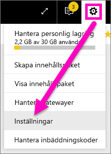
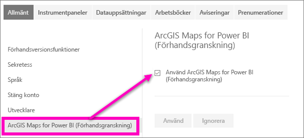

# Anmäl dig till förhandsversionsfunktioner i Power BI-tjänsten
## Vad är *förhandsversionsfunktioner*?
Efter hand som vi förbättrar Power BI-tjänsten släpper vi några nya funktioner som *förhandsversionsfunktioner*. Förhandsversionsfunktioner kan aktiveras och inaktiveras, vilket ger dig möjlighet att testa dem.

> [!TIP]
> Förhandsversionsfunktioner är också tillgängliga för Power BI Desktop. För mer information [besök community-forumet för Power BI Desktop](https://community.powerbi.com/t5/Desktop/bd-p/power-bi-designer).
> 
> 

## Hitta förhandsversioner och aktivera dem (och inaktivera dem)
1. Öppna inställningsmenyn genom att välja kugghjulsikonen längst upp till höger på Power BI-skärmen och välj **Inställningar**.
   
   .
2. Välj fliken **allmänt**. Om förhandsgranskningar finns, ser du antingen ett alternativ för **förhandsgranskningsfunktioner** eller så ser du en förhandsgranskningsfunktion listad till vänster.  I det här exemplet har en förhandsgranskning listats för ArcGIS Maps. 
   
   
3. Välj alternativknappen **På** eller markera kryssrutan för att testa den nya upplevelsen. Välj därefter **Tillämpa**.
4. Inaktivera förhandsgranskningsfunktioner genom att följa steg 1-3 ovan och i steg 3, väljer du **Av**, eller ta bort kryssmarkeringen och välj **Tillämpa**.

Har du några frågor eller feedback? [Besök Power BI Community](http://community.powerbi.com/t5/Navigation-Preview-Forum/bd-p/NavigationPreview).

