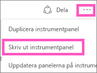
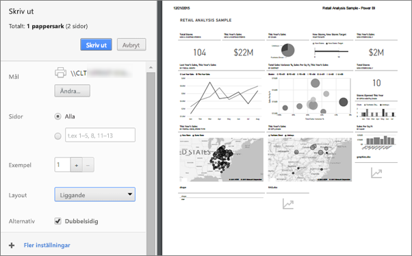
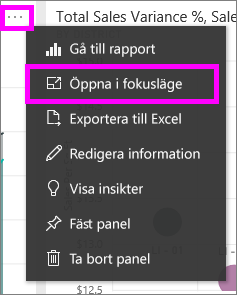
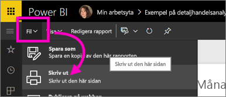

# Skriva ut från Power BI-tjänsten
Skriva ut en hel instrumentpanel, en panel, en rapportsida eller ett visuellt rapportobjekt från Power BI-tjänsten. Rapporter kan bara skrivas ut en sida i taget – det går inte att skriva ut hela rapporten på samma gång.

> [!NOTE]
> Utskrift finns bara i tillgängligt i Power BI-tjänsten, inte i Power BI Desktop.
> 
> 

Se när Amanda skriver ut från sin instrumentpanel och rapport. Följ sedan de stegvisa instruktionerna under videon för att prova själv.

<iframe width="560" height="315" src="https://www.youtube.com/embed/jtlLGRKBvXY" frameborder="0" allowfullscreen></iframe>

## Skriva ut en instrumentpanel
1. Öppna den instrumentpanel som du vill skriva ut.
2. Välj ellipserna (...) i övre högra hörnet och välj **Skriv ut instrumentpanelen**.
   
    
3. Webbläsarens utskriftsfönster öppnas. Välj inställningar och utskriftsmål och **Skriv ut**.
   
   > [!NOTE]
   > Vilken utskriftsdialogruta du ser beror på vilken webbläsare du använder.
   > 
   
    

## Skriva ut en panel
1. [Öppna panelen i fokusläge](end-user-focus.md) genom att välja ellipsen och ikonen Fokus .
   
    
2. Öppna panelen i [helskärmsläge](end-user-focus.md) genom att välja helskärmsikonen  i det övre navigeringsfältet.
3. Hovra över panelen för att visa menyn Alternativ.
   
    
4. Välj ikonen Skriv ut .     
   
   > [!NOTE]
   > Vilken utskriftsdialogruta du ser beror på vilken webbläsare du använder.
   > 
   > 

## Skriva ut en rapportsida
Det går bara att skriva ut rapporter med en sida i taget.

1. Öppna rapporten i Läsvy eller Redigeringsvy.
2. Välj **Arkiv** > **Skriv ut** för att skriva ut den aktuella rapportsidan.
   
    
3. Webbläsarens utskriftsfönster öppnas.
   
   > [!NOTE]
   > Vilken utskriftsdialogruta du ser beror på vilken webbläsare du använder.
   > 
   > 

## Skriva ut ett visuellt rapportobjekt
1. [Öppna det visuella objektet i fokusläge](end-user-focus.md) genom att hovra över panelen och välja ikonen Fokus  i det övre högra hörnet.
2. Följ steg 2–3 under *Skriva ut en rapportsida* ovan.

## Överväganden och felsökning
* F: Jag kan inte hitta knappen **Skriv ut**.    
* S: Om du använder Power BI Desktop stöds utskrift inte.  Det går bara att skriva ut i Power BI-tjänsten.
* F: Jag kan inte skriva ut alla rapportsidor på samma gång.    
* S: Det är korrekt. Det går bara att skriva ut rapportsidor med en sida i taget.
* F: Jag kan inte skriva till PDF-format.    
* S: Du ser bara det här alternativet om du har konfigurerat PDF-drivrutinen i webbläsaren.    
* F: Det som jag ser när jag väljer **Skriv ut** stämmer inte med det du visar mig här.    
* S: Utskriftsskärmarna varierar beroende på webbläsare och programversion.
* F: Min utskrift skalas inte på rätt sätt.  Instrumentpanelen får inte plats på sidan. Andra frågor om skalning och orientering.    
* S: Vi garanterar inte att utskriften blir exakt likadan som det som visas i Power BI-tjänsten. Saker som skalning, marginaler, information om visuella objekt, orientering och storlek kontrolleras inte av Power BI. Om du behöver hjälp med sådana här problem bör du läsa dokumentationen för din specifika webbläsare.      

## Nästa steg
[Dela instrumentpaneler och rapporter med kolleger och andra](../service-share-dashboards.md)

Har du fler frågor? [Prova Power BI Community](http://community.powerbi.com/)

