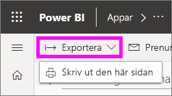
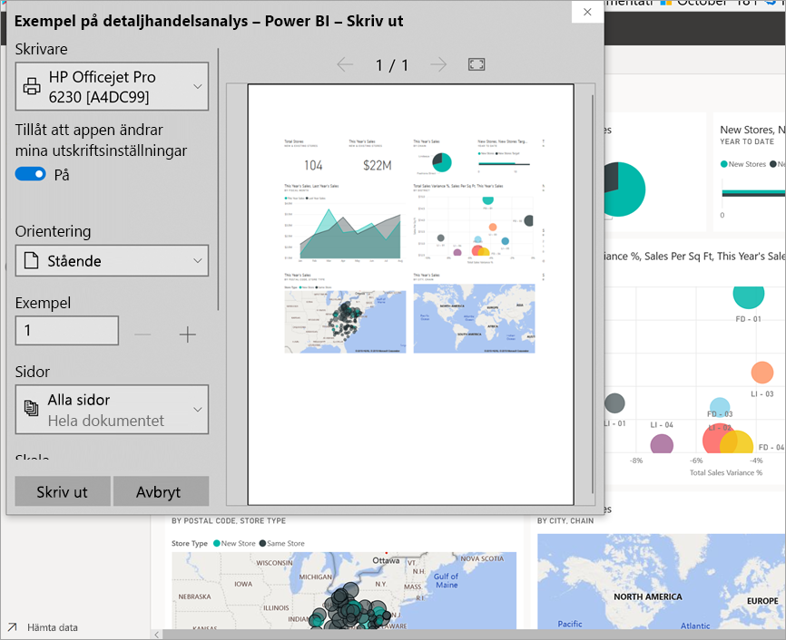
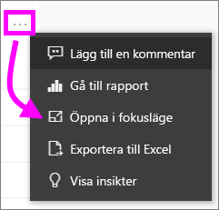
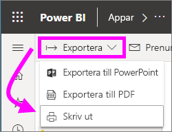

# Skriva ut från Power BI-tjänsten

[!INCLUDE[consumer-appliesto-yynn](../includes/consumer-appliesto-yynn.md)]
## Det som kan skrivas ut
[!INCLUDE [power-bi-service-new-look-include](../includes/power-bi-service-new-look-include.md)]

Skriv ut en hel instrumentpanel, en panel, en rapportsida eller ett visuellt rapportobjekt från Power BI-tjänsten. Om rapporten har fler än en sida måste du skriva ut varje sida separat. 

## Överväganden för utskrifter

De flesta Power BI-instrumentpaneler och rapporter skapas av *designers* för rapporter för användning online och bra utseende på en mängd olika enheter. När du skriver ut en rapport styrs innehållets utseende på papper av webbläsaren. 

Det finns webbläsarinställningar som du kan använda för att justera utskriften, men även det gör inte nödvändigtvis att du får det resultat du vill ha. Överväg att [exportera till PDF](end-user-pdf.md) först och skriva ut PDF-filen i stället. 

## Ändra utskriftsinställningarna för webbläsaren
När du skriver ut från Power BI öppnar webbläsaren ett utskriftsfönster. Utskriftsfönstret är olika för varje webbläsare. Men du kommer se att alla har liknande alternativ som du kan använda för att kontrollera utskriftens utseende. 

Här följer några snabba tips som du kan använda för att formatera utskriften.

   > 
1. Om din instrumentpanel, rapport eller visualisering är mer bred än hög kan du överväga att använda layouten **Liggande**. 

   

2. Justera saker såsom marginaler och skala för att få plats med mer information på en utskriven sida. 

    

Experimentera med inställningarna för just din webbläsare tills du får det utseende som du vill ha. Vissa webbläsare har även alternativ för att skriva ut bakgrundsgrafik. 

## Skriva ut en instrumentpanel
1. Öppna den instrumentpanel som du vill skriva ut.
2. I det övre vänstra hörnet väljer du exportera och sedan **Skriv ut den här sidan**.
   
    

3. Webbläsarens utskriftsfönster öppnas. Välj inställningarna. Om din instrumentpanel till exempel är mer bred än lång bör du kanske ändra layouten till **Liggande**. Välj **Skriv ut**.
   
    

## Skriva ut en panel
1. Öppna instrumentpanelen i [helskärmsläge](end-user-focus.md) genom att välja helskärmsikonen  i det övre menyfältet.

3. [Öppna panelen i fokusläge](end-user-focus.md) genom att hovra så att du ser **Fler alternativ** (…) och välj **Öppna i fokusläge** eller fokusikonen .
   
    

4. Hovra över panelen för att visa menyn Alternativ.
   
    

4. Välj ikonen Skriv ut .     

5. Webbläsarens utskriftsfönster öppnas. Välj inställningarna. Om din panel exempelvis inte passar in på sidan bör du kanske ändra skalan till 75 %. Välj **Skriv ut**.

     

> [!TIP]
> Om du har följt alla dessa steg och din panel fortfarande inte visas på det sätt du vill kan du prova följande.
> 1. Öppna utskriftsfönstret och gör de ändringar av utskriftsinställningarna som du tror kommer att resultera i den bästa utskriften. Du kan till exempel ändra layout, marginaler och skala. 
> 2. Men i stället för att skriva ut väljer du **Avbryt**. 
> 3. Gå igenom steg 1–5 igen. Panelen anpassas till de nya inställningarna för utskriftsfönstret och är redo att skrivas ut.

## Skriva ut en rapportsida
Det går bara att skriva ut rapporter med en sida i taget.

1. Öppna rapporten och välj **Exportera** > **Skriv ut** för att skriva ut aktuell rapportsida.
   
    
2. Webbläsarens utskriftsfönster öppnas.

3. Följ utskriftsstegen från **Skriva ut en instrumentpanel** ovan.
   

## Skriva ut ett visuellt rapportobjekt
1. [Öppna det visuella objektet i fokusläge](end-user-focus.md) genom att hovra över panelen och välja ikonen Fokus  i det övre högra hörnet.

2. I det övre vänstra hörnet väljer du **Exportera** > **Skriv ut** för att skriva ut det visuella objektet.

    

3. Följ utskriftsstegen från **Skriva ut en instrumentpanel** ovan.

## Överväganden och felsökning

* F: Jag kan inte skriva ut alla rapportsidor på samma gång.    
* S: Det är korrekt. Det går bara att skriva ut rapportsidor med en sida i taget.
* F: Jag kan inte skriva till PDF-format.    
* S: Du ser bara det här alternativet om du har konfigurerat PDF-drivrutinen i webbläsaren.    
* F: Det som jag ser när jag väljer **Skriv ut** stämmer inte med det du visar mig här.    
* S: Utskriftsskärmarna varierar beroende på webbläsare och programversion.
* F: Min utskrift skalas inte på rätt sätt.  Instrumentpanelen får inte plats på sidan. Andra frågor om skalning och orientering.    
* S: Vi garanterar inte att utskriften blir exakt likadan såsom den visas i Power BI-tjänsten. Saker som skalning, marginaler, information om visuella objekt, orientering och storlek kontrolleras inte av Power BI. Försök att justera utskriftsinställningarna för din webbläsare. Några av våra föreslag ovan gäller sidorientering (stående eller liggande), marginalstorlek och skala. Om dessa inte hjälper bör du läsa dokumentationen för din specifika webbläsare.      
* F: När jag skriver ut från helskärmsläge ser jag inte utskriftsalternativet när jag hovrar över det visuella objektet.   
* S: Gå tillbaka till instrumentpanelen eller rapporten i standardvyn och öppna det visuella objektet i fokusläge igen och sedan i helskärmsläge. 

## Nästa steg
[Dela instrumentpaneler och rapporter med kolleger och andra](../service-share-dashboards.md)

Har du fler frågor? [Prova Power BI Community](https://community.powerbi.com/)

