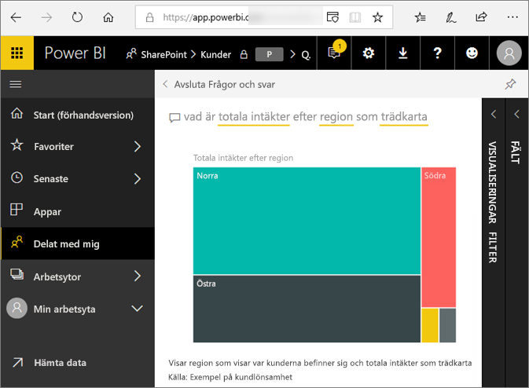
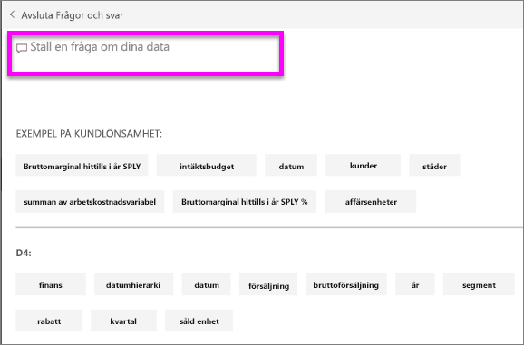
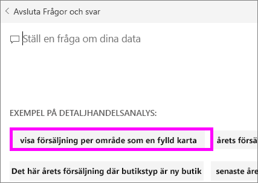

# Frågor och svar för Power BI-**användare**
## Vad är frågor och svar?
Ibland är det snabbaste sättet att få svar från dina data att ställa en fråga med hjälp av naturligt språk. Till exempel hur mycket sålde vi förra året.  
Använd frågor och svar för att utforska dina data med hjälp av intuitiva, naturliga språkfunktioner och få svar i form av tabeller och diagram. Frågor och svar skiljer sig från en sökmotor – den ger dig bara resultat om data i Power BI.

**Frågor och svar om Power BI** har endast stöd för att besvara frågor med naturligt språk som ställs på engelska. Det finns en förhandsversion för spanska som kan aktiveras av Power BI-administratören.

**Power BI – Frågor och svar** är tillgängligt med en Pro- eller Premium-licens. 
>

Att ställa frågan är bara början.  Roa dig med att resa igenom dina data och förfina eller expandera din fråga. Hitta betrodd ny information och gå till botten med information eller zooma ut för en bredare vy. Du kommer att fascineras av de insikter och upptäckter du kan göra.

Upplevelsen är helt interaktiv... och snabb! Det drivs av en minnesintern lagring och svaret är nästan omedelbart.

## Var kan jag använda Frågor och svar?
Du hittar Frågor och svar på instrumentpaneler i Power BI-tjänsten, längst ned på instrumentpanelen i Power BI Mobile och ovanför visualiseringen i Power BI Embedded. Om designern inte har gett dig redigeringsbehörigheter kommer du att kunna använda Frågor och svar för att utforska data men inte för att spara visualiseringar som skapats med Frågor och svar.

## Hur kan frågor och svar veta hur de ska svara på frågor?
Frågor och svar letar efter svar i alla datamängder som är associerade med instrumentpanelen. Om en datamängd har en panel på instrumentpanelen letar Frågor och svar i efter svar i den datamängden. 

## Hur börjar jag?
Bekanta dig först med innehållet. Titta på visualiseringarna på instrumentpanelen och i rapporten. Få en uppfattning av de typer och intervall av data som är tillgängliga för dig. Gå sedan tillbaka till instrumentpanelen och placera markören i frågerutan. Då öppnas skärmen med Frågor och svar.

 

* Om visualiseringarnas axeletiketter och värden inkluderar försäljning, konto, månad och affärsmöjligheter så kan du ställa frågor som: ”Vilket *konto* har de högsta *affärsmöjligheterna*, eller visa *försäljning* per månad som ett stapeldiagram.”

* Om du har prestandadata för webbplatser i Google Analytics kan du fråga Frågor och svar om den tid som tillbringats på en webbplats, antalet unika besök och användarengagemang. Eller, om du frågar demografisk data, kan du ställa frågor om ålder om hushållets inkomst efter plats.

Längst ned på skärmen ser du andra användbara objekt. För varje datamängd visar Frågor och svar nyckelord och ibland även några exempel eller föreslagna frågor. Välj någon av dessa om du vill lägga till dem i frågerutan. 

Ett annat sätt som Frågor och svar hjälper dig att ställa frågor på är med uppmaningar, automatisk komplettering och visuella tips. 

 

### Vilken visualisering använder sig frågor och svar av?
Frågor och svar väljer den bästa visualiseringen baserat på de data som visas. Ibland definieras data i de underliggande datauppsättningarna som en viss typ eller kategori och det hjälper frågor och svar att veta hur de ska visas. Om data till exempel har definierats som en datumtyp, är det troligare att de ska visas som ett linjediagram. Data som kategoriseras som en stad visas mer troligt som en karta.

Du kan också säga till frågor och svar vilka visualiseringar som ska användas genom att lägga till det i din fråga. Men kom ihåg att det inte alltid är möjligt för frågor och svar att visa data i den visualiseringstyp du begärt. Frågor och svar uppmanar dig med en lista över lämpliga visualiseringstyper.

## Överväganden och felsökning
**Fråga:** Jag ser inte Frågor och svar på den här instrumentpanelen.    
**Svar 1:** Om du inte ser någon frågeruta kontrollerar du först inställningarna. Det gör du genom att välja kugghjulsikonen i det övre högra hörnet i Power BI-verktygsfältet.   

Välj sedan **Inställningar** > **Instrumentpaneler**. Kontrollera att det finns en bockmarkering intill **Visa sökrutan för Frågor och svar på den här instrumentpanelen**.
  

**Svar 2**: Ibland inaktiverar instrumentpanelens *designer* eller administratören Frågor och svar. Kontakta dem och fråga om det är OK att aktivera det igen.   

**Fråga:** Jag får inte de resultat som jag vill ha när jag skriver en fråga.    
**Svar:** Kontakta instrumentpanelens *designer*. Det finns många saker som designern kan göra för att förbättra resultaten för Frågor och svar. Till exempel kan designern byta namn på kolumner i datamängden till termer som är lätta att förstå (`CustomerFirstName` i stället för `CustFN`). Designern känner till datamängden väl och kan därför ta fram användbara frågor och lägga till dem i arbetsytan för Frågor och svar.

## Nästa steg

