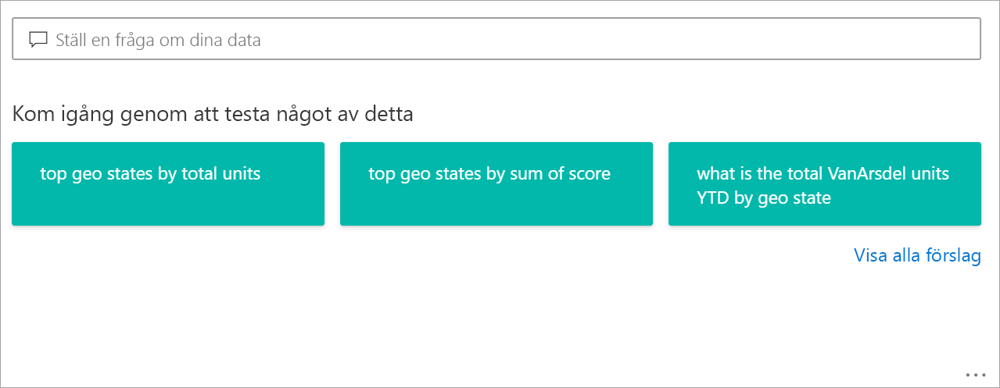
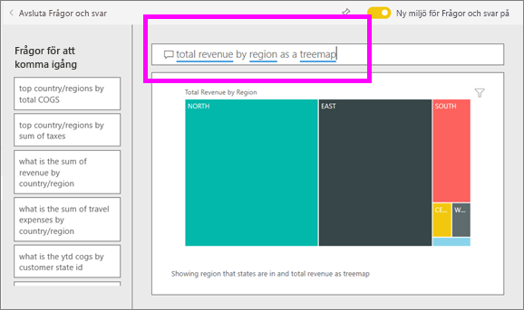
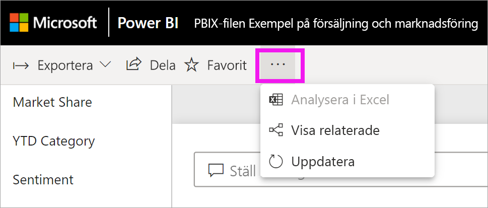
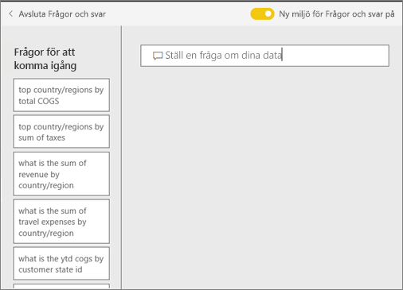
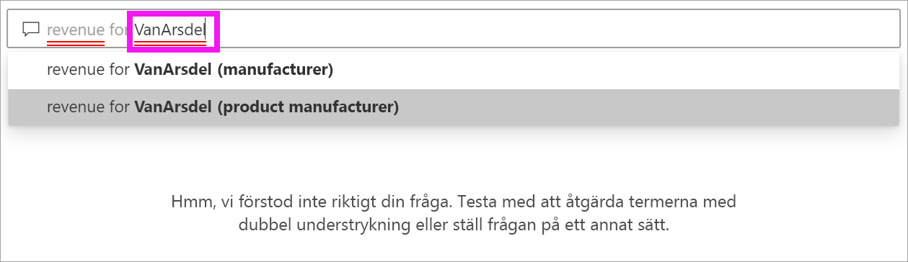
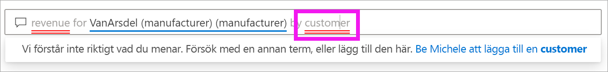
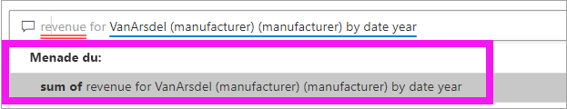
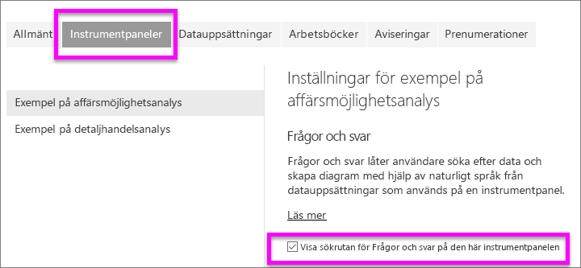
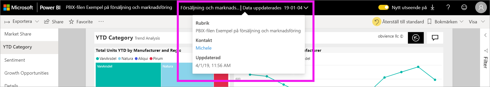

# Frågor och svar för Power BI-**användare**

[!INCLUDE [power-bi-service-new-look-include](../includes/power-bi-service-new-look-include.md)]

## Vad är frågor och svar?
Ibland är det snabbaste sättet att få svar från dina data att ställa en fråga med hjälp av naturligt språk. Till exempel hur mycket sålde vi förra året.

Använd frågor och svar för att utforska dina data med hjälp av intuitiva, naturliga språkfunktioner och få svar i form av tabeller och diagram. Frågor och svar skiljer sig från en sökmotor – den ger dig bara resultat om data i Power BI.

## Vilken visualisering använder sig frågor och svar av?
Frågor och svar väljer den bästa visualiseringen baserat på de data som visas. Ibland definieras data i den underliggande datamängden som en viss typ eller kategori, och det hjälper Frågor och svar att veta hur de ska visas. Om data till exempel har definierats som en datumtyp, är det troligare att de ska visas som ett linjediagram. Data som kategoriseras som en stad visas mer troligt som en karta.

Du kan också säga till Frågor och svar vilket visuellt objekt som ska användas genom att lägga till det i din fråga. Men kom ihåg att det inte alltid är möjligt för Frågor och svar att visa data i den typ av visuellt objekt som du har begärt. Frågor och svar kommer att föreslå en lista över lämpliga typer av visuella objekt.

## Var kan jag använda Frågor och svar?
Du hittar Frågor och svar på instrumentpaneler i Power BI-tjänsten och längst ned på instrumentpanelen i Power BI Mobile. Om designern inte har gett dig redigeringsbehörigheter kommer du att kunna använda Frågor och svar för att utforska data men inte för att spara visualiseringar som skapats med Frågor och svar.

Du hittar också Frågor och svar för rapporter om *rapportdesignern* lade till [Visuella frågor och svar](../visuals/power-bi-visualization-q-and-a.md).   

## Frågor och svar på instrumentpaneler

**Power BI – Frågor och svar** är tillgängligt med en Pro- eller Premium-licens.  [Frågor och svar i Power BI-mobilappar](mobile/mobile-apps-ios-qna.md) och [Frågor och svar med Power BI Embedded](../developer/qanda.md) täcks i separata artiklar. För närvarande har **Power BI Q & A** bara stöd för att besvara frågor på naturligt språk som ställs på engelska, även om det finns en förhandsversion för spanska som kan aktiveras av Power BI-administratören.

Att ställa frågan är bara början.  Roa dig med att resa igenom dina data och förfina eller expandera din fråga. Hitta betrodd ny information och gå till botten med information eller zooma ut för en bredare vy. Du kommer att fascineras av de insikter och upptäckter du kan göra.

Upplevelsen är helt interaktiv... och snabb! Det drivs av en minnesintern lagring och svaret är nästan omedelbart.

## Använda Frågor och svar på en instrumentpanel i Power BI-tjänsten
I Power BI-tjänsten (app.powerbi.com) innehåller en instrumentpanel paneler som fästs från en eller flera datamängder så att du kan ställa frågor om data som finns i någon av datamängderna. Om du vill se vilka rapporter och datamängder som använts till att skapa instrumentpanelen väljer du **Visa relaterade** från listrutan **Fler åtgärder**.

## Hur börjar jag?
Bekanta dig först med innehållet. Titta på de visuella objekten på instrumentpanelen och i rapporten. Få en uppfattning av de typer och intervall av data som är tillgängliga för dig. 

Till exempel:

* Om det visuella objektets axeletiketter och värden inkluderar försäljning, konto, månad och affärsmöjligheter så kan du ställa frågor som: ”Vilket *konto* har de högsta *affärsmöjligheterna*, eller visa *försäljning* per månad som ett stapeldiagram.”

* Om du har prestandadata för webbplatser i Google Analytics kan du fråga Frågor och svar om den tid som tillbringats på en webbplats, antalet unika besök och användarengagemang. Eller, om du frågar demografisk data, kan du ställa frågor om ålder om hushållets inkomst efter plats.

När du är bekant med dina data går du tillbaka till instrumentpanelen och placerar markören i frågerutan. Då öppnas skärmen med Frågor och svar.

 

Innan du ens börjar skriva, visar frågor och svar en ny skärm med förslag för att hjälpa dig formulera din fråga. Du ser fraser och frågor som innehåller namnen på tabellerna i de underliggande datamängderna och kan även se *utvalda* frågor som har skapats av datamängdsägaren.

Du kan välja någon av dem för att lägga till dem i frågerutan och sedan förfina dem för att hitta ett visst svar. 

Frågor och svar hjälper dig också att ställa frågor med hjälp av uppmaningar, automatisk komplettering och visuella tips. 

<!--  -->

## Visuella frågor och svar

Med Visuella frågor och svar kan du ställa frågor på naturligt språk och få svar i form av ett visuellt objekt. Visuella frågor och svar fungerar som alla andra visuella objekt, de kan korsfiltreras/korsmarkeras och har även stöd för bokmärken och kommentarer. 

Du ser att det är ett visuellt Frågor och svar-objekt på frågerutan längst upp. Här kan du skriva frågor på naturligt språk. Du kan använda Visuella frågor och svar upprepade gånger för att ställa frågor om dina data. När du lämnar rapporten återställs Visuella frågor och svar till standardvärdet. 

## Använda Visuella frågor och svar
Om du vill använda Visuella frågor och svar väljer du någon av de föreslagna frågorna eller så skriver du en egen fråga på naturligt språk. 

### Skapa ett Visuella frågor och svar-objekt med hjälp av en föreslagen fråga

Här har vi valt **top geo states by total units**. Power BI väljer vilken typ av visualisering som ska användas. I det här fallet är det en karta.

Du kan ange för Power BI vilken visualiseringstyp som ska användas genom att lägga till den i frågan på naturligt språk. Tänk på att alla typer av visualiseringar kanske inte fungerar eller är meningsfulla för dina data. Dessa data skulle till exempel inte generera något meningsfullt punktdiagram. De fungerar däremot som en koropletkarta.

### Skapa ett Visuella frågor och svar-objekt genom att skriva en fråga på naturligt språk

Om du är osäker på vilken typ av frågor du ska ställa eller vilken terminologi du ska använda kan du expandera **Visa alla förslag** eller titta på de andra visuella objekten i rapporten. På så sätt kan du bekanta dig med termerna och innehållet i datamängden.

1. Skriv din fråga i Frågor och svar-fältet på naturligt språk. När du skriver din fråga får du hjälp i form av automatiskt avslut, förslag och feedback i Power BI.

    - En röd understrykning används för ord som Power BI inte känner igen. När det är möjligt kan Power BI hjälpa dig att definiera dessa ord. Om du ser rätt definition väljer du den i listrutan.  

        

    - Om ingen av definitionerna är korrekt kan du försöka med en annan term, eller välja det röda understrukna ordet för att be rapportägaren att lägga till ordet.

        

    - När du skriver mer av frågan så meddelar Power BI dig om det inte går att förstå den. Du får också olika hjälpförslag. I exemplet nedan frågar Power BI ”Did you mean...” (Menade du) och föreslår ett annat sätt att formulera frågan med hjälp av terminologi från datamängden. 

        

2. När du har en korrigering i Power BI visas resultatet som ett linjediagram. 

    

3. Du kan ändra linjediagrammet till en annan typ av visualisering.  

    

## Överväganden och felsökning

**Fråga:** Jag ser inte Frågor och svar på den här instrumentpanelen.    
**Svar 1:** Om du inte ser någon frågeruta kontrollerar du först inställningarna. Det gör du genom att välja kugghjulsikonen i det övre högra hörnet i Power BI-verktygsfältet.   

Välj sedan **Inställningar** > **Instrumentpaneler**. Kontrollera att det finns en bockmarkering intill **Visa sökrutan för Frågor och svar på den här instrumentpanelen**.    
  

**Svar 2**: Ibland har du inte åtkomst till inställningarna. Om den som *designat* instrumentpanelen eller administratören har avaktiverat Frågor och svar kan du fråga dem om det är okej att du aktiverar det igen.   

**Fråga:** Jag får inte de resultat som jag vill ha när jag skriver en fråga.    
**Svar:** Välj ett alternativ för att kontakta ägaren till rapporten eller instrumentpanelen. Det här kan du göra direkt instrumentpanelsidan för Frågor och svar eller från det visuella Frågor och svar-objektet. Du kan också leta rätt på ägaren i Power BI-sidhuvudet.  Det finns många saker som designern kan göra för att förbättra resultaten för Frågor och svar. Till exempel kan designern byta namn på kolumner i datamängden till termer som är lätta att förstå (`CustomerFirstName` i stället för `CustFN`). Designern känner till datamängden väl och kan därför ta fram användbara frågor och lägga till dem bland de föreslagna frågorna i Frågor och svar.

## Nästa steg
Om du vill lära dig hur en *rapportdesigner* skapar och hanterar ett visuellt Frågor och svar-objekt kan du läsa [Typ av visuellt Frågor och svar-objekt](../visuals/power-bi-visualization-q-and-a.md).
