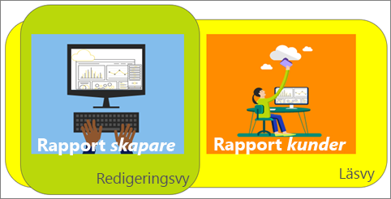
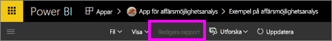
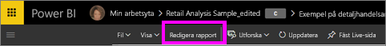
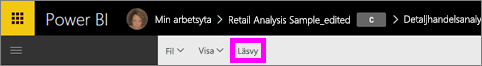

# Läsvyn och redigeringsvyn i Power BI-tjänsterapporter
I Power BI-tjänsten (inte i Power BI Desktop) finns det två lägen för att visa och interagera med rapporter: läsvyn och redigeringsvyn. Läsvyn är tillgänglig för alla användare och har särskilt utformats för data*konsumenter*, medan redigeringsvyn endast är tillgänglig för *skapare* och ägare av rapporter.

## Rapportläsvyn

 Läsvyn kan användas för att utforska och interagera med rapporten. Det är ett roligt och säkert sätt att experimentera med och bekanta dig med dina data. Läsvyn är utformad för rapportens *konsumenter*, alltså de som öppnar rapporter från appar eller som [tilldelas rapporter från andra](../service-share-dashboards.md). Läsvyn garanterar att varje enskild användare av en specifik rapport ser samma rapport, samma visualiseringar, och om de vill med samma filter.  Användarna kan interagera med rapporter och ändra befintliga filter (och dessa ändringar sparas med rapporten), men de kan inte lägga till nya filter.

>**Obs**: Under vissa omständigheter kan rapportkonsumenterna se olika data beroende på radnivåsäkerhet och databehörighet.

## Rapportredigeringsvyn

Redigeringsvyn är endast tillgänglig för den person som skapade rapporten eller som [samäger rapporten som en medlem eller administratör i en apparbetsyta](end-user-create-apps.md).

Redigeringsvyn är utformad för *rapportskapare*. Det är där skapare importerar och ansluter till datamängder, utforskar data och skapar rapporter och instrumentpaneler. I redigeringsvyn i Power BI kan *skapare* granska data djupare genom att lägga till och ta bort fält, ändra typ av visualisering, skapa nya visualiseringar och lägga till och ta bort visualiseringar och sidor i rapporten. De kan sedan dela rapporterna som de har skapat med kollegor.

## Läsvyn jämfört med redigeringsvyn
Det här diagrammet visar inte alla funktioner för rapporter i Power BI-tjänsten! Endast de åtgärder för rapporter som inte är tillgängliga i **både** läsvyn och redigeringsvyn visas.

|Aktivitet  | Läsvy  | Redigeringsvy |
|-------------------------|-------|-------|
|**Rapporter som helhet**  |
| [Skapa eller redigera en rapport](../service-report-create-new.md) | Nej  | Ja |
| [Dela en rapport](../service-share-reports.md)| Ja | Ja, och du kan även hantera behörigheter, inklusive att ge andra *ägare* behörigheter. |
| [Skapa beständiga (permanenta) visuella nivåfilter, detaljinformationsfilter, sidnivåfilter och filter på rapportnivå från fönstret Filter](../power-bi-report-add-filter.md) | Nej  | Ja |
| [Använda rapportfönstret Filter](end-user-report-filter.md) | Ja, befintliga filter kan användas och ändringar kan sparas med rapporten, men nya filter kan inte läggas till. | Ja |
| [Använda rapportfönstret Analytics](../service-analytics-pane.md) | Nej | Ja |
| [Rapport**vy**alternativ](../power-bi-report-display-settings.md) | Ja, med vissa undantag. | Ja, alla, inklusive stödlinjer, fästen och lås. |
| [Skapa ett uppdateringsschema](../refresh-data.md) | Nej  | Ja |
| [Prenumerera på en rapport](end-user-subscribe.md) | Ja | Nej |
| [Frågor och svar – ställa frågor i rapporter](end-user-q-and-a.md) | Nej  | Ja |
| [Visa användningsstatistik](../service-usage-metrics.md) | Ja, på rapportarbetsytan. | Ja, i rapportlistan (innehållsvyn) |
| [Visa relaterade](end-user-related.md) | Ja, i rapportarbetsytan. | Ja, i rapportlistan (innehållsvyn) |
| [Spara en rapport](../service-report-save.md) | Ja, men endast genom att använda **Spara som**. | Ja |
| [Ta bort en rapport](end-user-delete.md) | Nej  | Ja |
|**Rapportsidor** |
| [Lägga till eller byta namn på en rapportsida](../power-bi-report-add-page.md)  | Nej  | Ja  |
| [Duplicera en rapportsida](../power-bi-report-copy-paste-page.md) | Nej  | Ja |
| [Ta bort en rapportsida](end-user-delete.md) | nej | ja |
|**Arbeta med rapportvisualiseringar**|
| [Lägga till visuella objekt i en rapport](../visuals/power-bi-report-add-visualizations-i.md) | Nej  | Ja |
| [Lägga till textrutor och former i en rapport](../power-bi-reports-add-text-and-shapes.md) | Nej  | Ja |
| [Använda rapportfönstret för formatering](../service-the-report-editor-take-a-tour.md) | Nej | Ja |
| [Ange visuella interaktioner](end-user-interactions.md) | Nej  | Ja |
| [Visa data som används för att skapa visualiseringen](end-user-show-data.md) | Nej  | Ja |
| [Konfigurera detaljgranskning](end-user-drill.md) | Nej  | Ja |
| [Ändra vilken visualisering som används](../visuals/power-bi-report-change-visualization-type.md) | Nej | Ja|
| [Ta bort en visualisering, en textruta eller en form](end-user-delete.md)| Nej | Ja |

## Navigera mellan redigeringsvyn och läsvyn
Kom ihåg att endast skaparen och ägarna av rapporten kan öppna en rapport i redigeringsvyn.

1. Som standard öppnas rapporten vanligtvis läsvyn. Du vet att du är i läsvyn om ser du alternativet **Redigera rapporten**. Om **Redigera rapporten** är gråmarkerat har du inte behörighet att öppna rapporten i redigeringsvyn.

   

2. Om **Redigera rapporten** inte är gråmarkerat, väljer du alternativet för att öppna rapporten i redigeringsvyn.

   

   Rapporten är nu i redigeringsvyn och använder samma [visningsinställningar](../power-bi-report-display-settings.md) som du senast använde i läsvyn.

2. För att återgå till läsvyn, väljer du **Läsvy** från det övre navigeringsfältet.

    

### Nästa steg
Det finns många sätt att interagera med en rapport i läsvyn, finfördela dina data för att upptäcka insikter och få svar på frågor.  Nästa avsnitt, [Interagera med rapporter i läsvyn](../service-interact-with-a-report-in-editing-view.md), beskriver vissa av dessa i detalj.    
Tillbaka till [Rapporter i Power BI](end-user-reports.md)    
Har du fler frågor? [Prova Power BI Community](http://community.powerbi.com/)
