<!-- once the sample apps are live, change this so consumers can follow along -->
# Snabbstart: Lär dig mer om Power BI-funktioner för ***användare***
I den här snabbstarten lär du dig att interagera med Power BI för att identifiera databaserade affärsinsikter. Det här är ingen djupgående artikel utan snarare en snabb titt på många av de åtgärder som är tillgängliga för **Power BI-användare**.

Om du inte har registrerat dig för Power BI [registrerar du dig för en kostnadsfri utvärderingsversion](https://app.powerbi.com/signupredirect?pbi_source=web) innan du börjar.

## Förutsättningar
- Power BI-tjänsten (app.powerbi.com)
<!-- app from AppSource -->

## Läsvy
Läsvyn i Power BI-tjänsten är tillgänglig för *rapportanvändare*. När en kollega delar en rapport med dig kan du utforska och interagera med rapporten i läsvyn. 

[Redigeringsvyn](../service-interact-with-a-report-in-editing-view.md) är ett annat rapportläge i Power BI-tjänsten. Den vyn är tillgänglig för *rapportdesigner*.  

Läsvyn är ett kraftfullt och säkert sätt att utforska dina instrumentpaneler och rapporter. Även om du delar upp och analyserar instrumentpaneler och rapporter som delats med dig, förblir de underliggande datauppsättningarna intakta och oförändrade. 

I läsvyn kan du till exempel korsmarkera och korsfiltrera visuella objekt på en sida.  Det är bara att markera eller välja ett värde i ett visuellt objekt så ser du direkt hur det påverkar andra visuella objekt. Använd filterfönstret för att lägga till och ändra filter på en rapportsida och ändra hur värden sorteras i en visualisering. Det här är bara några av *användarfunktionerna* i Power BI.  Läs vidare om du vill lära dig mer om dessa funktioner och annat.

 
### Visa en app
Relaterade instrumentpaneler och rapporter samlas på ett och samma ställe i *appar* i Power BI.

1. Välj **Appar**  > **Hämta appar**. 
   
     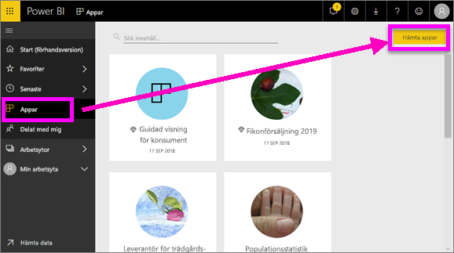
2. I AppSource under **Min organisation** kan du söka för att begränsa resultaten och hitta den app som du letar efter.
   
     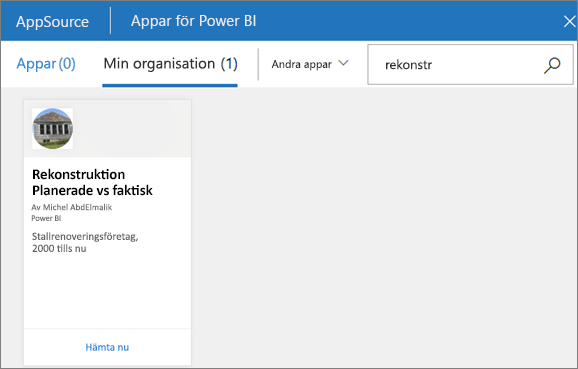
3. Välj **Hämta den nu** om du vill lägga till den i din appcontainer. 

### Visa en instrumentpanel
Den här appen öppnas på en instrumentpanel. En ***instrumentpanel*** i Power BI är en enskild sida, ofta kallad en arbetsyta, som använder sig av visualiseringar för att förmedla ett budskap. Eftersom den är begränsad till en sida, innehåller en väl utformad instrumentpanel endast de viktigaste elementen i detta budskap.

De visualiseringar som visas på instrumentpanelen kallas *paneler* och de *fästs* på instrumentpanelen från rapporter.

### Prenumerera på en instrumentpanel (eller en rapport)
Du behöver inte öppna Power BI för att övervaka en instrumentpanel.  Du kan prenumerera på den i stället så skickar Power BI ett e-postmeddelande med en ögonblicksbild av instrumentpanelen enligt ett schema som du anger. 

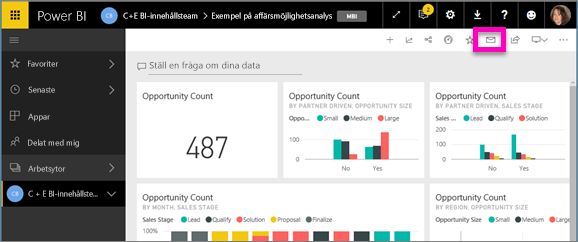.

1. Välj **Prenumerera** på den översta menyraden, eller välj kuvertikonen .
   
   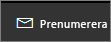

3. Aktivera eller inaktivera prenumerationen med det gula skjutreglaget.  Lägg alternativt till e-postmeddelandeinformation. 

    I skärmbilderna nedan ser du att när du prenumererar på en rapport prenumererar du i själv verket på en rapport*sida*.  Om du vill prenumerera på flera sidor i en rapport väljer du **Lägg till en till prenumeration** och väljer en annan sida. 
      
   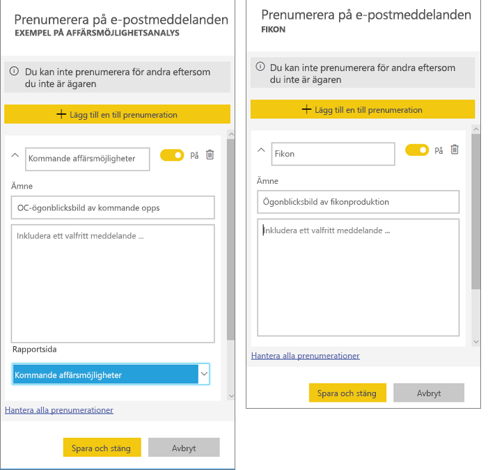
   
    Att uppdatera rapportsidan uppdaterar inte datauppsättningen. Endast datauppsättningens ägare kan uppdatera en datauppsättning manuellt. Om du vill söka efter namnet på den underliggande datauppsättningen, välj **Visa relaterade** på den översta menyraden.

### Visa relaterat innehåll
Fönstret **Relaterat innehåll** visar hur din Power BI-tjänsts innehåll – instrumentpaneler, rapporter och datauppsättningar – är sammankopplade. Fönstret visar inte bara relaterat innehåll, det låter dig också vidta åtgärder för innehållet och enkelt navigera mellan relaterat innehåll.

Välj **Visa relaterade** på den översta menyraden.

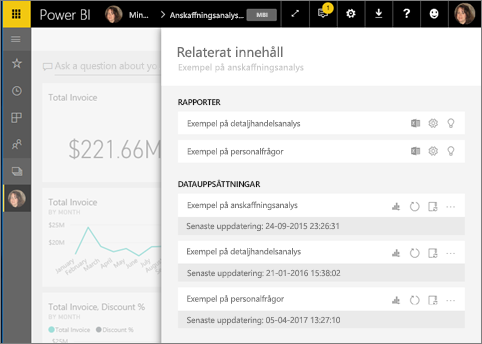

### Ställ frågor på ett naturligt språk med Frågor och svar
Ibland är det snabbaste sättet att få svar från dina data att ställa en fråga med hjälp av naturligt språk. Frågerutan finns högst upp på instrumentpanelen. Till exempel: ”visa mig antal stora affärsmöjligheter efter säljstatus som ett trattdiagram”. 

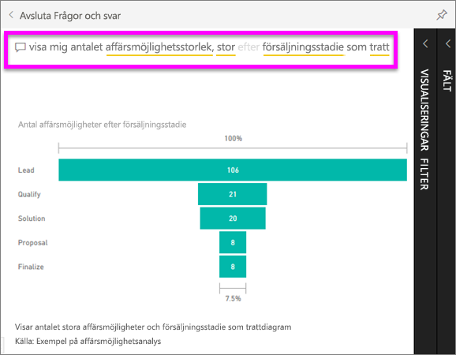

### Favoritmarkera en instrumentpanel
När du skapat en *favorit* av innehåll kan du komma åt den från det vänstra navigeringsfältet. Det vänstra navigeringsfältet är synligt i praktiskt taget alla områden i Power BI. Favoriter är vanligtvis de instrumentpaneler, rapportsidor och appar som du använder oftast.

1. Avsluta Frågor och svar för att återgå till en instrumentpanel.    
2. I det övre högra hörnet i Power BI-tjänsten väljer du **favoritmarkera** eller stjärnikonen .
   
   

### Öppna och visa en rapport och rapportsidor
En rapport är en eller flera sidor med visuella objekt. Rapporter skapas av Power BI-*rapportdesigner* och [delas med *användare* direkt](end-user-shared-with-me.md) eller som en del av en [app](end-user-apps.md). 

Rapporter kan öppnas från en instrumentpanel. De flesta paneler på instrumentpanelen är *Fästa* från rapporter. Om du väljer en panel öppnas rapporten som användes för att skapa panelen. 

1. Välj en panel från en instrumentpanel. I det här exemplet har vi valt kolumndiagramspanelen Revenue (Intäkt).

    

2.  Den associerade rapporten öppnas. Observera att vi är på sidan Revenue overview (Intäktsöversikt). Det är den rapportsidan som innehåller kolumndiagrammet som vi valt från instrumentpanelen.

    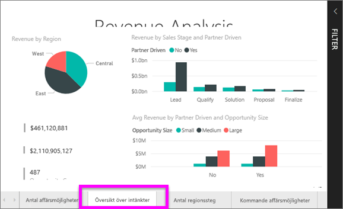

### Justera dimensionerna för visning
Rapporterna granskas på många olika enheter med olika skärmstorlekar och proportioner.  Standardåtergivningen är kanske inte vad du vill se på enheten.  

1. Om du vill justera detta väljer du **Visa** på den översta menyraden.

    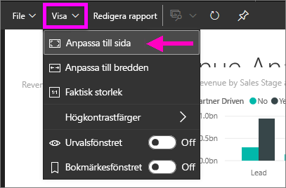

2.  Välj något av visningsalternativen. I det här exemplet har vi valt **Anpassa till sida**.

    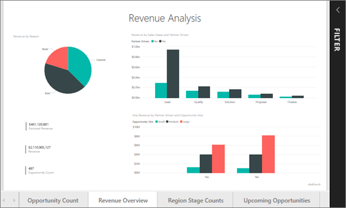    

### Använda rapportfönstret Filter
Om rapportskaparen har lagt till filter på en sida i en rapport kan du interagera med dem och spara dina ändringar med rapporten.

1. Välj **filterikonen** i det övre högra hörnet.
   
   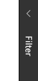  

2. Välj ett visuellt objekt för att aktivera det. Du ser alla filter som har kopplats till det visuella objektet (filter på visuell nivå), över hela sidan (filter på sidonivå) och i hela rapporten (filter på rapportnivå).
   
   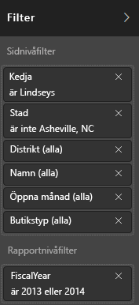

3. Håll muspekaren över ett filter och expandera det genom att välja nedpilen.
   
   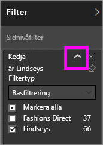

4. Göra ändringar i dina filter och se hur det visuella objektet påverkas.  
   
     
     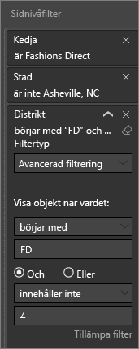

### Se hur alla visuella objekt på en sida är sammankopplade
Korsmarkera och korsfiltrera flera relaterade visualiseringar på en sida. Visualiseringar på en enstaka rapportsida är alla ”kopplade” till varandra.  Det innebär att om du väljer ett eller flera värden i en visualisering kommer andra visualiseringar som använder samma värde att ändras baserat på ditt val.

> 
### Visa information om en visualisering
Håll muspekaren över visuella element för att visa detaljer

### Sortera en visualisering
Visuella objekt på en rapportsida kan sorteras och sparas med tillämpade ändringar. 

1. Håll muspekaren över ett visuellt objekt för att aktivera det.    
2. Välj ellipsen (...) för att öppna sorteringsalternativen.

     

###  Öppna **Markeringsfönstret**.
Du kan enkelt navigera mellan visualiseringarna på rapportsidan. 

1. Välj **Visa > Markeringsfönstret** för att öppna markeringsfönstret. Ändra inställningen för **markeringsfönstret** till På.

    

2. Markeringsfönstret öppnas på din rapportarbetsyta. Välj ett visuellt objekt i listan för att aktivera det.

    

### Zooma in på enskilda visuella objekt
Håll muspekaren över visualiseringen och välj ikonen **Fokusläge** . När du visar en visualisering i fokusläge expanderas den så att den fyller hela rapportarbetsytan enligt nedan.

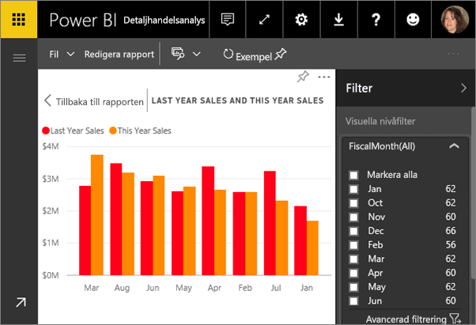

Om du vill visa att samma visualiseringen utan att störas av menyfält, filterfönstret och annan krom kan du välja ikonen **Helskärm** från den översta menyraden    .

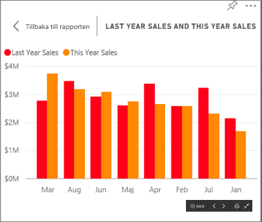

### Visa de data som används för att skapa en visualisering
En Power BI-visualisering konstrueras med hjälp av data från underliggande datamängder. Om du är intresserad av att se vad som pågår i bakgrunden, Power BI kan *visa* de data som används för att skapa visualiseringen. När du väljer **Visa data** visar Power BI dessa data under (eller bredvid) visualiseringen.

1. Öppna en rapport i Power BI-tjänsten och välj ett visuellt objekt.  
2. Om du vill visa bakomliggande data för det visuella objektet väljer du ellipsen (...) och **Visa data**.
   
   

Detta har varit en snabb översikt över några av de saker som **användare** kan göra med Power BI-tjänsten.  

## Rensa resurser
- Om du är ansluten till en app väljer du **Appar** i det vänstra navigeringsfältet för att öppna appinnehållslistan. Håll muspekaren över den app som du vill ta bort och välj ikonen för papperskorgen.

- Om du har importerat eller anslutit till en Power BI-exempelrapport öppnar du **Min arbetsyta** från det vänstra navigeringsfältet. Leta reda på instrumentpanelen, rapporten och datauppsättningen med hjälp av flikarna längst upp och välj ikonen för papperskorgen för var och en av dessa.

## Nästa steg

