# Snabbstart: Lär dig mer om Power BI-funktioner för *användare*

[!INCLUDE[consumer-appliesto-ynny](../includes/consumer-appliesto-ynny.md)]

I den här snabbstarten lär du dig att interagera med Power BI för att identifiera databaserade affärsinsikter. Det här är ingen djupgående artikel utan snarare en snabb titt på många av de åtgärder som är tillgängliga för **Power BI-användare**.

Om du inte har registrerat dig för Power BI [registrerar du dig för en kostnadsfri utvärderingsversion](https://app.powerbi.com/signupredirect?pbi_source=web) innan du börjar.

## Vad är Power BI? 
Power BI är en samling programvarutjänster, appar och anslutningsprogram som arbetar tillsammans för att förvandla dina orelaterade datakällor till sammanhängande, visuellt fördjupande och interaktiva insikter. Oavsett om dina data består av ett enkelt Excel-kalkylblad eller en samling data från olika datakällor kan du med Power BI enkelt ansluta till datakällorna, visualisera (eller identifiera) vad som är viktigt och dela det med andra. 

## Läsvy
Läsvyn i Power BI-tjänsten är tillgänglig för *rapportanvändare*. När en kollega delar en rapport, instrumentpanel eller app med dig använder du läsvyn för att utforska och interagera med rapporten. 

Det enda du behöver göra är att öppna Power BI-tjänsten i en webbläsare eller på en mobil enhet. Du och dina kollegor arbetar från samma betrodda appar, instrumentpaneler och rapporter. De uppdateras automatiskt, så att ni alltid arbetar med det senaste innehållet.   

Eftersom innehållet inte är statiskt kan du studera trender, insikter och annan företagsinformation närmare. Segmentera och blanda innehållet – du kan till och med ställa frågor till det med dina egna ord. Eller luta dig tillbaka och låt dina data upptäcka intressanta insikter åt dig; skicka aviseringar när data ändras och skicka rapporter via e-post till dig enligt ett schema som du själv anger. Det här gäller alla dina data, när som helst, i molnet eller lokalt och från valfri enhet. 

Läs vidare om du vill lära dig mer om dessa funktioner och annat.

## Power BI-innehåll
När vi använder begreppet ”innehåll” i Power BI syftar vi på rapporter, instrumentpaneler och appar. Det här är de byggstenar som du använder för att utforska dina data och fatta affärsbeslut. 

> [!NOTE]
> Instrumentpaneler, rapporter och appar kan dessutom visas och delas på mobila enheter.

###  Appar

En *app* är en Power BI-innehållstyp som kombinerar relaterade instrumentpaneler och rapporter, samlat på en plats. En app kan ha en eller flera instrumentpaneler och en eller flera rapporter, alla samlade. Appar skapas av Power BI-*designers* som distribuerar och delar apparna med *konsumenter* som du. 

Ett sätt att visa dina appar är att välja **Appar** i navigeringsfönstret och sedan välja en app att öppna.

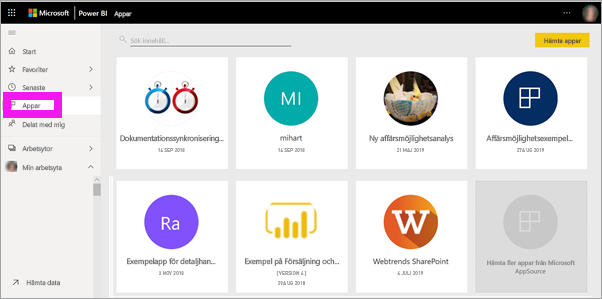

Mer information om hur du visar appar finns i [Power BI-appar](end-user-apps.md)

### Rapporter

En Power BI-rapport visar en datauppsättning ur flera perspektiv med visuella objekt som representerar olika fynd och insikter från datauppsättningen. En rapport kan ha ett enda visuellt objekt eller sidor som är fulla av dem. Rapporter skapas av Power BI-*designers* som distribuerar och delar rapporterna med *konsumenter* som du.

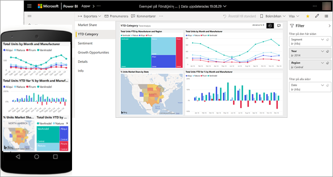

Information om hur du visar rapporter finns i [Power BI-rapporter](end-user-reports.md)

### Instrumentpaneler

En instrumentpanel i Power BI är en enskild sida, ofta kallad för arbetsyta, som använder sig av visualiseringar för att förmedla ett budskap. Eftersom den är begränsad till en sida, innehåller en väl utformad instrumentpanel endast de viktigaste elementen i detta budskap.

De visualiseringar som visas på instrumentpanelen kallas paneler, och de fästs på instrumentpanelen av *rapportdesigners*. Om du väljer en panel kommer du i de flesta fall till den rapportsida där visualiseringen skapades. 

Information om hur du visar instrumentpaneler finns i [Power BI-instrumentpaneler](end-user-dashboards.md)
 
## Interagera i Power BI-tjänsten

### Samarbeta med kollegor
Hoppa över e-postmeddelandet. Lägg till en personlig kommentar eller starta en konversation med kollegor om en instrumentpanel direkt på instrumentpanelen. Kommentarsfunktionen är bara ett av många sätt som du kan samarbeta med andra. 

Läs mer om att [kommentera](end-user-comment.md)

### Luta dig tillbaka och låt Power BI göra arbetet åt dig
Två av de sätt som Power BI-tjänst gör arbetet åt dig är prenumerationer och aviseringar. 

#### Prenumerera på en instrumentpanel (eller en rapport)
Du behöver inte öppna Power BI för att övervaka en instrumentpanel.  Du kan prenumerera på den i stället så skickar Power BI ett e-postmeddelande med en ögonblicksbild av instrumentpanelen enligt ett schema som du anger. 

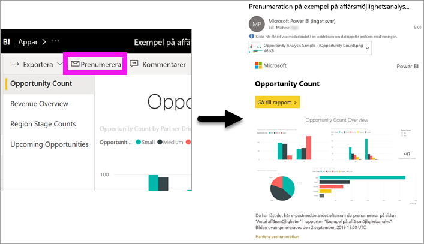.

 Läs mer om [Power BI-prenumerationer](end-user-subscribe.md)

#### Få aviseringar när dina data når ett tröskelvärde
Dina data är live, och de visuella objekten uppdateras automatiskt för att avspegla detta. Om du vill bli meddelad när data överskrider eller underskrider ett tröskelvärde som du anger så använder du dataaviseringar. Aviseringar fungerar för mätare, KPI: er och kort.    

Power BI skickar dig ett e-postmeddelande när värdet överskrider eller underskrider den gräns som du har angett.  
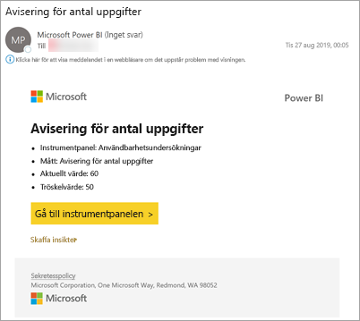

Läs mer om [Power BI-aviseringar](end-user-alerts.md)

### Ställ frågor på ett naturligt språk med Frågor och svar
Ibland är det snabbaste sättet att få svar från dina data att ställa en fråga med hjälp av naturligt språk. Frågerutan finns högst upp på instrumentpanelen. Till exempel: ”visa mig antal stora affärsmöjligheter efter säljstatus som ett trattdiagram”. 

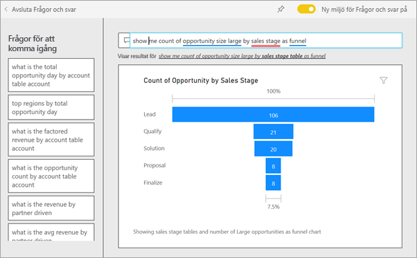

Läs mer om [frågor och svar i Power BI Pro](end-user-q-and-a.md)

### Visa information om en visualisering
Visuella objekt består av datapunkter. Du kan visa information genom att hovra över en datapunkt.

### Favoritmarkera en instrumentpanel
När du gör innehåll till en *favorit* kan du komma åt det från navigeringsfönstret. Navigeringsfönstret är synligt i praktiskt taget alla områden i Power BI. Favoriter är vanligtvis de instrumentpaneler, rapportsidor och appar som du använder oftast.

Välj **Favorit** uppe till höger i Power BI-tjänsten. Om du inte ser det här alternativet väljer du **Fler alternativ** (…) och sedan **Favorit** i listrutan. 
   
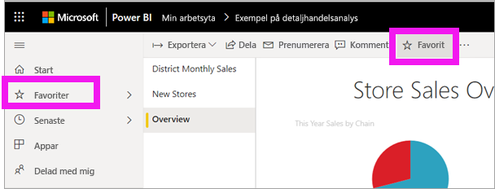

Ta en titt på de andra åtgärderna som finns i listrutan.  Vi beskriver inte alla dessa i den här artikeln, men vi behandlar dem i andra artiklar.  Lär dig mer med hjälp av innehållsförteckningen i Power BI eller via **Sökfältet**. 

Lär dig mer om [favoriter och aktuella](end-user-favorite.md)

### Justera dimensionerna för visning
Rapporterna granskas på många olika enheter med olika skärmstorlekar och proportioner.  Standardåtergivningen är kanske inte vad du vill se på enheten.  

Om du vill justera väljer du **Visa** i det övre högra menyfältet och väljer en av visningsalternativen. 

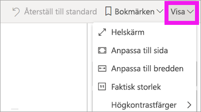

### Se hur alla visuella objekt på en sida är sammankopplade
Korsmarkera och korsfiltrera de relaterade visualiseringarna på en rapportsida. Visualiseringar på en enstaka rapportsida är alla ”kopplade” till varandra.  Det innebär att om du väljer ett eller flera värden i en visualisering kommer andra visualiseringar som använder samma värde att ändras baserat på ditt val.

> 

Läs mer om [interaktioner med visuella objekt](end-user-interactions.md)

<!-- ###  Open the **Selection** pane
Easily navigate between the visualizations on the report page. 

1. Select **View > Selection pane** to open the Selection pane. Toggle **Selection pane** to On.

    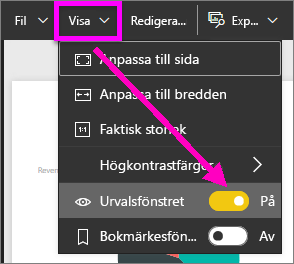

2. The Selection pane opens on your report canvas. Select a visual from the list to make it active.

    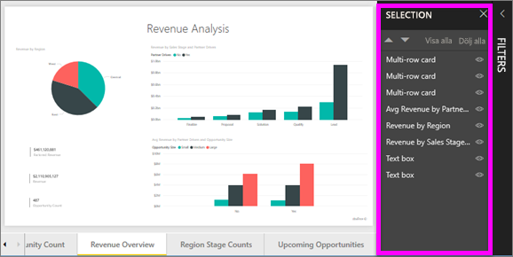 -->

### Zooma in på enskilda visuella objekt
Håll muspekaren över ett visuellt objekt och välj ikonen **Fokusläge** och . När du visar en visualisering i fokusläge expanderas den så att den fyller hela rapportarbetsytan enligt nedan.

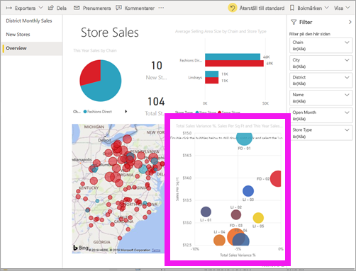

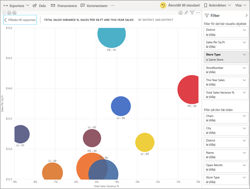

<!-- To display that same visualization without the distraction of menubars, filter pane, and other chrome -- select the **Full Screen** icon from the top menubar    .

 -->

Läs mer om [fokusläge och helskärmsläge](end-user-focus.md)

### Sortera en visualisering
Visuella objekt på en rapportsida kan sorteras och sparas med tillämpade ändringar. 

Hovra över ett visuellt objekt för att göra det aktivt och välj **Fler alternativ** för att öppna sorteringsalternativen.

 

Läs mer om [sortering av visuella objekt](end-user-search-sort.md)

### Visa de data som används för att skapa en visualisering
En Power BI-visualisering konstrueras med hjälp av data från underliggande datamängder. Om du är intresserad av att se vad som pågår i bakgrunden, Power BI kan *visa* de data som används för att skapa visualiseringen. När du väljer **Visa data** visar Power BI dessa data under (eller bredvid) visualiseringen.

När ett visuellt objekt är aktivt väljer du **Fler alternativ** (…) och sedan **Visa data**.
   
   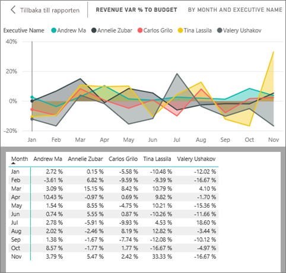

### Exportera data till Excel
Utöver att visa de data som används för att skapa ett visuellt objekt kan du även exportera dessa data och visa dem i Microsoft Excel. När du exporterar till Excel skapar du ett separat dokument, ett kalkylblad som inte är en del av Power BI. Eventuella ändringar som du gör i Excel-filen påverkar inte data i Power BI. Oavsett om du vill titta närmare på data eller använda data i ett annat program eller för ett annat ändamål ger Power BI dig den flexibiliteten.

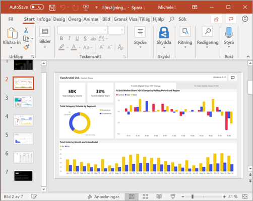

<!-- Exporting isn't limited to individual visuals; you can export entire reports to PowerPoint or PDF to share with your colleagues.

 -->

Detta har varit en snabb översikt över några av de saker som *konsumenter* kan göra med Power BI-tjänsten.  

## Rensa resurser
- Om du är ansluten till en app öppnar du appinnehållslistan genom att välja **Appar** i navigeringsfönstret. Håll muspekaren över den app som du vill ta bort och välj ikonen för papperskorgen.

- Om du har importerat eller anslutit till en Power BI-exempelrapport öppnar du **Min arbetsyta** från navigeringsfönstret. Leta reda på instrumentpanelen, rapporten och datauppsättningen med hjälp av flikarna längst upp och välj ikonen för papperskorgen för var och en av dessa.

## Nästa steg
[Power BI för konsumenter](end-user-consumer.md)

