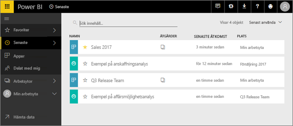
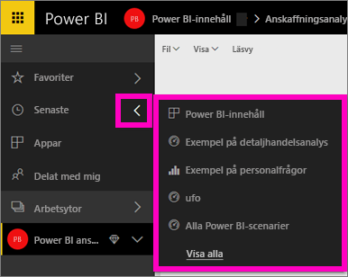
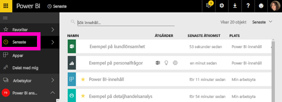

# **Senaste** innehåll i Power BI-tjänsten
Det senaste innehållet är de senaste objekten du besökte i Power BI-tjänsten, max. 20 objekt.  Dessa omfattar: instrumentpaneler, rapporter, appar och arbetsböcker för alla dina arbetsytor.

Låt Amanda visa hur innehållslistorna **Senaste** i Power BI-tjänsten fylls och följ sedan instruktionerna under videon för att prova själv.

<iframe width="560" height="315" src="https://www.youtube.com/embed/G26dr2PsEpk" frameborder="0" allowfullscreen></iframe>

## Visa senaste innehåll
Om du vill se dina fem senast besökta objekt väljer du på pilen till höger om **Senaste** i det vänstra navigeringsfönstret.  Här kan du välja ett objekt att öppna från senaste innehåll. Endast de fem senaste objekten visas.

Om du har fler än fem senast besökta objekt väljer du **se alla** för att öppna skärmen Senaste (se nedan). Du kan också välja **Senaste**, eller ikonen Senaste , från det vänstra navigeringsfältet.

Härifrån du kan interagera med innehållet på samma sätt som på enskilda flikar i [ **instrumentpaneler**](end-user-dashboards.md), [ **rapporter**](end-user-reports.md) och  **arbetsböcker**, och på skärmen <!--[**Apps**](end-user-apps.md)--> Appar.

## Nästa steg
<!--[Power BI service Apps](end-user-apps.md)-->

Har du fler frågor? [Prova Power BI Community](http://community.powerbi.com/)

