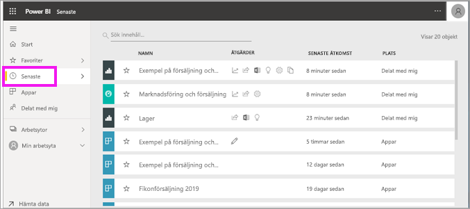
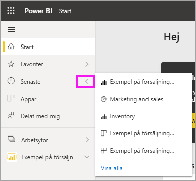

# **Senaste** innehåll i Power BI Service-tjänsten

[!INCLUDE[consumer-appliesto-yyny](../includes/consumer-appliesto-yyny.md)]

Det senaste innehållet är de senaste objekten du besökte i Power BI-tjänsten, max. 20 objekt.  Dessa omfattar: instrumentpaneler, rapporter, appar och arbetsböcker.

Låt Amanda visa hur innehållslistorna **Senaste** i Power BI-tjänsten fylls och följ sedan instruktionerna under videon för att prova själv.

<iframe width="560" height="315" src="https://www.youtube.com/embed/G26dr2PsEpk" frameborder="0" allowfullscreen></iframe>

> [!NOTE]
> Den här videon använder en äldre version av Power BI-tjänsten.

## Visa senaste innehåll
Om du vill se dina fem senast besökta objekt väljer du på pilen till höger om **Senaste** i navigeringsfönstret.  Här kan du välja ett objekt att öppna från senaste innehåll. Endast de fem senaste objekten visas.

Om du har fler än fem senast besökta objekt väljer du **se alla** för att öppna skärmen Senaste. Du kan också välja **Senaste**, eller ikonen Senaste , från navigeringsfältet.

## Åtgärder tillgängliga i innehållslistan **Senaste**
Åtgärderna som är tillgängliga för dig beror på vilka inställningar som tilldelats av innehålls*designern*. Några av dina alternativ kan vara:
* Välj stjärnikonen om du vill [favoritmarkera en instrumentpanel, rapport eller app](end-user-favorite.md) .
* Vissa instrumentpaneler och rapporter kan delas vidare  .
* [Öppna rapporten i Excel](end-user-export.md)  
* [Visa insikter](end-user-insights.md) som Power BI hittar i data .
* Om dina listor blir långa, kan du dessutom [använda sökfältet och sortering för att hitta vad du behöver](end-user-search-sort.md). Du kan ta reda på om en kolumn kan sorteras genom att hovra för att se om en pil visas. I det här exemplet visas när du hovrar över **Senaste åtkomst** en pil – ditt senaste innehåll kan sorteras efter åtkomstdatum. 

    

## Nästa steg
[Power BI-tjänstens appar](end-user-apps.md)

Fler frågor? [Prova Power BI Community](https://community.powerbi.com/)

