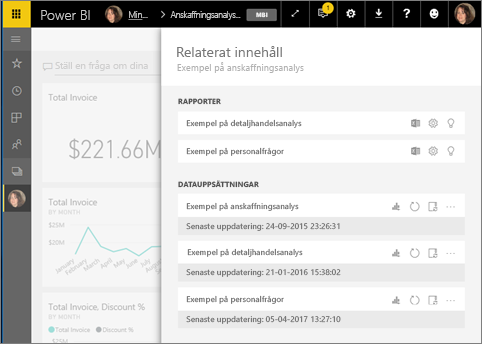
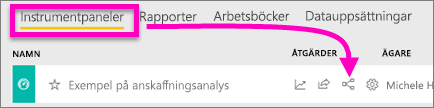
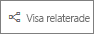
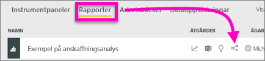
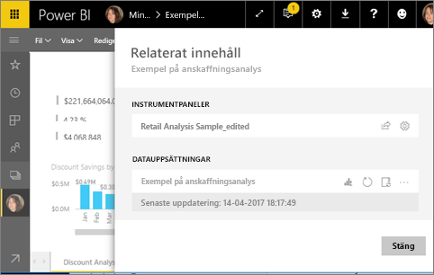
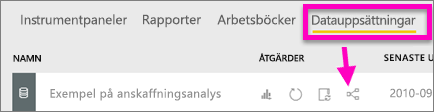
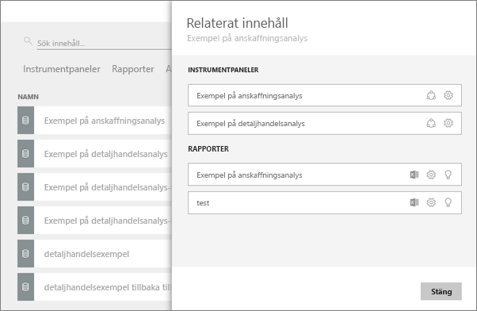

# Visa relaterat innehåll i Power BI-tjänsten
Fönstret **Relaterat innehåll** visar hur din Power BI-tjänsts innehåll – instrumentpaneler, rapporter och datauppsättningar – är sammankopplade. Fönstret för relaterat innehåll är också ett utgångspunkt för att vidta åtgärder. Härifrån kan du uppdatera, byta namn på, generera insikter och mycket mer. Välj en relaterad rapport eller instrumentpanel så öppnas den i din Power BI-arbetsyta.   

I Power BI skapas rapporter på datauppsättningar, rapportvisualiseringar fästs på instrumentpaneler och instrumentpanelens visuella objekt länkar tillbaka till rapporter. Men hur vet du vilka instrumentpaneler som är värdar för visuella objekt från marknadsföringsrapporten? Och hur hittar du dessa instrumentpaneler? Använder din instrumentpanel för Anskaffning visuella objekt från mer än en datauppsättning? I så fall, vad heter de och hur kan du öppna och redigera dem? Används HR-datauppsättningen i några rapporter och instrumentpaneler? Eller kan den flyttas utan att orsaka några brutna länkar? Frågor som dessa kan alla besvaras på fönstret **Relaterat innehåll**.  Fönstret visar inte bara relaterat innehåll, det låter dig också vidta åtgärder för innehållet och enkelt navigera mellan relaterat innehåll.

> [!NOTE]
> Funktionen relaterat innehåll fungerar inte för strömning av datauppsättningar.
> 
> 

## Visa relaterat innehåll för en instrumentpanel
Se på när Will visar relaterat innehåll för en instrumentpanel. Prova sedan själv genom att följa de stegvisa anvisningarna under videon med exemplet på Anskaffningsanalysen för datauppsättningen.

<iframe width="560" height="315" src="https://www.youtube.com/embed/B2vd4MQrz4M#t=3m05s" frameborder="0" allowfullscreen></iframe>

Du behöver minst behörighet att *visa* för en instrumentpanel för att öppna fönstret **Relaterat innehåll**. I det här exemplet använder vi [Exemplet på anskaffningsanalys](../sample-procurement.md).

**Metod 1**

I en arbetsyta väljer du fliken **Instrumentpaneler** och därefter ikonen **Visa relaterade** .

 

**Metod 2**

I en öppen instrumentpanel väljer du    på den översta menyraden.

Fönstret **Relaterat innehåll** öppnas. Det visar alla rapporter som har visualiseringar fästa på instrumentpanelen och deras associerade datauppsättningar. För den här instrumentpanelen finns visualiseringar fästa från tre olika rapporter och dessa rapporter baseras på tre olika datauppsättningar.

Härifrån kan du vidta direkta åtgärder för det relaterade innehållet.  Välj exempelvis ett rapportnamn för att öppna det.  Välj en ikon för en rapport på listan för att [analysera i Excel](../service-analyze-in-excel.md), [byta namn](../service-rename.md) eller [hämta insikter](end-user-insights.md). Välja en ikon för en datauppsättning för att [skapa en ny rapport](../service-report-create-new.md), [uppdatera](../refresh-data.md), byta namn[, analysera i Excel](../service-analyze-in-excel.md), [hämta insikter](end-user-insights.md) eller öppna fönstret  **Inställningar** för datauppsättningen.  

## Visa relaterat innehåll för en rapport
Du behöver minst behörighet att *visa* för en rapport för att öppna fönstret **Relaterat innehåll**. I det här exemplet använder vi [Exemplet på anskaffningsanalys](../sample-procurement.md).

**Metod 1**

I en arbetsyta väljer du fliken **Rapporter** och därefter ikonen **Visa relaterade** .

 

**Metod 2**

Öppna rapporten i [Läsvyn](end-user-reading-view.md) och välj  på den översta menyraden.

Fönstret **Relaterat innehåll** öppnas. Det visar associerad datauppsättning och alla instrumentpaneler som har minst en panel fäst från rapporten. Det finns visualiseringar fästa på två olika instrumentpaneler för den här rapporten.

Härifrån kan du vidta direkta åtgärder för det relaterade innehållet.  Välj exempelvis ett instrumentpanelsnamn för att öppna det.  Välj en ikon för någon instrumentpanel i listan för att [dela instrumentpanelen med andra](../service-share-dashboards.md) eller öppna fönstret **Inställningar** för instrumentpanelen. Välja en ikon för datauppsättningen för att [skapa en ny rapport](../service-report-create-new.md), [uppdatera](../refresh-data.md), byta namn[, analysera i Excel](../service-analyze-in-excel.md), [hämta insikter](end-user-insights.md) eller öppna fönstret  **Inställningar** för datauppsättningen.  

## Visa relaterat innehåll för en datauppsättning
Du behöver minst behörighet att *visa* för en datauppsättning för att öppna fönstret **Relaterat innehåll**. I det här exemplet använder vi [Exemplet på anskaffningsanalys](../sample-procurement.md).

I en arbetsyta väljer du fliken **Datauppsättningar** och letar sedan upp ikonen **Visa relaterade**.

Välj ikonen för att öppna fönstret **Relaterat innehåll**.

Härifrån kan du vidta direkta åtgärder för det relaterade innehållet. Välj exempelvis ett namn på en instrumentpanel eller rapport för att öppna den.  Välj en ikon för någon instrumentpanel i listan för att [dela instrumentpanelen med andra](../service-share-dashboards.md) eller öppna fönstret **Inställningar** för instrumentpanelen. Välj en ikon för en rapport för att [analysera i Excel](../service-analyze-in-excel.md), [byta namn](../service-rename.md) eller [hämta insikter](end-user-insights.md).  

## Begränsningar och felsökning
* Om du inte ser ”Visa relaterade” ska du istället leta efter . Välj ikonen för att öppna fönstret **Relaterat innehåll**.
* Om du vill öppna relaterat innehåll för en rapport måste du vara i [Läsvy](end-user-reading-view.md).
* Funktionen Relaterat innehåll fungerar inte för strömning av datauppsättningar.

## Nästa steg
* [Kom igång med Power BI-tjänsten](../service-get-started.md)
* Har du fler frågor? [Prova Power BI Community](http://community.powerbi.com/)

