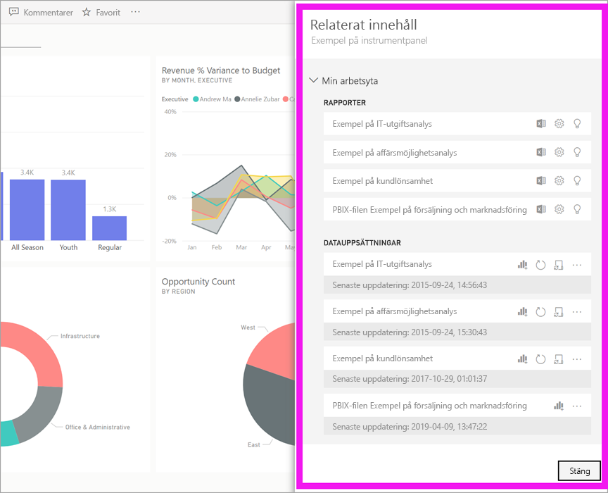
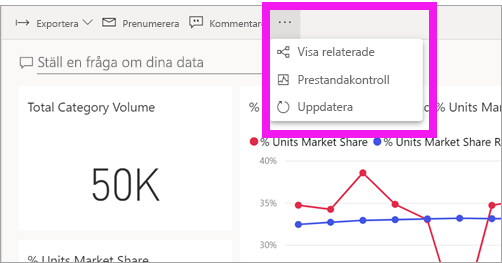
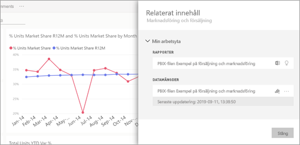
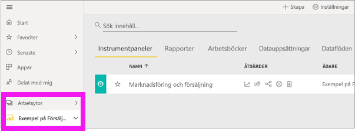
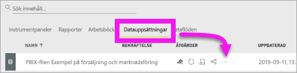
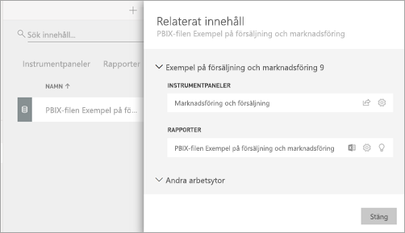

# Visa relaterat innehåll i Power BI-tjänsten

[!INCLUDE[consumer-appliesto-ynny](../includes/consumer-appliesto-ynny.md)]

[!INCLUDE [power-bi-service-new-look-include](../includes/power-bi-service-new-look-include.md)]

Fönstret **Relaterat innehåll** visar hur din Power BI-tjänsts innehåll – instrumentpaneler, rapporter och datauppsättningar – är sammankopplade. Fönstret **Relaterat innehåll** är även en utgångspunkt för att vidta åtgärder. Härifrån kan du göra saker som att öppna en instrumentpanel, öppna en rapport, generera insikter, analysera data i Excel och annat.  

I Power BI skapas rapporter på datauppsättningar, rapportvisualiseringar fästs på instrumentpaneler och instrumentpanelens visuella objekt länkar tillbaka till rapporter. Men hur vet du vilka instrumentpaneler som är värdar för visuella objekt från marknadsföringsrapporten? Och hur hittar du dessa instrumentpaneler? Använder din instrumentpanel för Anskaffning visuella objekt från mer än en datauppsättning? I så fall, vad heter de och hur kan du öppna och redigera dem? Används HR-datauppsättningen i några rapporter och instrumentpaneler? Eller kan den flyttas utan att orsaka några brutna länkar? Frågor som dessa kan alla besvaras på fönstret **Relaterat innehåll**.  Fönstret visar inte bara relaterat innehåll, det låter dig också vidta åtgärder för innehållet och enkelt navigera mellan relaterat innehåll.

> [!NOTE]
> Funktionen relaterat innehåll fungerar inte för strömning av datauppsättningar.
> 
> 

## Visa relaterat innehåll för en instrumentpanel eller en rapport
Se på när Will visar relaterat innehåll för en instrumentpanel. Prova sedan själv genom att följa de stegvisa anvisningarna under videon med exemplet på Anskaffningsanalysen för datauppsättningen.

<iframe width="560" height="315" src="https://www.youtube.com/embed/B2vd4MQrz4M#t=3m05s" frameborder="0" allowfullscreen></iframe>

Välj **Fler alternativ** (…) på menyraden med en instrumentpanel eller en rapport öppen och välj sedan **Visa relaterade** från listrutan.

Fönstret **Relaterat innehåll** öppnas. För en instrumentpanel visas alla rapporter som har visualiseringar fästa på instrumentpanelen samt deras associerade datamängder. För den här instrumentpanelen finns det visualiseringar som har fästs från endast en rapport, och den rapporten baseras på endast en datamängd. 

Härifrån kan du vidta direkta åtgärder för det relaterade innehållet.  Välj exempelvis namnet på en rapport eller en instrumentpanel för att öppna.  För en rapport i listan väljer du en ikon för att [analysera i Excel](../collaborate-share/service-analyze-in-excel.md) eller [få insikter](end-user-insights.md). För en datamängd kan du se datum och tid för senaste uppdatering, [analysera i Excel](../collaborate-share/service-analyze-in-excel.md) och [få insikter](end-user-insights.md).  

## Visa relaterat innehåll för en datauppsättning
Du behöver minst behörighet att *visa* för en datauppsättning för att öppna fönstret **Relaterat innehåll**. I det här exemplet använder vi [Exemplet på anskaffningsanalys](../create-reports/sample-procurement.md).

I navigeringsfältet letar Leta upp rubriken **Arbetsytor** i navigeringsfönstret och välj en arbetsyta i listan. Om du har innehåll på en arbetsyta visas det på ytan till höger. 

I en arbetsyta väljer du fliken **Datauppsättningar** och letar sedan upp ikonen **Visa relaterade**.

Välj ikonen för att öppna fönstret **Relaterat innehåll**.

Härifrån kan du vidta direkta åtgärder för det relaterade innehållet. Välj exempelvis ett namn på en instrumentpanel eller rapport för att öppna den.  Välj en ikon för någon instrumentpanel i listan för att [dela instrumentpanelen med andra](../collaborate-share/service-share-dashboards.md) eller öppna fönstret **Inställningar** för instrumentpanelen. Välj en ikon för en rapport för att [analysera i Excel](../collaborate-share/service-analyze-in-excel.md), [byta namn](../create-reports/service-rename.md) eller [hämta insikter](end-user-insights.md).  

## Begränsningar och felsökning
* Om du inte ser ”Visa relaterade” ska du istället leta efter . Välj ikonen för att öppna fönstret **Relaterat innehåll**.
* Om du vill öppna relaterat innehåll för en rapport måste du vara i [Läsvy](end-user-reading-view.md).
* Funktionen Relaterat innehåll fungerar inte för strömning av datauppsättningar.

## Nästa steg
* [Kom igång med Power BI-tjänsten](../fundamentals/service-get-started.md)
* Har du fler frågor? [Prova Power BI Community](https://community.powerbi.com/)
