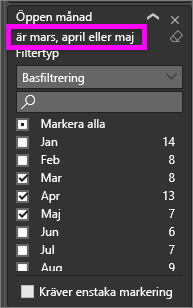
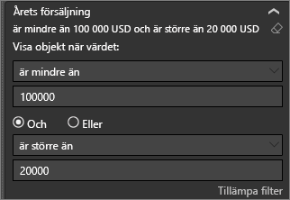

# Ta en titt på panelen för rapportfilter
Den här artikeln tar en titt på filterrapportfönstret i Power BI-tjänsten. Använd filtren för att upptäcka nya insikter i dina data.

Det finns många olika sätt att filtrera data i Power BI och vi rekommenderar att först läsa [Om filter och markering](../power-bi-reports-filters-and-highlighting.md).

## Arbeta med panelen för rapportfilter
Glöm inte att titta i fönstret **Filter** när en kollega delar en rapport med dig. Ibland är fönstret dolt på den högra kanten av rapporten. Välj fönstret för att visa det.   

Fönstret Filter innehåller de filter som *rapportdesignern* har lagt till i rapporten. *Konsumenter* som du kan interagera med befintliga filter och spara ändringarna, men det går inte att lägga till nya filter i rapporten. På skärmbilden ovan har designern lagt till två sidnivåfilter: Segmentera och kör år. Du kan interagera och ändra filtren, men du kan inte lägga till ett tredje sidnivåfilter.

Rapporter i Power BI-tjänsten sparas ändringar du gör i fönstret filter och dessa ändringar är med till mobilversionen av rapporten. Om du vill återställa standardvärdena (som designern angett) i fönstret Filter väljer du **Återställ till standard** på den översta menyraden.  

   

## Visa alla filter för en rapportsida
Fönstret filter visas alla filter som lagts till i rapporten efter den *designer*. Fönstret filter är också där du kan visa information om filter och interagera med dem. Du kan spara de ändringar du gör eller använda **Återställ till standard** att återgå till de ursprungliga inställningarna i filtret.

Om det finns ändringar som du vill spara, kan du också skapa ett personligt bokmärke.  Mer information finns i [lägga till ett bokmärke i en rapport](end-user-bookmarks.md).

Det finns flera typer av rapportfilter som visas och hanteras från fönstret filter de som tillämpas på ett visuellt objekt, till en rapportsida och på hela rapporten.

I det här exemplet har vi valt ett visuellt objekt som har 2 filter. Rapportsidan har också filter som visas under den **filter på den här sidan** rubrik. Och hela rapporten har ett filter för datum.

Vissa filter har ordet **alla** och detta innebär att alla värden ingår i filtret.  Till exempel **Segment(All)** i skärmbilden ovan talar om för oss att den här sidan innehåller information om alla produkten segment.  Å andra sidan, sidnivå filtrera av **regionen är västra** talar om för oss att rapportsidan bara innehåller data för region Väst.

Alla som visar den här rapporten kan interagera med filtren.

### Visa endast de filter som används för ett visuellt objekt
För att få en närmare titt på de filter som används i ett specifikt visuellt objekt, hovrar du över det visuella att visa filterikonen . Välj den filterikonen för att se ett popup-fönster med alla filter, utsnitt och så vidare, påverkar det visuella objektet. Filtren i fönstret som visas är de samma filter som visas på den **filter** fönstret. 

 
Här är typerna av filter som kan visa den här vyn:
- Grundläggande filter
- Utsnitt
- Korsmarkering
- Korsfiltrering
- Avancerad filtrering
- Högsta N-filter
- Relativa datumfiltrer
- Synkroniseringsutsnitt
- Inkludera/exkludera filter
- Filter som skickas via en URL

I exemplet nedan:
1. Vi kan se att stapeldiagrammet har korsfiltrerats.
2. **Ingår** talar om för oss att korsfiltrera avser **Segment**, och tre ingår. 
3. Ett utsnitt har tillämpats för **kvartal**.
4. **Region** är ett filter som tillämpas på den här rapportsidan och
5. **isVanArsdel** och **år** är filter som tillämpas till det här visuella objektet.

### Söka i ett filter
Ett filter kan ibland ha en lång lista med värden. Använd sökrutan för att hitta och välj det värde som du vill. 

### Visa detaljer
Ta en titt på de tillgängliga värdena och antal för att förstå ett filter.  Visa information om filtret genom att hovra och klicka på pilen bredvid namnet på filtret. 
  

### Ändra val av filter
Ett sätt att söka efter insikter från data är att interagera med filtren. Du kan ändra filtren med hjälp av den nedrullningsbara pilen bredvid fältnamnet.  Dina alternativ varierar beroende på filtret och typ av data som filtreras, från enkla val från en lista för att identifiera områden i datumen eller siffrorna. I det avancerade filtret nedan har vi ändrat filtret **Totalt antal enheter hittills i år** på trädkartan ska vara mellan 2 000 och 3 000. Observera att detta tar bort Prirum från trädkartan. 
  

> [!TIP]
> Håll ned CTRL-tangenten för att välja fler än en filtervärde i taget. De flesta filter har stöd för flera val. 

### Återställ filter till standard
Om du vill säkerhetskopiera utanför alla ändringar du har gjort i filter, väljer **Återställ till standard** på den översta menyraden.  Detta återställer filtren till deras ursprungliga tillstånd, som fastställs av rapporten *designer*. 

    
### Rensa ett filter
Om det finns ett enda filter som du vill ange **(alla)** , avmarkerar du den genom att välja raderingsikonen  intill filternamnet.
  
<!--  too much detail for consumers

## Types of filters: text field filters
### List mode
Ticking a checkbox either selects or deselects the value. The **All** checkbox can be used to toggle the state of all checkboxes on or off. The checkboxes represent all the available values for that field.  As you adjust the filter, the restatement updates to reflect your choices. 

Note how the restatement now says "is Mar, Apr or May".

### Advanced mode
Select **Advanced Filtering** to switch to advanced mode. Use the dropdown controls and text boxes to identify which fields to include. By choosing between **And** and **Or**, you can build complex filter expressions. Select the **Apply Filter** button when you've set the values you want.  

## Types of filters: numeric field filters
### List mode
If the values are finite, selecting the field name displays a list.  See **Text field filters** &gt; **List mode** above for help using checkboxes.   

### Advanced mode
If the values are infinite or represent a range, selecting the field name opens the advanced filter mode. Use the dropdown and text boxes to specify a range of values that you want to see. 

By choosing between **And** and **Or**, you can build complex filter expressions. Select the **Apply Filter** button when you've set the values you want.

## Types of filters: date and time
### List mode
If the values are finite, selecting the field name displays a list.  See **Text field filters** &gt; **List mode** above for help using checkboxes.   

### Advanced mode
If the field values represent date or time, you can specify a start/end time when using Date/Time filters.  

-->

## Nästa steg
[Lär dig hur och varför visuella objekt korsfiltrerar och korsmarkerar varandra på en rapportsida](end-user-interactions.md)