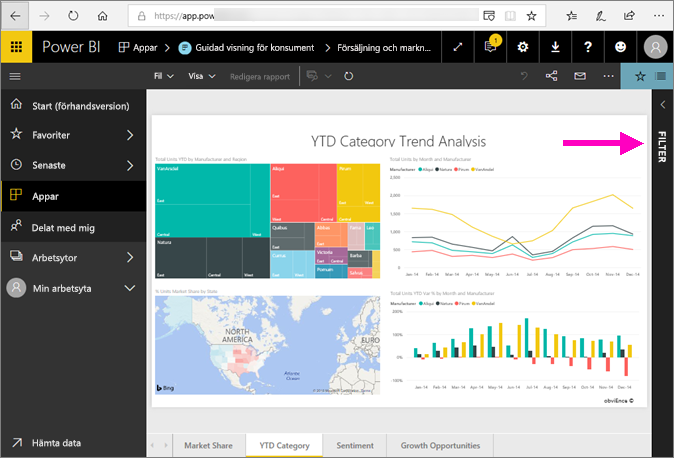
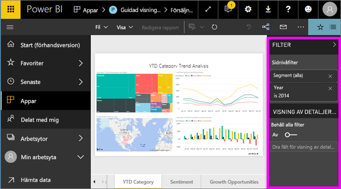
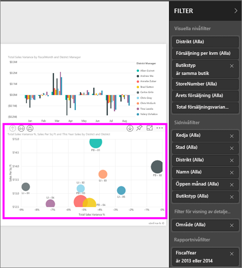
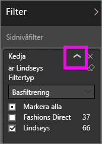
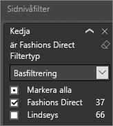
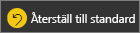
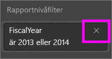
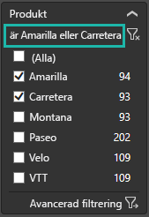
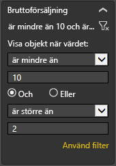
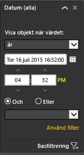

# Ta en titt på panelen för rapportfilter
Den här artikeln tar en titt på filterrapportfönstret i Power BI-tjänsten.

Det finns många olika sätt att filtrera data i Power BI och vi rekommenderar att först läsa [Om filter och markering](../power-bi-reports-filters-and-highlighting.md).

## Arbeta med panelen för rapportfilter
Glöm inte att titta i fönstret **Filter** när en kollega delar en rapport med dig. Ibland är fönstret dolt på den högra kanten av rapporten. Välj fönstret för att visa det.   

Fönstret Filter innehåller de filter som *rapportdesignern* har lagt till i rapporten. Som *användare* kan du interagera med filtren och spara dina ändringar, men du kan inte lägga till nya filter i rapporten.

I Power BI-tjänsten sparas ändringar du gör i fönstret Filter i rapporterna, och dessa ändringar följer med till mobilversionen av rapporten. Om du vill återställa standardvärdena (som designern angett) i fönstret Filter väljer du **Återställ till standard** på den översta menyraden.     

## Öppna fönstret Filter
När en rapport har öppnats visas fönstret Filter längst till höger i rapportarbetsytan. Om du inte ser fönstret väljer du pilen i det övre högra hörnet för att expandera det.  

I det här exemplet har vi valt ett visuellt objekt som innehåller 6 filter. Sidan har också filter som visas under rubriken **Sidonivåfilter**. Det finns ett [filter för detaljerad information](../power-bi-report-add-filter.md) och hela rapporten har också ett filter: **räkenskapsår** är 2013 eller 2014.

Vissa filter har ordet **alla** och detta innebär att alla värden ingår i filtret.  Som exempel kan vi av **Chain(All) (Kedja(alla))** på skärmbilden nedan avläsa att den här rapportsidan innehåller data om alla butikskedjorna.  Å andra sidan berättar filtret på rapportnivå för **Räkenskapsår 2013 eller 2014** att rapporten bara innehåller data för räkenskapsåren 2013 och 2014.

Alla som visar den här rapporten kan interagera med filtren.

* Visa information om filtret genom att hålla muspekaren över och klicka på pilen bredvid filtret.
  
   
* Ändra filtret, till exempel, ändra **Lindseys** till **Fashion Direct**.
  
     

* Återställ filtren till deras ursprungliga tillstånd genom att välja **Återställ till standard** på den översta menyraden.    
    
    
* Ta bort filtret genom att välja **x** intill filternamnet.
  
  När du tar bort ett filter försvinner den från listan och data raderas från rapporten.  Om du till exempel tar bort filtret **räkenskapsår är 2013 eller 2014** finns räkenskapsårets informationen kvar i rapporten men den kommer inte längre att filtreras så att endast 2013 och 2014 visas. Istället visas alla räkenskapsår som innehåller data.  När du tar bort filtret, kommer inte du att kunna ändra det igen eftersom det har tagits bort från listan. Ett bättre alternativ är att ta bort filtret genom att välja ikonen Radera .
  
  

## Rensa ett filter
 Välj ikonen Radera i antingen grundläggande eller avancerat filtreringsläge   för att ta bort filtret. 

## Typer av filter: textfältfilter
### Listläge
Om du markerar en kryssruta markeras eller avmarkeras värdet. Kryssrutan **Alla** kan användas för att växla tillståndet för alla kryssrutor. Kryssrutorna representerar de tillgängliga värdena för det här fältet.  När du justerar filtret uppdateras omformuleringen efter dina val. 

Nu står det ”är Amarilla eller Carretera” i omformuleringen

### Avancerat läge
Välj **Avancerade filter** för att övergå till avancerat läge. Använd listrutekontroller och textrutor för att ange vilka fält som ska inkluderas. Genom att välja mellan **Och** och **Eller** kan du skapa komplexa filteruttryck. Välj knappen **Använd Filter** när du har angett dina önskade värden.  

## Typer av filter: sifferfältfilter
### Listläge
Om värdena är begränsade, visar fältnamnet en lista.  Se **Textfältfilter** &gt; **Listläge** ovan för att få hjälp med att använda kryssrutor.   

### Avancerat läge
Om värdena är oändliga eller motsvarar ett värde öppnas det avancerade filterläget när du markerar fältnamnet. Använd listrutan och textrutor för att ange ett intervall med värden som du vill se. 

Genom att välja mellan **Och** och **Eller** kan du skapa komplexa filteruttryck. Välj knappen **Använd Filter** när du har angett dina önskade värden.

## Typer av filter: datum och tid
### Listläge
Om värdena är begränsade, visar fältnamnet en lista.  Se **Textfältfilter** &gt; **Listläge** ovan för att få hjälp med att använda kryssrutor.   

### Avancerat läge
Om fältvärdena representerar datum och tid, kan du ange en starttid/sluttid med datum/tid-filter.  

## Nästa steg
[Lär dig hur och varför visuella objekt korsfiltrerar och korsmarkerar varandra på en rapportsida](end-user-interactions.md)