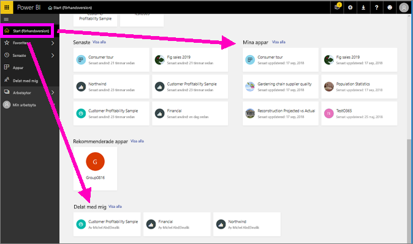
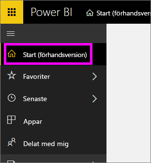
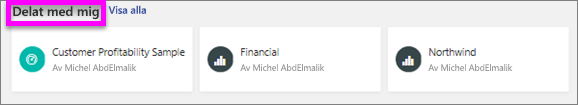
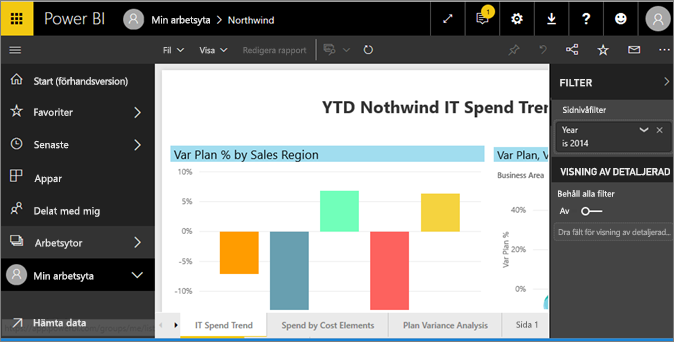
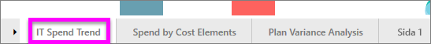
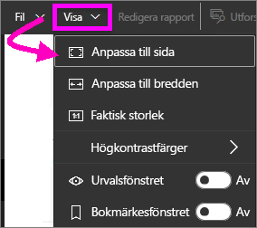
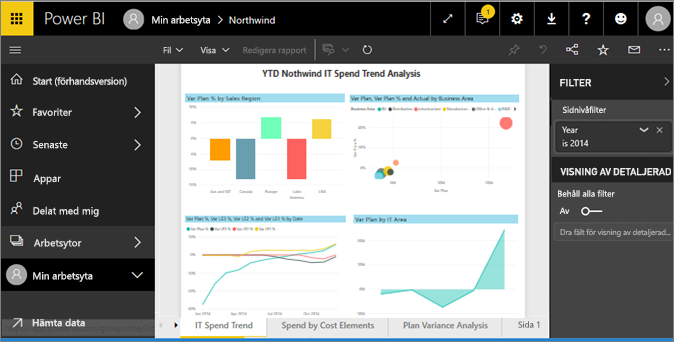
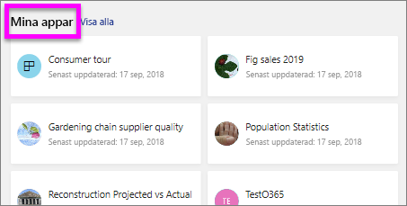
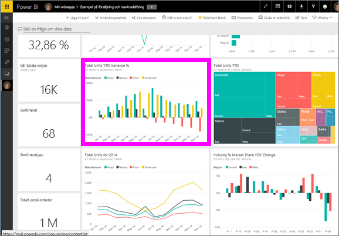
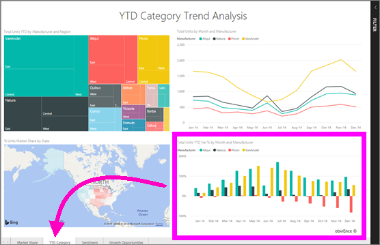

# Visa en rapport i Power BI-tjänsten för *användare*
En rapport är en eller flera sidor med visuella objekt. Rapporter skapas av Power BI-*rapportdesigner* och [delas med *användare* direkt](end-user-shared-with-me.md) eller som en del av en [app](end-user-apps.md). 

Det finns många olika sätt att öppna en rapport och vi kommer att visa dig två av dem: Öppna från startsidan och öppna från en instrumentpanel. 

<!-- add art-->

## Öppna en rapport från din startsida
Nu ska vi öppna en rapport som har delats med dig direkt och sedan öppnar en rapport som har delats som en del av en app.

   

### Öppna en rapport som har delats med dig
Power BI-*designers* kan dela en rapport med dig genom att klicka på knappen **dela** på den övre menyraden. Innehåll som delas på detta sätt visas i behållaren **delat med mig** på det vänstra navigeringsfältet och i avsnittet **delat med mig** på startsidan.

1. Öppna Power BI-tjänsten (app.powerbi.com).

2. I det vänstra navigeringsfältet väljer du **Home (förhandsversion)** för att öppna startsidan.  

   
   
3. Rulla nedåt tills du ser **delat med mig**. Leta efter rapportikonen . På den här skärmbilden har vi två rapporter: *Finans* och *Northwind*. 
   
   

4. Öppna rapporten genom att välja ett av *rapportkorten*.

   

5. Observera flikarna längst ned. Varje flik representerar en *sida* i rapporten. Vi har för närvarande sidan *IT Spend Trend* öppen. Välj en annan flik för att öppna den rapportsidan. 

   

6. Nu kan vi bara se en del av rapportsidan. Om du vill ändra visningen (zooma) på sidan väljer du **Visa** > **Anpassa till sida**.

   

   

### Öppna en rapport som är en del av en app
Om du har fått appar från kollegor eller från AppSource, är dessa appar tillgängliga från din startsida och från behållaren **appar** i det vänstra navigeringsfältet. En [app](end-user-apps.md) är ett paket med instrumentpaneler och rapporter.

1. Gå tillbaka till startsidan genom att välja **Start (förhandsversion)** från det vänstra navigeringsfältet.

7. Rulla nedåt tills du ser **delat med mig**.

   

8. Välj en av apparna för att öppna den. Beroende på vilka alternativ som angetts av appens *designer*, kommer appen att öppnas i en instrumentpanel, en rapport eller en appinnehållslista. Om du väljer appen:
    - öppnas rapporten, allt är klart.
    - öppnas en instrumentpanel, se [öppna en rapport från en instrumentpanel](#Open-a-report-from-a-dashboard) nedan.
    - öppnas appinnehållslistan under **Rapporter**, och rapporten öppnas genom att välja den.

## Öppna en rapport från en instrumentpanel
Rapporter kan öppnas från en instrumentpanel. De flesta paneler på instrumentpanelen är *Fästa* från rapporter. Om du väljer en panel öppnas rapporten som användes för att skapa panelen. 

1. Välj en panel från en instrumentpanel. I det här exemplet har vi valt kolumndiagramspanelen Totalt antal enheter hittills i år...

    

2.  Den associerade rapporten öppnas. Du märker att vi är på sidan kategori hittills i år. Det är den rapportsidan som innehåller kolumndiagrammet som vi valt från instrumentpanelen.

    

> [!NOTE]
> Inte alla paneler leder till en rapport. Om du väljer en panel som [skapades med Frågor och svar](end-user-q-and-a.md), visas Frågor och svar-skärmen. Om du väljer en panel som [skapades med instrumentpanelens **Lägg till panel**-widget](../service-dashboard-add-widget.md), kan flera saker hända.  

##  Ännu fler sätt att öppna en rapport
När du börjar bli mer bekväm med att använda Power BI-tjänsten, kommer du att lista ut de arbetsflöden som fungerar bäst för dig. Några andra sätt att komma åt rapporter:
- Från det vänstra navigeringsfönstret med **Favoriter** och **Senaste**    
- Med [Visa relaterade](end-user-related.md)    
- I ett e-postmeddelande när någon [delar med dig](../service-share-reports.md) eller [ställer in en avisering](end-user-alerts.md)    
- Från ditt [Meddelandecenter](end-user-notification-center.md)    
- och mycket mer

## Nästa steg
Det finns [många sätt att interagera med en rapport](end-user-reading-view.md).  Börja att utforska genom att välja varje flik längst ned i rapportarbetsytan.

