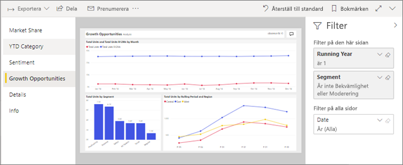
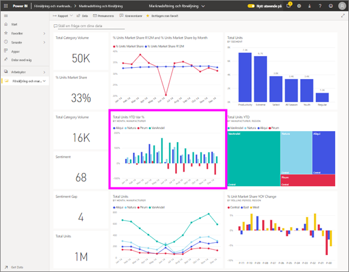

# Visa en rapport i Power BI-tjänsten för *användare*
En rapport är en eller flera sidor med visuella objekt. Rapporter skapas med Power BI *designers* och [delas med *konsumenter* direkt](end-user-shared-with-me.md) eller som en del av en [app](end-user-apps.md). 

Det finns många olika sätt att öppna en rapport och vi visar dig två av dem: öppna hemifrån och öppna från en instrumentpanel. 

<!-- add art-->

## Öppna en rapport från Power BI Start
Nu ska vi öppna en rapport som har delats med dig direkt och sedan öppnar en rapport som har delats som en del av en app.

   

### Öppna en rapport som har delats med dig
Power BI *designers* kan dela en rapport med dig. Innehåll som delas på så sätt som visas i den **delat med mig** behållare på ditt nav fältet och i den **delat med mig** delen av arbetsytan hem.

1. Öppna Power BI-tjänsten (app.powerbi.com).

2. Välj navigationsfält, **Start** att visa startsidan arbetsytan.  

   
   
3. Rulla nedåt tills du ser **delat med mig**. Leta efter rapportikonen . I den här skärmbilden har vi en instrumentpanel och en rapport med namnet *försäljning och marknadsföringsexemplet*. 
   
   

4. Helt enkelt välja rapporten *kort* att öppna rapporten.

   

5. Observera på flikarna till vänster.  Varje flik representerar en *sida* i rapporten. Vi har för närvarande den *tillväxt möjlighet* öppen. Välj den *kategori hittills i år* fliken för att öppna den rapportsidan i stället. 

   

6. Nu har vi ser sidan hela rapporten. Om du vill ändra visningen (zooma) på sidan Välj Visa listrutan längst upp till höger ( **>** ) och välj **faktisk storlek**.

   

   

### Öppna en rapport som är en del av en app
Om du har fått appar från kollegor eller från AppSource, apparna är tillgängliga från Start och från den **appar** behållare på ditt navigeringsfält. En [app](end-user-apps.md) är ett paket med instrumentpaneler och rapporter.

1. Gå tillbaka till startsidan genom att välja **Start** från navigeringsfältet.

7. Rulla nedåt tills du ser **delat med mig**.

   

8. Välj en av apparna för att öppna den. Beroende på vilka alternativ som angetts av appens *designer*, kommer appen att öppnas i en instrumentpanel, en rapport eller en appinnehållslista. Om du väljer appen:
    - öppnas rapporten, allt är klart.
    - öppnas en instrumentpanel, se ***öppna en rapport från en instrumentpanel*** nedan.
    - öppnas appinnehållslistan under **Rapporter**, och rapporten öppnas genom att välja den.

## Öppna en rapport från en instrumentpanel
Rapporter kan öppnas från en instrumentpanel. De flesta paneler på instrumentpanelen är *Fästa* från rapporter. Om du väljer en panel öppnas rapporten som användes för att skapa panelen. 

1. Välj en panel från en instrumentpanel. I det här exemplet har vi valt kolumndiagramspanelen Totalt antal enheter hittills i år...

    

2.  Den associerade rapporten öppnas. Du märker att vi är på sidan kategori hittills i år. Det är den rapportsidan som innehåller kolumndiagrammet som vi valt från instrumentpanelen.

    

> [!NOTE]
> Inte alla paneler leder till en rapport. Om du väljer en panel som [skapades med Frågor och svar](end-user-q-and-a.md), visas Frågor och svar-skärmen. Om du väljer en panel som [skapades med instrumentpanelens **Lägg till panel**-widget](../service-dashboard-add-widget.md), kan flera saker hända.  

##  Ännu fler sätt att öppna en rapport
När du bli mer bekväm navigera i Power BI-tjänsten ska du räkna ut de arbetsflöden som fungerar bäst för dig. Några andra sätt att komma åt rapporter:
- Från navigeringsfält med **Favoriter** och **senaste**    
- Med [Visa relaterade](end-user-related.md)    
- I ett e-postmeddelande när någon [delar med dig](../service-share-reports.md) eller [ställer in en avisering](end-user-alerts.md)    
- Från ditt [Meddelandecenter](end-user-notification-center.md)    
- och mycket mer

## Nästa steg
Det finns [många sätt att interagera med en rapport](end-user-reading-view.md).  Börja utforska genom att välja varje flik till sida i rapportarbetsytan.

