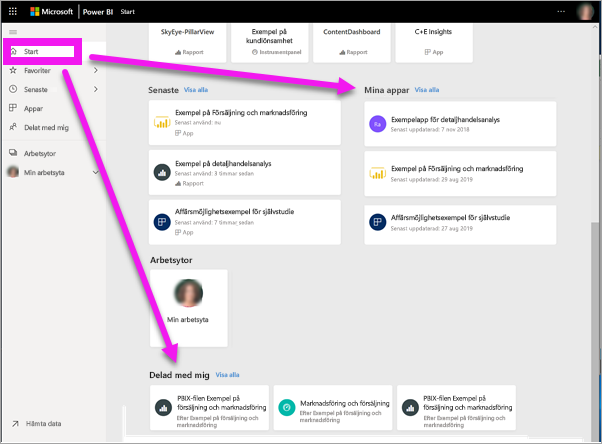
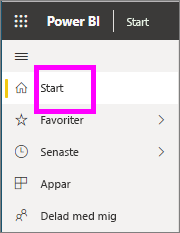
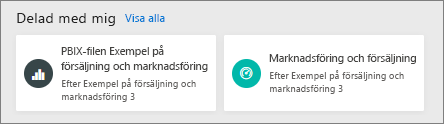
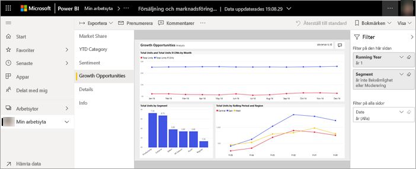
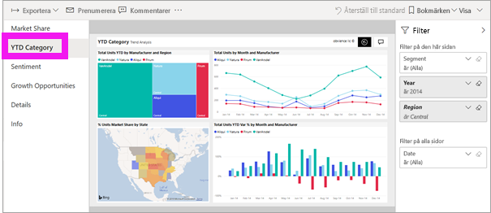
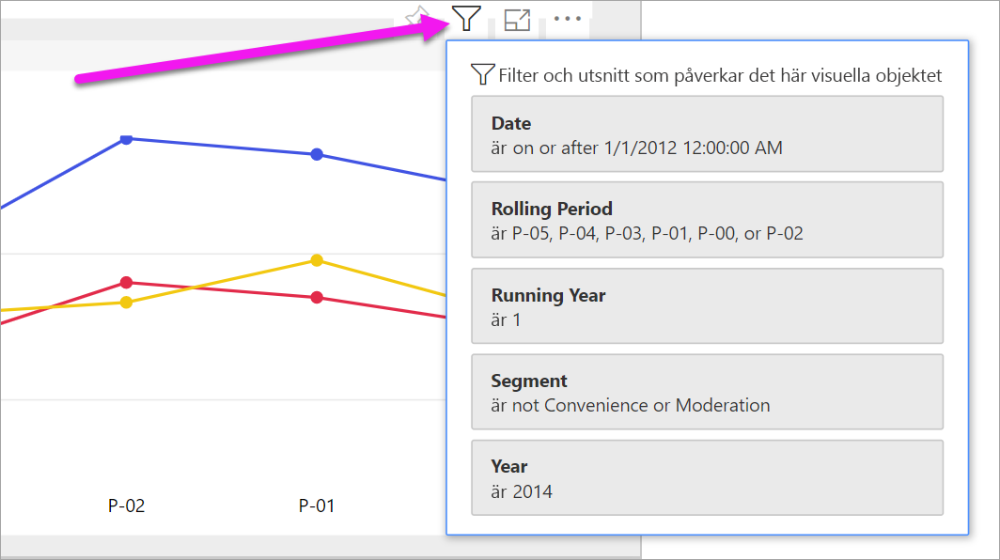
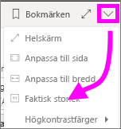
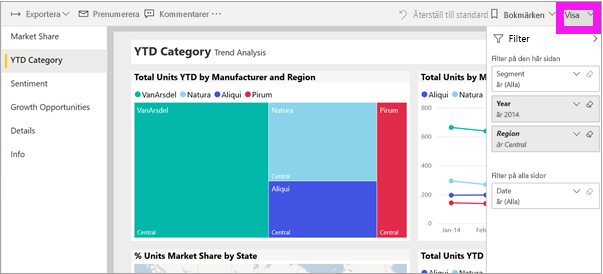
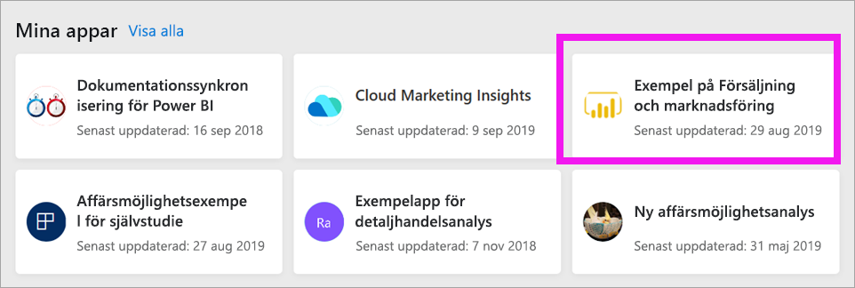
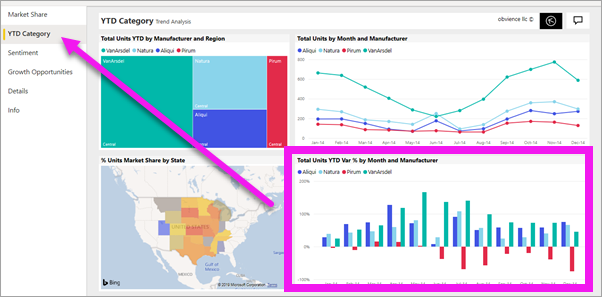

# Visa en rapport i Power BI-tjänsten för *konsumenter*

[!INCLUDE[consumer-appliesto-yyny](../includes/consumer-appliesto-yyny.md)]

[!INCLUDE [power-bi-service-new-look-include](../includes/power-bi-service-new-look-include.md)]

En rapport är en eller flera sidor med visuella objekt. Rapporter skapas av Power BI-*designer* och [delas med *användare* direkt](end-user-shared-with-me.md) eller som en del av en [app](end-user-apps.md). 

Det finns många olika sätt att öppna en rapport och vi kommer att visa dig två av dem: Öppna från startsidan och öppna från en instrumentpanel. 

<!-- add art-->

## Öppna en rapport från Power BI-start
Nu ska vi öppna en rapport som har delats med dig direkt och sedan öppnar en rapport som har delats som en del av en app.

   

### Öppna en rapport som har delats med dig
*Power BI-designers* kan dela en enskild rapport direkt med dig via en länk i ett e-postmeddelande eller genom att lägga till den automatiskt i ditt Power BI-innehåll. Rapporter som delas på detta sätt visas i containern **Delat med mig** i navigeringsfönstret samt i avsnittet **Delat med mig** på startarbetsytan.

1. Öppna Power BI-tjänsten (app.powerbi.com).

2. Visa Hem-arbetsytan genom att välja **Hem** i navigeringsfönstret.  

   
   
3. Rulla nedåt tills du ser **delat med mig**. Leta efter rapportikonen . På den här skärmbilden har vi en instrumentpanel och en rapport. Rapporten heter *Exempel på försäljning och marknadsföring*. 
   
   

4. Öppna rapporten genom att välja *rapportkortet*.

   

5. Observera flikarna längs vänster sida.  Varje flik representerar en *sida* i rapporten. Just nu är sidan för *Tillväxtmöjligheter* öppen. Välj fliken *YTD-kategori* för att öppna rapportsidan i stället. 

   

6. Expandera fönstret **Filter** till höger. Filter som har tillämpats på den här rapportsidan eller i hela rapporten visas här.

7. När du hovrar över ett visuellt rapportobjekt visas flera ikoner och **Fler alternativ** (...). Om du vill se de filter som används för ett visst visuellt objekt väljer du filterikonen. Här har vi valt filterikonen för linjediagrammet *Totalt antal enheter efter rullande period och region*.

   

6. Just nu ser vi hela rapportsidan. Om du vill ändra visningen (zoomning) av sidan väljer du listrutan Visa från det övre högra hörnet och väljer **Faktisk storlek**.

   

   

Det finns många sätt att interagera med en rapport för att upptäcka insikter och fatta affärsbeslut.  Använd innehållsförteckningen till vänster för att läsa igenom andra artiklar om Power BI-rapporter. 

### Öppna en rapport som är en del av en app
Om du har tagit emot appar från kollegor eller från AppSource, är dessa appar tillgängliga från startsidan och från containern **Appar** i navigeringsfönstret. En [app](end-user-apps.md) är en samling instrumentpaneler och rapporter som har samlats ihop av en *Power BI-designer*.

### Förutsättningar
Om du vill följa med hämtar du appen Försäljning och marknadsföring.
1. Navigera till appsource.microsoft.com i webbläsaren.
1. Sök efter "Försäljning och marknadsföring" och välj **Microsofts exempel – Försäljning & marknadsföring**.
1. Välj **Hämta nu** > **Fortsätt** > **Installera** för att installera appen i din appbehållare. 

Du kan öppna appen från din appcontainer eller från Start.
1. Gå tillbaka till startsidan genom att välja **Start** i navigeringsfönstret.

7. Rulla nedåt tills du ser **delat med mig**.

   

8. Välj den nya appen *Försäljning och marknadsföring* för att öppna den. Beroende på vilka alternativ som angetts av appens *designer*, kommer appen att öppnas sin en instrumentpanel eller en rapport. Den här appen öppnas på en instrumentpanel.  

## Öppna en rapport från en instrumentpanel
Rapporter kan öppnas från en instrumentpanel. De flesta [paneler](end-user-tiles.md) på instrumentpanelen är *fästa* från rapporter. Om du väljer en panel öppnas rapporten som användes för att skapa panelen. 

1. Välj en panel från en instrumentpanel. I det här exemplet har vi valt kolumndiagramspanelen *Totalt antal enheter hittills i år...* .

    

2.  Den associerade rapporten öppnas. Observera att vi är på sidan *Kategori hittills i år*. Det är den rapportsidan som innehåller kolumndiagrammet som vi valt från instrumentpanelen.

    

> [!NOTE]
> Inte alla paneler leder till en rapport. Om du väljer en panel som [skapades med Frågor och svar](end-user-q-and-a.md), visas Frågor och svar-skärmen. Om du väljer en panel som [skapades med instrumentpanelens **Lägg till panel**-widget](../create-reports/service-dashboard-add-widget.md), kan flera saker hända: en video kanske spelas upp, en webbplats öppnas eller annat.  

##  Ännu fler sätt att öppna en rapport
När du börjar bli mer bekväm med att använda Power BI-tjänsten, kommer du att lista ut vilka arbetsflöden som fungerar bäst för dig. Några andra sätt att komma åt rapporter:
- Från navigeringsfönstret med [Favoriter](end-user-favorite.md) och [Senaste](end-user-recent.md)    
- Med [Visa relaterade](end-user-related.md)    
- I ett e-postmeddelande när någon [delar med dig](../collaborate-share/service-share-reports.md) eller [ställer in en avisering](end-user-alerts.md)    
- Från ditt [Meddelandecenter](end-user-notification-center.md)    
- Från en arbetsyta
- och mycket mer

## Nästa steg
[Öppna och visa en instrumentpanel](end-user-dashboard-open.md)    
[Rapportfilter](end-user-report-filter.md)

