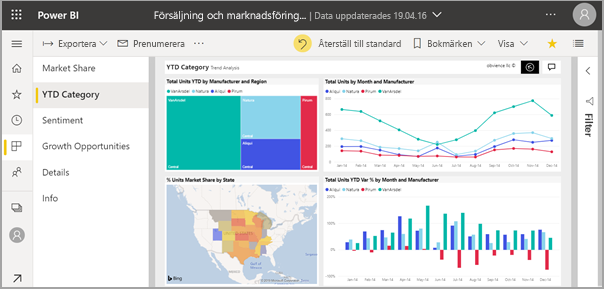
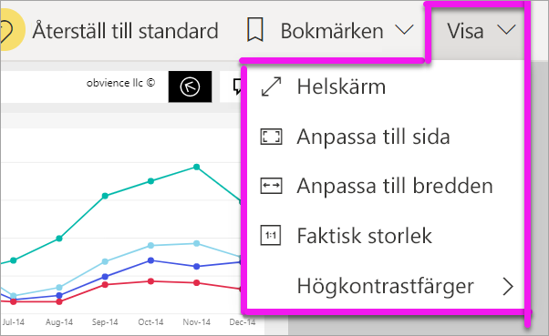
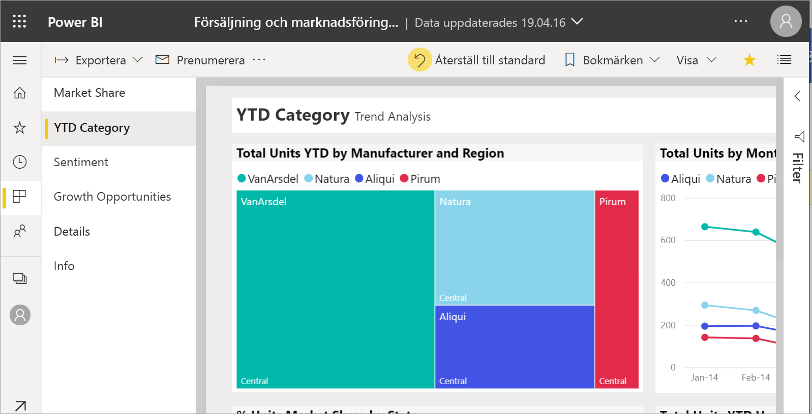
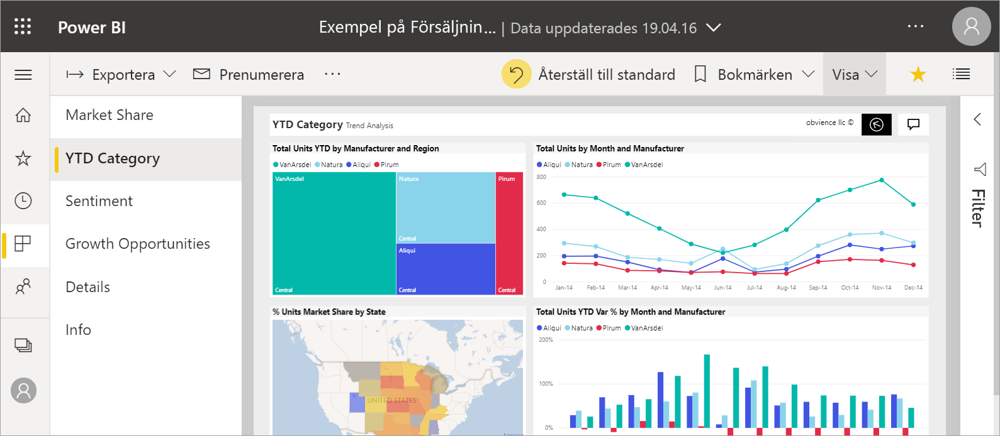
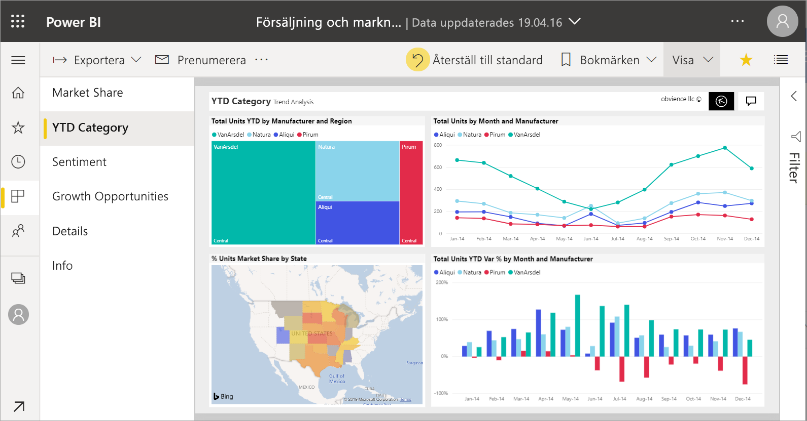
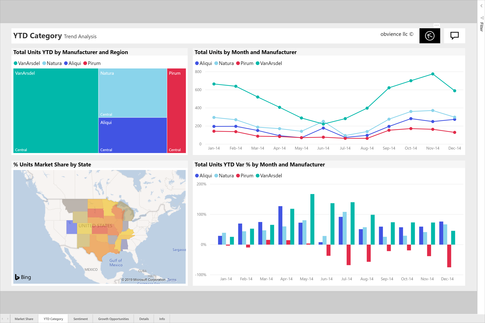

# Ändra visning av en rapportsida

[!INCLUDE[consumer-appliesto-yyny](../includes/consumer-appliesto-yyny.md)]

[!INCLUDE [power-bi-service-new-look-include](../includes/power-bi-service-new-look-include.md)]

Rapporterna visas på många olika enheter, med olika skärmstorlekar och bredd-höjd-förhållanden. Du kan ändra hur en rapportsida visas så att det passar dina behov.

## Utforska Visa-menyn

Alternativen på menyn **Visa** ger dig flexibilitet att visa rapportsidor med den storlek och bredd du väljer:

- Anta att du visar en rapport på en liten enhet och det är svårt att se rubriker och beskrivningar.  Välj **Visa** > **Faktisk storlek** för att öka storleken på rapportsidan. Använd rullningslisterna för att navigera i rapporten.

    

- Du kan även anpassa rapporten efter skärmbredden genom att välja **Anpassa till bredd**. Eftersom det bara är bredden, och inte höjden, kan du fortfarande behöva använda den lodräta rullningslisten.

  

- Om du inte vill använda rullningslister alls, utan vill använda den aktuella skärmstorleken på bästa sätt väljer du **Anpassa till sida**.

   

- Du kan också välja mellan fyra **Högkontrastfärger**: Högkontrast nr 1, Hög kontrast nr 2, Högkontrast svart och Högkontrast vit. Det är en hjälpmedelsfunktion som du kan använda så att personer med nedsatt syn kan se rapporterna bättre. Exemplet nedan är Hög kontrast 1. 

    

- Det sista alternativet, **Helskärm**, visar rapportsidan utan menyrader och rubriker. Helskärm kan vara ett bra val för små skärmar, där informationen är svår att se.  Helskärm kan också vara ett bra val när du projicerar rapportsidor på stora skärmar bara för information.  

    

När du avslutar rapporten sparas inte dina **visningsinställningar**, utan de återgår till standardinställningarna. Använd [Bokmärken](end-user-bookmarks.md) om du vill spara inställningarna.

## Använda webbläsaren för att ändra sidvisning

Zoomningskontrollerna i webbläsaren ökar och minskar det tillgängliga arbetsområdet. Om du minskar zoomningen expanderas det tillgängliga arbetsområdet och vice versa. 

Att ändra storlek på hela webbläsaren är ett annat sätt att ändra visningsstorleken för rapporten. 

## Zooma in på ett visuellt objekt
Ibland är det svårt att se information i ett visuellt objekt. Du kan göra så att det visuella objektet visas större och fristående. Mer information finns i [Fokusläge och Helskärmsläge](end-user-focus.md)

### Ett visuellt objekt i *Fokusläge*

### Ett visuellt objekt i *Helskärmsläge*

## Nästa steg

* [Ta en titt på panelen för rapportfilter](end-user-report-filter.md)