# Ändra storlek på en rapportsida
I den [föregående artikeln och videon](../power-bi-report-display-settings.md) fick du lära dig två olika sätt för att styra sidvisningen i Power BI-rapporter: **Visa** och **Sidstorlek**. Sidvy och Sidstorlek finns tillgängliga i både Power BI-tjänsten och Power BI Desktop och ser både ut och fungerar nästan på samma sätt. I den här självstudien använder vi dock Power BI-tjänsten.

### Förutsättningar
- Power BI-tjänsten   
- [Exempel på detaljhandelsanalysrapport](../sample-retail-analysis.md)

## Vi börjar med att ändra inställningarna för Sidvisning

1. Öppna rapporten i läsvyn eller redigeringsvyn och välj rapportfliken för **Nya butiker**. Som standard visas den här sidan med hjälp av inställningen **Anpassa till sidan**.  I det här fallet visar Anpassa till sida rapportsidan utan rullningslister, men vissa detaljer och rubriker är för små för att kunna läsas.

   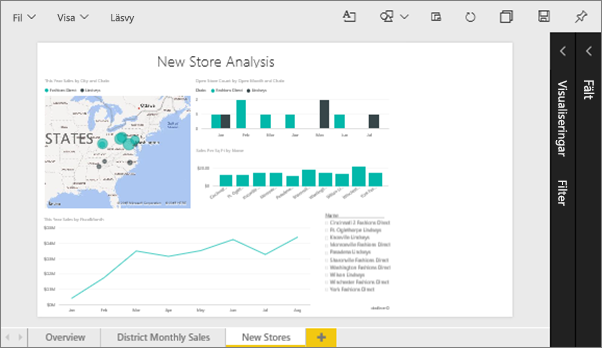
2. Kontrollera att inga visualiseringar är markerade på arbetsytan. Välj **Visa** och granska visningsalternativen.

   * I Läsvy visas följande.

     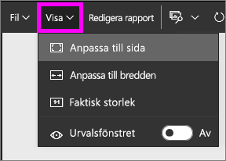
   * I Redigeringsvy visas följande.

     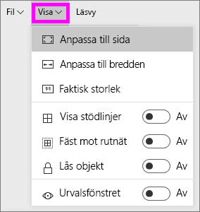

3. Nu ska vi se hur sidan visas med hjälp av inställningen **Faktisk storlek**.

   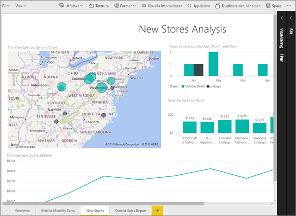

   Inte så bra, instrumentpanelen har nu dubbla rullningslister.
4. Växla till **Anpassa till bredd**.

   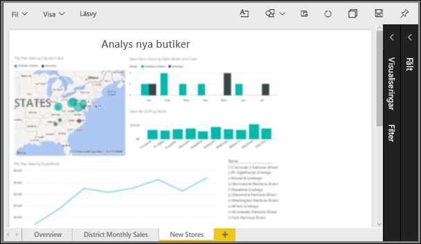

   Ser bättre ut, nu har vi rullningslister och det är lättare att läsa detaljerna.

## Ändra standardvyn för en rapportsida
Om du är en rapport-*skapare*, kan du ändra standardvyn för dina rapportsidor. När du delar din rapport med andra öppnas rapportsidorna med den vyn du har ställt in. Rapport-*konsumenter* kommer att kunna ändra vyn, men kommer inte att kunna spara sina ändringar när de stänger ner rapporten.

1. På sidan **New stores (Nya butiker)** i rapporten växlar du tillbaka till vyn **Faktisk storlek**.

   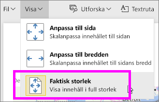

2. På rapportsidan **Månatlig försäljning per distrikt**, ställer du in Vyn till **Anpassa till bredden**.

3. På rapportsidan **Översikt**, lämnar du kvar standardinställningen för vyn.

4. Nu sparar du rapporten genom att välja **Fil > Spara**. Nästa gång du öppnar den här rapporten kommer sidorna att visas med de nya Vy-inställningarna. Nu ska vi se.

   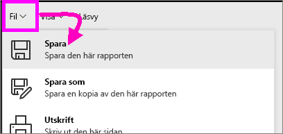
3. Välj namnet på den aktuella arbetsytan från det övre navigeringsfältet för att återgå till den arbetsytan.  

   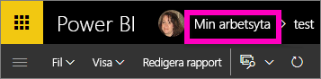
4. Välj fliken **Rapporter** och välj samma rapport (Exempel på detaljhandelsanalys).

    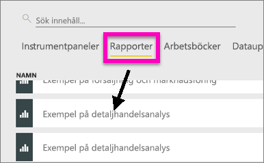
5. Öppna varje sida i rapporten för att se de nya inställningarna.

   

## Nu ska vi titta närmare på inställningen *Sidstorlek*.
Storleksinställningarna finns bara tillgängliga i [Redigeringsvyn](../service-interact-with-a-report-in-editing-view.md) så du måste ha redigeringsbehörigheter (*skapare*) till rapporten för att ändra sidstorleksinställningarna. Om du har anslutit till något av våra [exempel](../sample-datasets.md), kommer du att ha *skapare*-behörigheter till de rapporterna.

1. Öppna sidan ”District monthly sales (Månadsvis distriktsförsäljning)” i [Exempel på detaljhandelsanalys ](../sample-retail-analysis.md) i redigeringsvyn.
2. Kontrollera att inga visualiseringar är markerade på arbetsytan.  I fönstret **Visualiseringar** väljer du färgrollerikonen.
3. Välj **Sidstorlek** &gt; **Typ** för att visa alternativen för sidstorlek.

   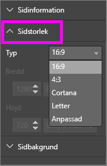
4. Välj **Letter**.  På arbetsytan återstår bara det innehåll som passar för 816 x 1056 bildpunkter (Letter-storlek) på den vita delen av arbetsytan.

   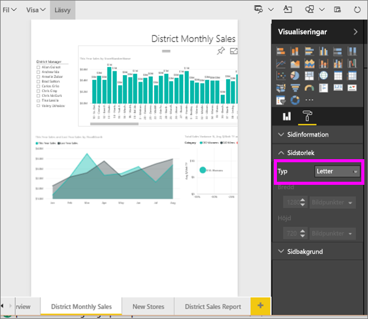
5. Välj **Sidstorlek** och förhållandet **16:9**.

   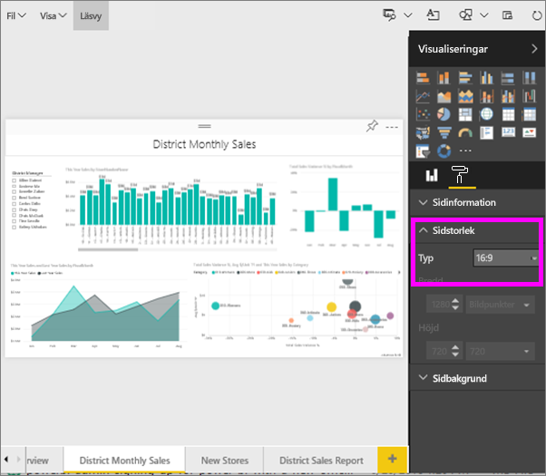

   Rapportsidan visas med hjälp av ett förhållande på 16 brett med 9 högt. Om du vill visa den faktiska bildpunktsstorlek som används, kan du ta en titt på de gråmarkerade fälten Bredd och Höjd (1 280 x 720). Det är mycket tomt utrymme runt rapportarbetsytan, vilket beror på att vi tidigare ställde in **Visa** på ”Anpassa till bredd”.
7. Fortsätt att utforska **Sidstorlek**-alternativen.

## Använda Sidvisning och Sidstorlek tillsammans
Du kan använda Sidvisning och Sidstorlek tillsammans för att skapa en rapport som ser bra ut när den delas med kollegor eller är inbäddad i ett annat program.

I den här övningen kommer du att skapa en rapportsida som ska visas i ett program som har utrymme för 500 bildpunkter på bredden och 750 bildpunkter på höjden.

Kom ihåg att vi i det föregående steget såg att rapportsidan för närvarande visas med 1 280 på bredden och 720 på höjden. Så vi vet att vi behöver göra många storleksändringar och nya arrangemang om vi vill att alla våra visuella objekt ska få plats.

1. Ändra storlek på och flytta de visuella objekten så att de passar in på mindre än hälften av den aktuella arbetsytan.

    
2. Välj **Sidstorlek** &gt; **Anpassad**.
3. Ange bredden till 500 och höjden till 750.

    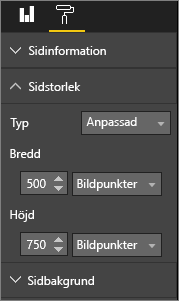
4. Justera rapportsidan så att den ser så bra ut som möjligt. Växla mellan **Visa > Faktisk storlek** och **Visa > Anpassa till sida** för att göra justeringar.

    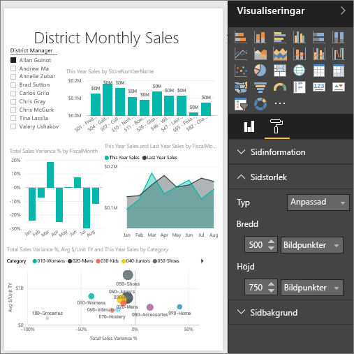

## Nästa steg
[Skapa rapporter för Cortana](../service-cortana-answer-cards.md)

Tillbaka till [Sidvisningsinställningar i en Power BI-rapport](../power-bi-report-display-settings.md)

Har du fler frågor? [Prova Power BI Community](http://community.powerbi.com/)
